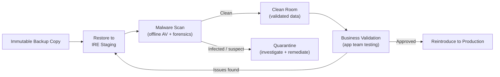

# IRE — Clean Room

The clean room is a verified, malware-free subset of the IRE used to analyse and validate recovered data before reintroducing it to production. Nothing leaves the clean room until it has been scanned and validated.

## Purpose

After restoring a backup to the IRE, the restored data may still contain:
- Dormant ransomware or malware executables.
- Corrupted data files from the attack period.
- Encrypted files that appear intact but are inaccessible.

The clean room is where analysis occurs. Data and systems are treated as suspect until proven clean.

## Clean Room Architecture



## Clean Room Build Standards

### Compute

- Fresh OS deployment from known-good media (not a clone of production).
- No production software agents installed (backup agents, monitoring, SIEM).
- All patches applied before use.
- Snapshot the clean OS state before loading any recovered data — revert between test cycles.

### Networking

- Clean room hosts on a dedicated subnet within the IRE.
- No outbound internet access (prevents C2 beacon from any surviving malware).
- DNS resolution pointing to IRE-internal DNS only.
- Inbound access limited to the jump host and authorised analyst workstations.

### Storage

- Recovered data mounted read-only initially.
- Scanning tools installed locally — do not send files to cloud-based scanning.
- Write access only granted after clean verification.

## Malware Scanning Procedure

```bash
# Example: ClamAV offline scan of mounted recovery volume (Linux)
# Install ClamAV and update definitions (from offline mirror or pre-downloaded)
clamscan --recursive --infected --log=/var/log/ire-scan-$(date +%F).log /mnt/recovery-volume

# Scan for known ransomware IOCs
clamscan --database=/opt/ir-signatures/ --recursive /mnt/recovery-volume

# Windows: offline AV scan using Windows Defender (from WinPE)
MpCmdRun.exe -Scan -ScanType 3 -File D:\recovery-volume

# Generate file hash manifest for integrity verification
find /mnt/recovery-volume -type f -exec sha256sum {} \; > /var/log/ire-hash-manifest-$(date +%F).txt
```

## Data Validation Checklist

| Step | Owner | Pass condition |
|---|---|---|
| AV scan complete | IR team | 0 detections or all detections reviewed and cleared |
| File integrity check | IR team | Hash manifest matches backup catalogue |
| Encrypted file check | IR team | No files in known encrypted extensions (`.locky`, `.ryuk`, etc.) |
| Application startup test | App team | Application starts and reaches health check endpoint |
| Database consistency check | DBA | No corruption reported (DBCC CHECKDB / pg_dump test) |
| Data completeness | Business owner | Critical records present up to the chosen recovery point |
| Sign-off | DR lead | Written approval before data leaves clean room |

## Database Integrity Checks

```sql
-- SQL Server: check for corruption
DBCC CHECKDB ('YourDatabase') WITH NO_INFOMSGS, ALL_ERRORMSGS;

-- PostgreSQL: test dump (will fail if corrupted)
pg_dump -h localhost -U postgres -d recovered_db > /dev/null && echo "Dump OK"

-- Oracle: check data file integrity
RMAN> VALIDATE DATABASE;
```

## Escalation — If Malware Found

```
1. Halt all access to the clean room immediately.
2. Preserve the infected restore point (do not delete — needed for forensics).
3. Notify the IR lead and security team.
4. Roll back the clean room hosts to pre-scan snapshot.
5. Identify an earlier, cleaner restore point and repeat the process.
6. Document IOCs found for threat hunting in production.
```

## Common Issues

| Symptom | Cause | Resolution |
|---|---|---|
| AV scan misses malware | Signature definitions outdated | Update definitions from offline mirror before each scan cycle |
| Recovered database won't start | Binary files corrupted or OS config mismatch | Check error logs; try restore from an earlier backup point |
| Clean room has internet access | Firewall misconfiguration | Block all outbound from clean room subnet except to IR team jump host |
| App team needs prod-like config to test | Config files contain prod secrets | Substitute test credentials; never bring prod credentials into IRE |
