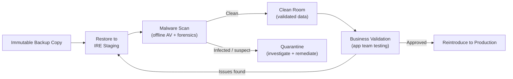

# IRE — Clean Room


<div class="kb-summary">
The clean room is a verified, malware-free subset of the IRE used to analyse and validate recovered data before reintroducing it to production. Nothing leaves the clean room until it has been scanned and validated.
</div>

## Purpose

After restoring a backup to the IRE, the restored data may still contain:
- Dormant ransomware or malware executables.
- Corrupted data files from the attack period.
- Encrypted files that appear intact but are inaccessible.

The clean room is where analysis occurs. Data and systems are treated as suspect until proven clean.

## Clean Room Architecture


┌─────────────────────────────────────────── IRE Clean Room ────────────────────────────────────────────┐
│                                                                                                       │
│   ┌───────────────────────────────────────────────────────────────────────────────────────────────┐   │
│   │         IRE Clean Room — isolated ESXi + vCenter + workstations for validated recovery        │   │
│   │                   See product-specific sub-sections for detailed procedures                   │   │
│   │          DR success depends on: documented runbooks · tested failover · validated RTO         │   │
│   │          Minimum DR posture: defined RPO/RTO · tested backups · known escalation path         │   │
│   │        Test DR procedures quarterly; document results; update runbooks after each test        │   │
│   └───────────────────────────────────────────────────────────────────────────────────────────────┘   │
│                                                                                                       │
│  Physical Infrastructure:                                                                             │
│  Production site · DR site · Replication link · Management network · Vault network                    │
│                                                                                                       │
│  Key terms:                                                                                           │
│                                                                                                       │
│  RPO           = Recovery Point Objective; max acceptable data loss window                            │
│  RTO           = Recovery Time Objective; max acceptable downtime before restore                      │
│  Failover      = activating the DR site; redirecting hosts to replica resources                       │
│  Failback      = returning operations to production site after DR resolved                            │
│  Runbook       = step-by-step documented procedure for a specific DR scenario                         │
│  IRE           = Isolated Recovery Environment; air-gapped clean-room for recovery                    │
│  Clean Room    = isolated vCenter + workstations for cyber recovery validation                        │
│  Air Gap       = network isolation preventing attacker lateral movement to vault                      │
│  DR Test       = planned failover test; validates RTO without real disaster                           │
│  Replication   = continuous or periodic data copy to secondary site or vault                          │
│  Recovery Tier = classification: hot/warm/cold based on RTO requirement                               │
│  BIA           = Business Impact Analysis; drives RPO/RTO targets per system                          │
│                                                                                                       │
└───────────────────────────────────────────────────────────────────────────────────────────────────────┘
```

## Common Issues

| Symptom | Cause | Resolution |
|---|---|---|
| AV scan misses malware | Signature definitions outdated | Update definitions from offline mirror before each scan cycle |
| Recovered database won't start | Binary files corrupted or OS config mismatch | Check error logs; try restore from an earlier backup point |
| Clean room has internet access | Firewall misconfiguration | Block all outbound from clean room subnet except to IR team jump host |
| App team needs prod-like config to test | Config files contain prod secrets | Substitute test credentials; never bring prod credentials into IRE |
