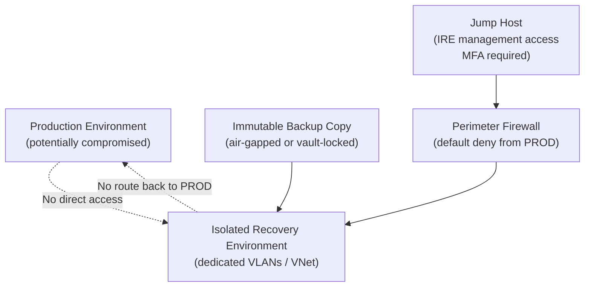

# IRE — Isolation

The Isolated Recovery Environment (IRE) is a network-isolated, air-gapped environment used for recovering from ransomware and other destructive attacks. Isolation is the foundational control: the IRE must never share network paths, credentials, or management planes with the production environment.

## Why Isolation Matters

Ransomware that has compromised a production environment may still be active during a recovery attempt. If the IRE shares any network connectivity with production, the threat actor can:
- Detect and destroy clean recovery copies.
- Pivot from production into the IRE.
- Re-encrypt or corrupt systems being restored.

Isolation eliminates these lateral movement paths.

## Network Isolation Architecture


┌──────────────────────────────────────── IRE Network Isolation ────────────────────────────────────────┐
│                                                                                                       │
│   ┌───────────────────────────────────────────────────────────────────────────────────────────────┐   │
│   │      IRE Network Isolation — air-gap switch config, VLAN separation, no production routes     │   │
│   │                   See product-specific sub-sections for detailed procedures                   │   │
│   │          DR success depends on: documented runbooks · tested failover · validated RTO         │   │
│   │          Minimum DR posture: defined RPO/RTO · tested backups · known escalation path         │   │
│   │        Test DR procedures quarterly; document results; update runbooks after each test        │   │
│   └───────────────────────────────────────────────────────────────────────────────────────────────┘   │
│                                                                                                       │
│  Physical Infrastructure:                                                                             │
│  Production site · DR site · Replication link · Management network · Vault network                    │
│                                                                                                       │
│  Key terms:                                                                                           │
│                                                                                                       │
│  RPO           = Recovery Point Objective; max acceptable data loss window                            │
│  RTO           = Recovery Time Objective; max acceptable downtime before restore                      │
│  Failover      = activating the DR site; redirecting hosts to replica resources                       │
│  Failback      = returning operations to production site after DR resolved                            │
│  Runbook       = step-by-step documented procedure for a specific DR scenario                         │
│  IRE           = Isolated Recovery Environment; air-gapped clean-room for recovery                    │
│  Clean Room    = isolated vCenter + workstations for cyber recovery validation                        │
│  Air Gap       = network isolation preventing attacker lateral movement to vault                      │
│  DR Test       = planned failover test; validates RTO without real disaster                           │
│  Replication   = continuous or periodic data copy to secondary site or vault                          │
│  Recovery Tier = classification: hot/warm/cold based on RTO requirement                               │
│  BIA           = Business Impact Analysis; drives RPO/RTO targets per system                          │
│                                                                                                       │
└───────────────────────────────────────────────────────────────────────────────────────────────────────┘

## Storage Isolation

Backup copies used for IRE restoration must be:

- **Immutable** — write-once, cannot be deleted or modified by any account including backup admins.
- **Isolated** — stored in a separate cloud tenant, offline media, or vault-locked object storage.
- **Access-controlled** — no production system has read or write access to the backup store.

```bash
# Azure: enable immutable blob storage for backup container
az storage container immutability-policy create \
  --account-name <backup-storage-account> \
  --container-name <container-name> \
  --period 30 \
  --allow-protected-append-writes false

az storage container immutability-policy lock \
  --account-name <backup-storage-account> \
  --container-name <container-name>
```

## Isolation Verification Checklist

| Check | Command / Test | Pass condition |
|---|---|---|
| No network route from IRE to production | `traceroute <prod-host>` from IRE | Route fails or hits default deny |
| No route from production to IRE | `ping <ire-host>` from prod | No response |
| No shared AD | `nltest /dsgetdc:<prod-domain>` from IRE | Returns error |
| No shared credentials | Verify IRE accounts do not exist in prod AD | Enumeration returns nothing |
| Immutable backups | Check immutability lock state | Locked, cannot be deleted |
| Firewall ACL | Review firewall ruleset | Default deny between prod and IRE |

## Common Issues

| Symptom | Cause | Resolution |
|---|---|---|
| IRE VM can ping production host | Missing ACL or VLAN trunk leak | Check firewall ACLs and switch port VLAN configuration |
| Restore fails because backup store is unreachable | Backup store IP not whitelisted in IRE firewall | Add firewall rule: IRE → backup store IP, port 443 only |
| Cannot manage IRE systems remotely | Jump host not in allowed source list | Update IRE NSG/firewall to allow traffic from jump host subnet only |
| AD join required for IRE workloads | App requires domain membership | Build dedicated IRE domain; never join production domain |
