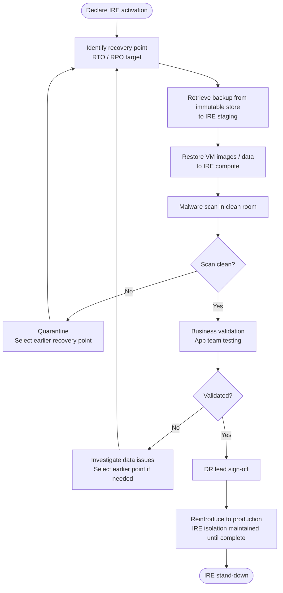

# IRE — Restore

Restoration in the IRE follows a staged process: retrieve the backup, restore to isolated staging, validate in the clean room, then reintroduce to production only after sign-off.

## Restore Workflow


┌───────────────────────────────────────────── IRE Restore ─────────────────────────────────────────────┐
│                                                                                                       │
│   ┌───────────────────────────────────────────────────────────────────────────────────────────────┐   │
│   │         IRE Restore — step-by-step clean restore from vault to clean-room environment         │   │
│   │                   See product-specific sub-sections for detailed procedures                   │   │
│   │          DR success depends on: documented runbooks · tested failover · validated RTO         │   │
│   │          Minimum DR posture: defined RPO/RTO · tested backups · known escalation path         │   │
│   │        Test DR procedures quarterly; document results; update runbooks after each test        │   │
│   └───────────────────────────────────────────────────────────────────────────────────────────────┘   │
│                                                                                                       │
│  Physical Infrastructure:                                                                             │
│  Production site · DR site · Replication link · Management network · Vault network                    │
│                                                                                                       │
│  Key terms:                                                                                           │
│                                                                                                       │
│  RPO           = Recovery Point Objective; max acceptable data loss window                            │
│  RTO           = Recovery Time Objective; max acceptable downtime before restore                      │
│  Failover      = activating the DR site; redirecting hosts to replica resources                       │
│  Failback      = returning operations to production site after DR resolved                            │
│  Runbook       = step-by-step documented procedure for a specific DR scenario                         │
│  IRE           = Isolated Recovery Environment; air-gapped clean-room for recovery                    │
│  Clean Room    = isolated vCenter + workstations for cyber recovery validation                        │
│  Air Gap       = network isolation preventing attacker lateral movement to vault                      │
│  DR Test       = planned failover test; validates RTO without real disaster                           │
│  Replication   = continuous or periodic data copy to secondary site or vault                          │
│  Recovery Tier = classification: hot/warm/cold based on RTO requirement                               │
│  BIA           = Business Impact Analysis; drives RPO/RTO targets per system                          │
│                                                                                                       │
└───────────────────────────────────────────────────────────────────────────────────────────────────────┘

### File/Volume Restore from Snapshot

```bash
# Pure FlashArray: restore volume from snapshot
purevol copy --overwrite snap01.vol01 vol01-ire-restore

# Mount restored volume to IRE host (after FC/iSCSI connection)
ssh pureuser@<flasharray-ip>
purevol connect vol01-ire-restore --host <ire-host>

# On IRE host: rescan and mount
iscsiadm -m session --rescan
# or for FC:
echo "1" > /sys/class/scsi_host/host0/scan

# Mount read-only for scanning
mount -o ro /dev/mapper/<device> /mnt/recovery-volume
```

### Database Restore

```sql
-- SQL Server: restore to IRE SQL instance (from backup file on shared storage)
RESTORE DATABASE [recovered_db]
FROM DISK = '\\ire-fileserver\backups\prod_db_20260510.bak'
WITH
  MOVE 'prod_db'     TO 'D:\Data\recovered_db.mdf',
  MOVE 'prod_db_log' TO 'D:\Log\recovered_db_ldf',
  NORECOVERY,    -- leave in restoring state for log restore
  REPLACE;

-- Apply transaction logs
RESTORE LOG [recovered_db]
FROM DISK = '\\ire-fileserver\backups\prod_db_log_20260510_2300.bak'
WITH RECOVERY;  -- bring online after final log
```

## Reintroduction to Production

Only after clean room sign-off:

1. **Networking** — establish a controlled one-way network path from IRE to production (IRE → prod only; no return path).
2. **DNS cutover** — update DNS records to point to restored systems.
3. **Monitoring** — connect restored systems to monitoring before traffic goes live.
4. **Traffic cutover** — move load balancer / DNS traffic incrementally (canary first if possible).
5. **IRE decommission** — shut down IRE VMs and revoke all IRE credentials after successful production handover.

## Restore Time Estimates

| Data volume | Backup type | Typical restore time |
|---|---|---|
| < 500 GB VM | Azure RSV restore | 1–3 hours |
| 1 TB database | Full backup + log restore | 2–4 hours |
| 10 TB NAS volume | Snapshot clone (Pure) | < 30 minutes (metadata only) |
| 50 TB NAS volume | Tape restore | 8–24 hours |

Snapshot-based restores (Pure, Azure snapshot) are near-instant for the clone operation; time is dominated by malware scanning and validation.

## Common Issues

| Symptom | Cause | Resolution |
|---|---|---|
| Restore job fails with storage error | Staging storage account not in IRE VNet / inaccessible | Verify storage account network rules include IRE subnet |
| Restored VM cannot boot | OS volume corrupted in the backup | Try one recovery point earlier; check backup consistency settings |
| Database restore leaves DB in restoring state | `NORECOVERY` used without subsequent log restore | Apply remaining logs then `RESTORE DATABASE WITH RECOVERY` |
| Snapshot clone is instant but data appears wrong | Wrong snapshot selected (post-compromise) | Review snapshot timestamps; select from before estimated attack start |
