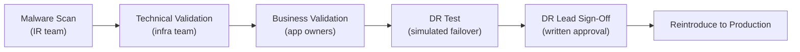

# IRE — Validation

Validation is the final gate before restored systems return to production. It covers technical verification (application health, data integrity) and business verification (data completeness, process functionality).

## Validation Gates



### Database

```sql
-- SQL Server: verify no corruption
DBCC CHECKDB ('recovered_db') WITH NO_INFOMSGS;

-- Check row counts match expected (compare against pre-incident baseline)
SELECT TABLE_NAME, TABLE_ROWS
FROM information_schema.TABLES
WHERE TABLE_SCHEMA = 'recovered_db'
ORDER BY TABLE_ROWS DESC;

-- PostgreSQL: check for bloat or corruption
SELECT schemaname, tablename, n_live_tup, n_dead_tup
FROM pg_stat_user_tables
ORDER BY n_dead_tup DESC LIMIT 20;
```

## Business Validation Checklist

Business owners test against a defined scenario list. Scenarios must be agreed before the incident.

| Scenario | System | Validation method |
|---|---|---|
| User login | Identity / App | Log in with IRE test account; confirm access |
| Core transaction | ERP / Line of business app | Execute a test transaction end-to-end |
| Report generation | BI / Reporting | Run key report; verify row counts within 5% of baseline |
| File access | File server / SharePoint | Access and open a known file from the recovery point |
| Email send/receive | Mail | Send test email from IRE mail relay; confirm delivery |
| Critical data records | Database | Verify records present up to the chosen recovery point |

```yaml
Business validation sign-off form:
  - System: ___________________
  - Recovery point tested: ___________________
  - Test scenarios passed: ___ / ___
  - Data loss acceptable: Yes / No
  - Approved by (app owner): ___________________
  - Date/time: ___________________
```

## RTO / RPO Measurement

Record actual recovery metrics for post-incident review:

| Metric | Definition | Measured value |
|---|---|---|
| **RTO** | Time from IRE activation to production-ready | ___ hours |
| **RPO** | Age of data at the chosen recovery point | ___ hours |
| **MTTR** | Total time from incident declaration to production recovery | ___ hours |
| **Scan duration** | Time taken for malware scan of all recovered volumes | ___ hours |
| **Restore duration** | Time taken to restore all systems to IRE | ___ hours |

```bash
# Log timestamps throughout the process
echo "$(date -u '+%Y-%m-%dT%H:%M:%SZ') IRE activation declared" >> /var/log/ire-timeline.log
echo "$(date -u '+%Y-%m-%dT%H:%M:%SZ') Backup retrieval complete" >> /var/log/ire-timeline.log
echo "$(date -u '+%Y-%m-%dT%H:%M:%SZ') Restore to IRE complete" >> /var/log/ire-timeline.log
echo "$(date -u '+%Y-%m-%dT%H:%M:%SZ') Malware scan complete — clean" >> /var/log/ire-timeline.log
echo "$(date -u '+%Y-%m-%dT%H:%M:%SZ') Business validation complete" >> /var/log/ire-timeline.log
echo "$(date -u '+%Y-%m-%dT%H:%M:%SZ') Production cutover complete" >> /var/log/ire-timeline.log
```

## Common Issues

| Symptom | Cause | Resolution |
|---|---|---|
| App health check passes but business test fails | App started but connected to wrong (production) database endpoint | Verify DB connection string in IRE config points to IRE DB |
| Data appears complete but timestamps are wrong | Timezone mismatch between IRE and production | Verify NTP source in IRE is IRE-internal; adjust display timezone |
| Business owner cannot access IRE clean room | IRE account not pre-provisioned | Create app-team accounts in IRE IdP before the next test or incident |
| Validation takes longer than RTO allows | Too many manual test scenarios | Pre-automate key validation scripts; reduce scenario list to critical paths |
| DB row count lower than expected | Recovery point predates recent data load | Either accept data loss or select a later recovery point and re-scan |
