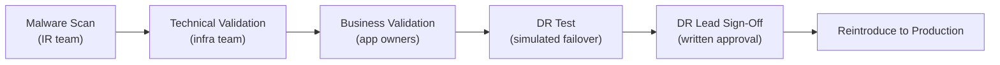

# IRE — Validation


<div class="kb-summary">
Validation is the final gate before restored systems return to production. It covers technical verification (application health, data integrity) and business verification (data completeness, process functionality).
</div>

## Validation Gates


┌─────────────────────────────────────────── IRE Validation ────────────────────────────────────────────┐
│                                                                                                       │
│   ┌───────────────────────────────────────────────────────────────────────────────────────────────┐   │
│   │      IRE Validation — application testing, data integrity checks, sign-off before cutback     │   │
│   │                   See product-specific sub-sections for detailed procedures                   │   │
│   │          DR success depends on: documented runbooks · tested failover · validated RTO         │   │
│   │          Minimum DR posture: defined RPO/RTO · tested backups · known escalation path         │   │
│   │        Test DR procedures quarterly; document results; update runbooks after each test        │   │
│   └───────────────────────────────────────────────────────────────────────────────────────────────┘   │
│                                                                                                       │
│  Physical Infrastructure:                                                                             │
│  Production site · DR site · Replication link · Management network · Vault network                    │
│                                                                                                       │
│  Key terms:                                                                                           │
│                                                                                                       │
│  RPO           = Recovery Point Objective; max acceptable data loss window                            │
│  RTO           = Recovery Time Objective; max acceptable downtime before restore                      │
│  Failover      = activating the DR site; redirecting hosts to replica resources                       │
│  Failback      = returning operations to production site after DR resolved                            │
│  Runbook       = step-by-step documented procedure for a specific DR scenario                         │
│  IRE           = Isolated Recovery Environment; air-gapped clean-room for recovery                    │
│  Clean Room    = isolated vCenter + workstations for cyber recovery validation                        │
│  Air Gap       = network isolation preventing attacker lateral movement to vault                      │
│  DR Test       = planned failover test; validates RTO without real disaster                           │
│  Replication   = continuous or periodic data copy to secondary site or vault                          │
│  Recovery Tier = classification: hot/warm/cold based on RTO requirement                               │
│  BIA           = Business Impact Analysis; drives RPO/RTO targets per system                          │
│                                                                                                       │
└───────────────────────────────────────────────────────────────────────────────────────────────────────┘
```
┌─────────────────────────────────────────── IRE Validation ────────────────────────────────────────────┐
│                                                                                                       │
│   ┌───────────────────────────────────────────────────────────────────────────────────────────────┐   │
│   │      IRE Validation — application testing, data integrity checks, sign-off before cutback     │   │
│   │                   See product-specific sub-sections for detailed procedures                   │   │
│   │          DR success depends on: documented runbooks · tested failover · validated RTO         │   │
│   │          Minimum DR posture: defined RPO/RTO · tested backups · known escalation path         │   │
│   │        Test DR procedures quarterly; document results; update runbooks after each test        │   │
│   └───────────────────────────────────────────────────────────────────────────────────────────────┘   │
│                                                                                                       │
│  Physical Infrastructure:                                                                             │
│  Production site · DR site · Replication link · Management network · Vault network                    │
│                                                                                                       │
│  Key terms:                                                                                           │
│                                                                                                       │
│  RPO           = Recovery Point Objective; max acceptable data loss window                            │
│  RTO           = Recovery Time Objective; max acceptable downtime before restore                      │
│  Failover      = activating the DR site; redirecting hosts to replica resources                       │
│  Failback      = returning operations to production site after DR resolved                            │
│  Runbook       = step-by-step documented procedure for a specific DR scenario                         │
│  IRE           = Isolated Recovery Environment; air-gapped clean-room for recovery                    │
│  Clean Room    = isolated vCenter + workstations for cyber recovery validation                        │
│  Air Gap       = network isolation preventing attacker lateral movement to vault                      │
│  DR Test       = planned failover test; validates RTO without real disaster                           │
│  Replication   = continuous or periodic data copy to secondary site or vault                          │
│  Recovery Tier = classification: hot/warm/cold based on RTO requirement                               │
│  BIA           = Business Impact Analysis; drives RPO/RTO targets per system                          │
│                                                                                                       │
└───────────────────────────────────────────────────────────────────────────────────────────────────────┘
```

## RTO / RPO Measurement

Record actual recovery metrics for post-incident review:

| Metric | Definition | Measured value |
|---|---|---|
| **RTO** | Time from IRE activation to production-ready | ___ hours |
| **RPO** | Age of data at the chosen recovery point | ___ hours |
| **MTTR** | Total time from incident declaration to production recovery | ___ hours |
| **Scan duration** | Time taken for malware scan of all recovered volumes | ___ hours |
| **Restore duration** | Time taken to restore all systems to IRE | ___ hours |

```bash
# Log timestamps throughout the process
echo "$(date -u '+%Y-%m-%dT%H:%M:%SZ') IRE activation declared" >> /var/log/ire-timeline.log
echo "$(date -u '+%Y-%m-%dT%H:%M:%SZ') Backup retrieval complete" >> /var/log/ire-timeline.log
echo "$(date -u '+%Y-%m-%dT%H:%M:%SZ') Restore to IRE complete" >> /var/log/ire-timeline.log
echo "$(date -u '+%Y-%m-%dT%H:%M:%SZ') Malware scan complete — clean" >> /var/log/ire-timeline.log
echo "$(date -u '+%Y-%m-%dT%H:%M:%SZ') Business validation complete" >> /var/log/ire-timeline.log
echo "$(date -u '+%Y-%m-%dT%H:%M:%SZ') Production cutover complete" >> /var/log/ire-timeline.log
```

## Common Issues

| Symptom | Cause | Resolution |
|---|---|---|
| App health check passes but business test fails | App started but connected to wrong (production) database endpoint | Verify DB connection string in IRE config points to IRE DB |
| Data appears complete but timestamps are wrong | Timezone mismatch between IRE and production | Verify NTP source in IRE is IRE-internal; adjust display timezone |
| Business owner cannot access IRE clean room | IRE account not pre-provisioned | Create app-team accounts in IRE IdP before the next test or incident |
| Validation takes longer than RTO allows | Too many manual test scenarios | Pre-automate key validation scripts; reduce scenario list to critical paths |
| DB row count lower than expected | Recovery point predates recent data load | Either accept data loss or select a later recovery point and re-scan |
