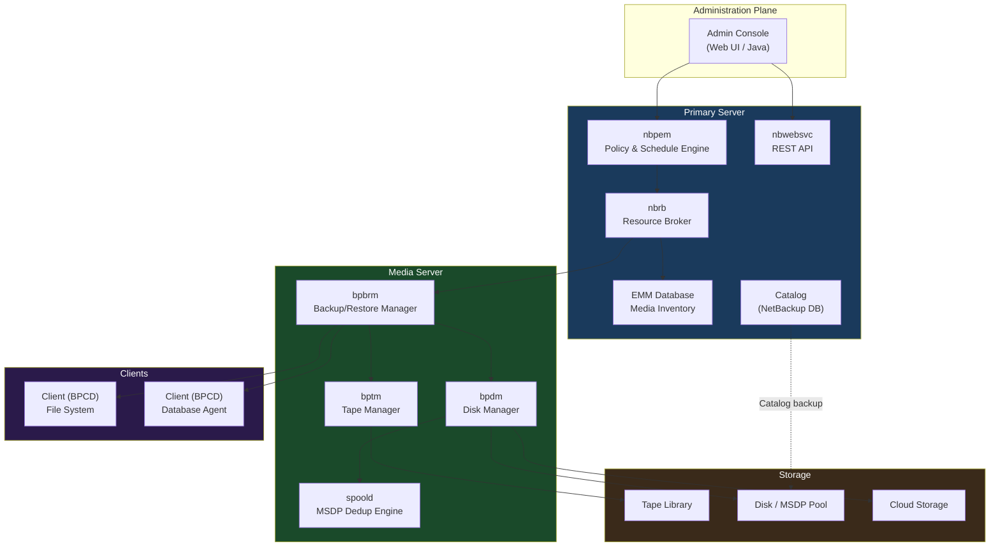

# NetBackup — Components

## Component Overview

NetBackup operates on a three-tier architecture: a centralized **Primary Server** (formerly Master Server) coordinates all operations, **Media Servers** handle data movement, and **Clients** provide the data to be protected. The **Catalog** is the operational heartbeat of the entire deployment.

| Component | Role | Key Processes |
|---|---|---|
| **Primary Server** | Policy scheduling, catalog management, resource arbitration | `nbpem`, `nbproxy`, `nbwebsvc`, `nbrb` |
| **Media Server** | Data mover — reads/writes backup streams | `bpbrm`, `bptm`, `bpdm` |
| **Client** | Source of backup data, hosts the backup agent | `bpcd`, `bpbkar` |
| **Catalog** | Internal DB of policies, images, and media inventory | `nbdb2`, `nbdbms_start_stop` |
| **Storage Unit** | Logical pointer to physical/virtual storage | Configured on Media Server |
| **Storage Unit Group** | Logical grouping of storage units for load balancing | Policy-level assignment |

---

## Component Detail

### Primary Server (formerly Master Server)

The Primary Server is the single control plane for a NetBackup domain. All policy configuration, scheduling, catalog writes, and job orchestration originate here.

- Runs the **NetBackup Resource Broker (nbrb)** to allocate drives, media, and server resources.
- Hosts the **EMM (Enterprise Media Manager)** database, tracking all media and device state.
- Exposes the **NetBackup Web UI** (port 443) and the legacy Java Admin Console.
- Manages **Catalog** backup and retention.

**Key configuration files:**

```
/usr/openv/netbackup/bp.conf           # Primary config (Unix)
C:\Program Files\Veritas\NetBackup\bin\bp.ini  # Primary config (Windows)
```

### Media Server

Media Servers perform the actual I/O — reading data from clients and writing it to storage units. In large environments, multiple Media Servers distribute the backup load.

- Can act as both Media Server and Client simultaneously.
- Each Media Server manages its own storage unit connections (tape libraries, disk pools, cloud).
- Media Server deduplication (MSDP) runs the `spoold` and `spad` daemons.

### Client

Any system with the NetBackup Client software installed. The client agent (`bpcd`) listens for connections from the Primary/Media Server and launches the appropriate backup agent (`bpbkar` for file-system, database agents for Oracle/SQL/etc.).

### Catalog

The Catalog stores all metadata about:

- **Image records** — what was backed up, when, to which media
- **Policy and schedule configuration**
- **Media and device inventory**

The Catalog is a relational database (Sybase SQL Anywhere, branded as NetBackup DB). It must be backed up separately and is the single most critical component to protect.

### Storage Unit

A Storage Unit is a logical definition of a backup target, mapped to a Media Server. Types include:

| Type | Description |
|---|---|
| BasicDisk | Local or NAS filesystem path |
| AdvancedDisk | NetBackup-managed disk volume |
| MSDP | Media Server Deduplication Pool |
| Cloud | Cloud Catalyst or direct cloud (S3/Azure/GCS) |
| Tape/Robot | Physical tape library managed by Media Server |

---

## Architecture Diagram



---

## Key Processes Reference

| Process | Server | Function |
|---|---|---|
| `nbpem` | Primary | Policy Execution Manager — evaluates schedules and triggers jobs |
| `nbrb` | Primary | Resource Broker — allocates drives, media, and server slots |
| `nbwebsvc` | Primary | Hosts the REST API and Web UI backend |
| `nbproxy` | Primary | Proxies API calls between Web UI and core services |
| `bpbrm` | Media | Backup/Restore Manager — parent process coordinating a single job |
| `bptm` | Media | Tape Manager — manages tape drive I/O |
| `bpdm` | Media | Disk Manager — manages disk-based storage unit I/O |
| `spoold` | Media | MSDP deduplication storage server daemon |
| `spad` | Media | MSDP fingerprint and segment tracking daemon |
| `bpcd` | Client | Client Daemon — accepts incoming connections from Primary/Media |
| `bpbkar` | Client | Backup Archiver — traverses filesystem and streams data |
| `nbwd` | Primary | NetBackup Watchdog — monitors and restarts critical daemons |

---

## Catalog Backup Procedure

The NetBackup Catalog contains all image metadata. Without a valid catalog backup, media cannot be read. Catalog backup is configured separately from standard policies.

### Configure Catalog Backup

1. Open **NetBackup Administration Console** → **NetBackup Management** → **Catalog**.
2. Right-click → **Set Up Catalog Backup**.
3. Specify:
   - **Catalog backup policy name**
   - **Disaster recovery passphrase** (encrypts the DR file)
   - **DR file path** — a network share accessible independently of the catalog host
   - **Retention period**
4. Set a schedule — recommend at minimum every 24 hours, ideally every 4–8 hours.

### Manual Catalog Backup (CLI)

```bash
# Trigger immediate catalog backup
/usr/openv/netbackup/bin/admincmd/bpbackupdb

# Verify catalog backup job in activity monitor
/usr/openv/netbackup/bin/admincmd/bpdbjobs -report -all_columns | grep -i catalog

# List catalog images
/usr/openv/netbackup/bin/admincmd/bpimmedia -L -policy <catalog_policy_name>
```

### Catalog Recovery

If the Primary Server must be rebuilt:

```bash
# Boot from Veritas installation media
# Run catalog recovery wizard, or use CLI:

/usr/openv/netbackup/bin/admincmd/bprecover -r -drc <path_to_disaster_recovery_file>
```

The DR file and passphrase are both required. Store the DR file off-host (NAS/object storage) and the passphrase in a secure vault (separate from the DR file location).

---

## NetBackup Domain Sizing Guidelines

| Environment Scale | Primary Server vCPU | RAM | Catalog Disk |
|---|---|---|---|
| Small (<500 clients) | 8 vCPU | 32 GB | 500 GB |
| Medium (500–2000 clients) | 16 vCPU | 64 GB | 2 TB |
| Large (>2000 clients) | 32 vCPU | 128 GB | 5–10 TB |

Catalog disk should be on fast storage (SSD/NVMe). Catalog IOPS under load are significantly higher than sequential throughput figures suggest.
