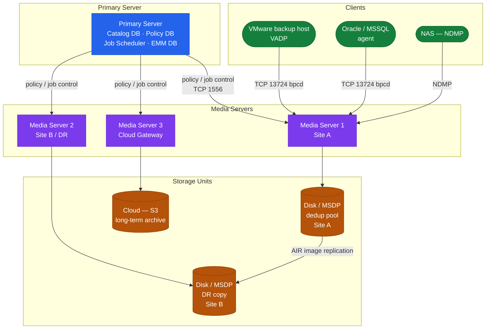

# NetBackup — How It Works

## Overview

NetBackup operates on a three-tier architecture: a centralized Primary Server (formerly Master Server) coordinates all operations via policy scheduling, catalog management, and resource arbitration. Media Servers handle data movement — reading from clients and writing to storage units. The Catalog is the operational heartbeat of the entire deployment, storing all image metadata, policies, and media inventory.

## Three-Tier Topology



## Key Ports

| Port | Protocol | Purpose |
|---|---|---|
| 1556 | TCP | vnetd (BPRD) — main communication |
| 13724 | TCP | bpcd — client daemon |
| 13782 | TCP | bpbrm — backup/restore manager |
| 13785 | TCP | bpdbm — database manager (master) |

## Components

| Component | Role | Key Processes |
|---|---|---|
| Primary Server | Policy scheduling, catalog management, resource arbitration | `nbpem`, `nbproxy`, `nbwebsvc`, `nbrb` |
| Media Server | Data mover — reads/writes backup streams | `bpbrm`, `bptm`, `bpdm` |
| Client | Source of backup data, hosts the backup agent | `bpcd`, `bpbkar` |
| Catalog | Internal DB of policies, images, and media inventory | `nbdb2`, `nbdbms_start_stop` |
| Storage Unit | Logical pointer to physical/virtual storage | Configured on Media Server |

## Storage Unit Types

| Type | Description |
|---|---|
| BasicDisk | Local or NAS filesystem path |
| AdvancedDisk | NetBackup-managed disk volume |
| MSDP | Media Server Deduplication Pool |
| Cloud | Cloud Catalyst or direct cloud (S3/Azure/GCS) |
| Tape/Robot | Physical tape library managed by Media Server |

## Key Processes

| Process | Server | Function |
|---|---|---|
| `nbpem` | Primary | Policy Execution Manager — evaluates schedules and triggers jobs |
| `nbrb` | Primary | Resource Broker — allocates drives, media, and server slots |
| `nbwebsvc` | Primary | Hosts the REST API and Web UI backend |
| `bpbrm` | Media | Backup/Restore Manager — parent process coordinating a single job |
| `bptm` | Media | Tape Manager — manages tape drive I/O |
| `bpdm` | Media | Disk Manager — manages disk-based storage unit I/O |
| `spoold` | Media | MSDP deduplication storage server daemon |
| `bpcd` | Client | Client Daemon — accepts incoming connections from Primary/Media |
| `bpbkar` | Client | Backup Archiver — traverses filesystem and streams data |

## Catalog Backup

The NetBackup Catalog contains all image metadata. Without a valid catalog backup, media cannot be read.

```bash
# Trigger immediate catalog backup
/usr/openv/netbackup/bin/admincmd/bpbackupdb

# Verify catalog backup job in activity monitor
/usr/openv/netbackup/bin/admincmd/bpdbjobs -report -all_columns | grep -i catalog

# Catalog recovery (on rebuilt Primary Server)
/usr/openv/netbackup/bin/admincmd/bprecover -r -drc <path_to_disaster_recovery_file>
```

Store the DR file off-host (NAS/object storage) and the passphrase in a secure vault — both are required for catalog recovery.

## Domain Sizing Guidelines

| Environment Scale | Primary Server vCPU | RAM | Catalog Disk |
|---|---|---|---|
| Small (<500 clients) | 8 vCPU | 32 GB | 500 GB |
| Medium (500–2000 clients) | 16 vCPU | 64 GB | 2 TB |
| Large (>2000 clients) | 32 vCPU | 128 GB | 5–10 TB |

Catalog disk should be on SSD/NVMe — IOPS under load are significantly higher than sequential throughput figures suggest.
