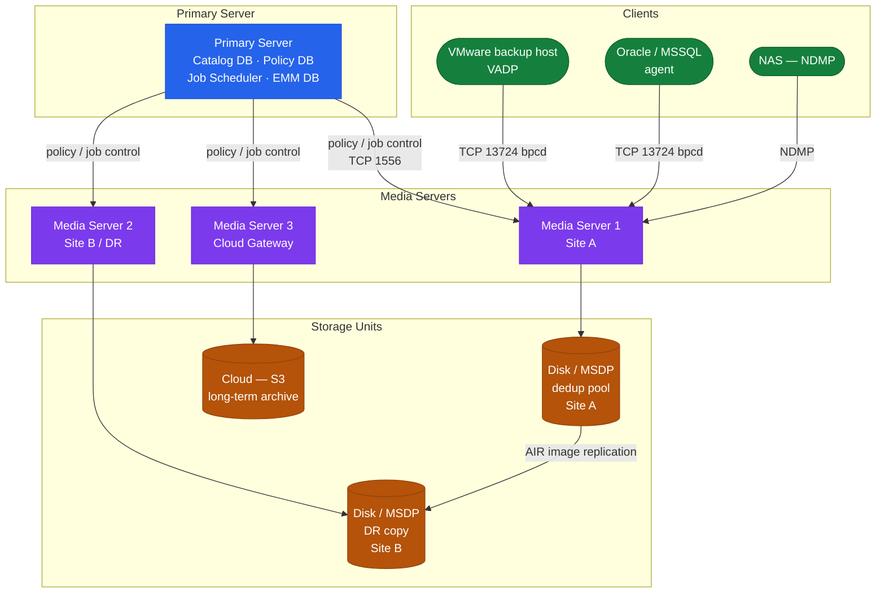

# NetBackup — Architecture Overview

## Three-Tier Topology



## Data Flow

```
Client (backup agent) → TCP 13782
    │
    ▼
Media Server (reads client data, deduplicates if OST, writes to storage unit)
    │
    ├── AdvancedDisk/BasicDisk (local disk storage units)
    ├── OpenStorage (Data Domain OST)
    └── Cloud Storage Unit (S3, Azure Blob)
    │
Master Server (catalogs image metadata, orchestrates scheduling)
```

## Key Ports

| Port | Protocol | Purpose |
|---|---|---|
| 1556 | TCP | vnetd (BPRD) — main communication |
| 13724 | TCP | bpcd — client daemon |
| 13782 | TCP | bpbrm — backup/restore manager |
| 13785 | TCP | bpdbm — database manager (master) |

---

## In this section

<div class="kb-grid kb-grid-3">
<a class="kb-card" href="components/"><strong>Components</strong><span>Core components, services, and technical specifications.</span></a>
<a class="kb-card" href="integrations/"><strong>Integrations</strong><span>Integration with other platforms and external systems.</span></a>
<a class="kb-card" href="standards/"><strong>Standards</strong><span>Sizing guidelines, design standards, and best practices.</span></a>
</div>
