# NetBackup Integration

## Integration Architecture

```mermaid
flowchart TD
    master["NetBackup\nPrimary Server"]

    subgraph storageIntegrations [Storage Integrations]
        ostDD["Dell Data Domain\nOST / DD Boost\n(inline dedup)"]
        msdpPool["MSDP Pool\nMedia Server Dedup\n(native dedup)"]
        pureSnap["Pure FlashArray\nSnapshot Client\n(near-zero RPO)"]
        s3Cloud["AWS S3\nCloud Storage Unit\n(Glacier archival)"]
    end

    subgraph sourceIntegrations [Source / Client Integrations]
        vadp["VMware VADP\nbpvmutil — agentless VM backup"]
        cyberark["CyberArk AAM\nruntime credential retrieval"]
    end

    subgraph operationsIntegrations [Operations Integrations]
        opscenter["OpsCenter\ncentralised reporting + alerts"]
        siem["SIEM\nsyslog audit log forwarding"]
    end

    master --> ostDD
    master --> msdpPool
    master --> pureSnap
    master --> s3Cloud
    master --> vadp
    master --> cyberark
    master --> opscenter
    master --> siem

    classDef master fill:#2563eb,stroke:#1d4ed8,color:#fff
    classDef storage fill:#7c3aed,stroke:#6d28d9,color:#fff
    classDef source fill:#15803d,stroke:#166534,color:#fff
    classDef ops fill:#b45309,stroke:#92400e,color:#fff
    class master master
    class ostDD,msdpPool,pureSnap,s3Cloud storage
    class vadp,cyberark source
    class opscenter,siem ops
```



## Dell Data Domain (OST)

The OpenStorage Technology (OST) plugin enables inline deduplication and DD Boost protocol between NetBackup media servers and Data Domain appliances:

1. Install the Dell OST plugin on each media server:
   ```bash
   # Linux media server
   rpm -ivh NetBackup_<version>_DataDomain_OST_plugin.rpm
   ```

2. Add Data Domain as a storage server:
   ```bash
   # Create OST storage server
   nbdevconfig -creatests -stype DataDomain -storage_server <dd_hostname> -media_server <media_server>
   # Enter DD credentials when prompted
   ```

3. Create disk pool and storage unit:
   ```bash
   nbdevconfig -createdp -stype DataDomain -storage_server <dd_hostname> -dp <pool_name>
   nbdevconfig -createstu -stype DataDomain -dp <pool_name> -stu <stu_name>
   ```

For AIR (Automatic Image Replication) between Data Domain systems: configure DD Boost managed file replication on the Data Domain appliances.

## VMware vSphere (VADP)

NetBackup for VMware uses VMware VADP for agentless VM backups:

1. Add vCenter as credential: NetBackup Admin Console → Credentials → Virtual Machine Servers
2. Create VMware backup policy:
   - Policy type: `VMware`
   - Client: vCenter FQDN
   - Backup selections: tag-based or folder-based VM selection
3. Configure backup host (media server or dedicated proxy):
   - Use hot-add transport for SAN-attached datastores
   - Use NBD for NFS datastores

```bash
# List VMs detected by NetBackup from vCenter
bpvmutil -disco -server <vcenter_fqdn>
```

## Pure FlashArray (Snapshot Client)

Use NetBackup Snapshot Client with the Pure Storage plug-in for near-zero RPO application-consistent backups:

1. Install Pure FlashArray Snapshot Client plugin on media server
2. Configure array credentials: `nbdevconfig -liststs` to verify array visibility
3. Create policy with snapshot method: `puredisk_instant_recovery`

## AWS S3 Cloud Storage Unit

```bash
# Create cloud storage server
nbdevconfig -creatests -stype CloudStorage -storage_server amazon.com -media_server <media_server>

# Provide AWS credentials when prompted
# Create cloud storage unit
nbdevconfig -createstu -stype CloudStorage -storage_server amazon.com -stu S3_LongTerm
```

Configure lifecycle rules on S3 to transition to Glacier after 90 days for cost reduction.

## SIEM Integration

Forward NetBackup audit logs to SIEM:

```bash
# Audit log location
/usr/openv/netbackup/logs/audit/

# Configure syslog forwarding for NetBackup events
/usr/openv/netbackup/bin/nblog -syslog enable -syslog_host <siem_ip> -syslog_port 514
```

Alert on: `backup failed`, `policy modified`, `client deleted`, `catalog backup failed`.

## CyberArk Integration

NetBackup retrieves service account passwords from CyberArk at runtime:

1. Install CyberArk AAM (Application Access Manager) agent on master and media servers
2. Configure NetBackup to use CyberArk: Credentials → enable CyberArk CCP integration
3. Create application credential in CyberArk safe mapped to NetBackup service account

## OpsCenter / IT Analytics

Connect OpsCenter to the master server for centralised reporting:

```bash
# Verify master server is connected to OpsCenter
/opt/SYMCOpsCenterServer/bin/opscenteragent status
```

Key reports:
- Job success rate by policy
- Backup window utilisation
- Storage unit fill levels
- Client backup age (identify clients not backed up recently)
