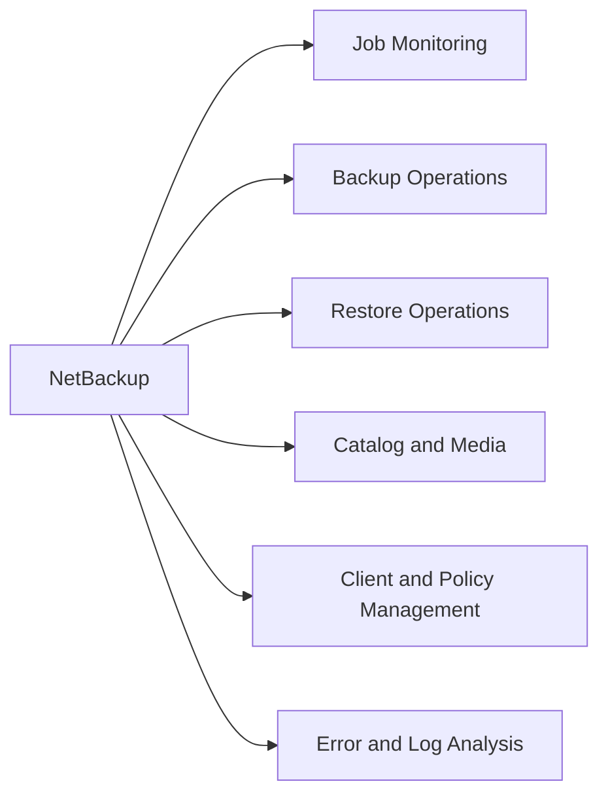

# NetBackup CLI Reference

NetBackup CLI commands run on the Primary Server as root (Linux) or Administrator (Windows). The `bp*` family covers backup and restore operations; `nb*` and `tp*` commands cover EMM, media, and device management. Commands are in `/usr/openv/netbackup/bin/admincmd/` on Linux or `C:\Program Files\Veritas\NetBackup\bin\admincmd\` on Windows.



---

## Job Monitoring

Monitor backup and restore jobs in real time or review recent history.

```bash
# High-level job summary
bpjobs -summary

# List all active jobs
bpjobs

# Query job database — failed jobs in last 24 hours
bpdbjobs -report -failed -hoursago 24

# Query job database — all jobs with verbose output
bpdbjobs -report -all_columns -hoursago 48

# Kill a running job
bpdbjobs -cancel -jobid <id>

# Check NetBackup processes
bpps -a
```

---

## Backup Operations

Initiate manual backups and inspect policy configuration.

```bash
# Initiate manual backup for a policy/schedule/client
bpbackup -p <policy> -s <schedule> -c <client>

# List all policies
bppllist -allpolicies -L

# List file list for a policy
bpplinclude -L -p <policy>

# List schedules for a policy
bpplschedrep <policy>

# List clients assigned to a policy
bpplclients <policy>
```

---

## Restore Operations

Run restores from the CLI. Always verify client name, backup time, and policy before executing.

```bash
# Restore files for a client
bprestore -C <client> -t <policy_type> -L /tmp/restore.log <file_path>

# List available restore points (backup images)
bpimmedia -U -client <client>

# Browse backups for a client
bplist -C <client> -t <type> -R /

# Initiate instant access restore
bprestore -L /tmp/restore.log -R -C <client> <path>
```

---

## Catalog & Media

Manage media, catalog verification, and storage unit health.

```bash
# List all storage units
bpstulist

# List storage unit detail
bpstulist -label <stu_name>

# List media volumes
vmquery -b -m <media_id>

# List all tape drives
tpconfig -d

# Run catalog backup
bpcatarc

# Verify catalog integrity
bpdbm -consistency_check
```

---

## Client & Policy Management

Inspect and manage client records and policy assignments.

```bash
# List all clients
bpclient -L

# Show detail for a specific client
bpclient -L -client <name>

# Test BPCD connectivity to a client
bptestbpcd -client <host>

# Test client backup connectivity
bptestnetconn -sv -client <host>

# List media servers
nbemmcmd -listhosts -machinetype mediaserver
```

---

## Error & Log Analysis

Decode errors and review logs.

```bash
# Show backup errors from last 24 hours
bperror -backstat -hoursago 24

# Look up an error code
bperror -S <exit_status>

# View unified logs (unilog format)
vxlogview -i 51216 -d 24:00:00

# Tail legacy job logs
tail -f /usr/openv/netbackup/logs/bprd/log.<today>
```
