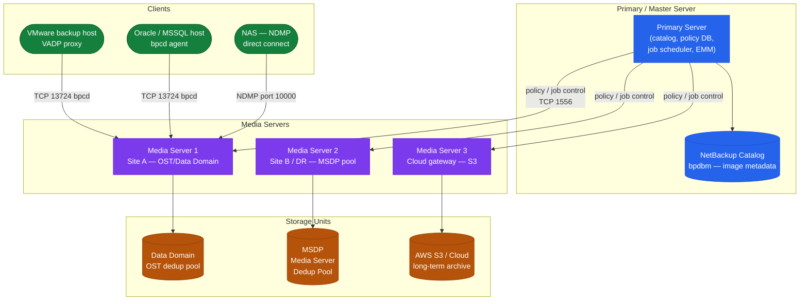
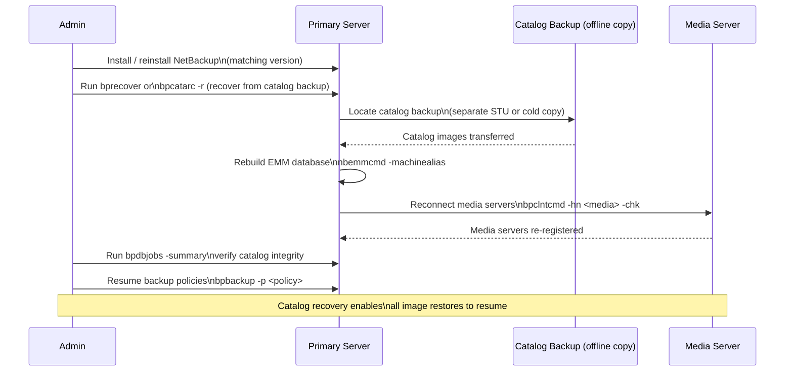

# NetBackup CLI Reference

## Master → Media → Client Topology

Understanding the three-tier topology is essential before using the CLI — commands execute at the correct tier.


┌────────────────────────────────────── NetBackup — CLI Reference ──────────────────────────────────────┐
│                                                                                                       │
│   ┌───────────────────────────────────────────────────────────────────────────────────────────────┐   │
│   │                                 NetBackup — Command Reference                                 │   │
│   │           Use these commands for routine operations, scripting, and troubleshooting           │   │
│   │                                       bpbackup / bprestore                                    │   │
│   │                                        bplist / bpdbjobs                                      │   │
│   │                                         nbpemreq / bpps                                       │   │
│   │                                       tpconfig / nbstlutil                                    │   │
│   │                                     bpexpdate / bpimmediate                                   │   │
│   └───────────────────────────────────────────────────────────────────────────────────────────────┘   │
│                                                                                                       │
│    Ports: 443 (Web UI) · 1556 (vnetd) · 13724 (bprd)                                                  │
│                                                                                                       │
│   ┌───────────────────────────────────────────────────────────────────────────────────────────────┐   │
│   │                                       Command Categories                                      │   │
│   │                  Status / Query  — check current state, list jobs, show config                │   │
│   │                  Operations      — start, stop, failover, restore, sync, expire               │   │
│   │                Configuration   — add/modify policies, schedules, storage targets              │   │
│   │               Diagnostics     — collect logs, run health checks, test connectivity            │   │
│   │                  Scripting       — REST API or CLI for automation and reporting               │   │
│   └───────────────────────────────────────────────────────────────────────────────────────────────┘   │
│                                                                                                       │
│  Physical Infrastructure:                                                                             │
│  Linux/Windows rack servers · SAN HBAs for tape · 10 GbE NIC · SCSI tape robot connection             │
│  Key terms:                                                                                           │
│                                                                                                       │
│  Master Server = central controller: scheduler, catalog, job manager, policy engine                   │
│  Media Server  = data mover between client and storage; can be co-located with master                 │
│  MSDP          = Media Server Deduplication Pool; inline variable-length block dedup                  │
│  Storage Unit  = logical target: AdvancedDisk, MSDP pool, cloud LSU, or tape robot                    │
│  Policy        = defines what, when, and where to back up; contains schedules and clients             │
│  Schedule      = full / differential-incremental / cumulative-incremental timing within policy        │
│  Retention     = how long an image is kept; set per schedule, enforced by catalog expiry              │
│  Catalog       = internal PostgreSQL DB tracking all image metadata, host IDs, and config             │
│  NBU CA        = auto-issued certificate authority; signs host IDs for secure comms                   │
│  vnetd         = NetBackup network daemon; multiplexes all client-master-media on port 1556           │
│  bpdbjobs      = CLI to query job history: status, duration, exit code, errors                        │
│  bplist        = CLI to list available backup images for a client, policy, or date range              │
│  KMS           = Key Management Service for encryption keys used in backup data encryption            │
│  NDMP          = Network Data Management Protocol; direct NAS-to-storage backup path                  │
│                                                                                                       │
└───────────────────────────────────────────────────────────────────────────────────────────────────────┘

---

## Restore Operations

### Catalog Restore Sequence

When the catalog is lost, recovery must happen before any other restore is possible.



Run restores from the CLI. Always verify client name, backup time, and policy before executing.

```bash
# Restore files for a client
bprestore -C <client> -t <policy_type> -L /tmp/restore.log <file_path>

# List available restore points (backup images)
bpimmedia -U -client <client>

# Browse backups for a client
bplist -C <client> -t <type> -R /

# Initiate instant access restore
bprestore -L /tmp/restore.log -R -C <client> <path>
```

---

## Catalog & Media

Manage media, catalog verification, and storage unit health.

```bash
# List all storage units
bpstulist

# List storage unit detail
bpstulist -label <stu_name>

# List media volumes
vmquery -b -m <media_id>

# List all tape drives
tpconfig -d

# Run catalog backup
bpcatarc

# Verify catalog integrity
bpdbm -consistency_check
```

---

## Client & Policy Management

Inspect and manage client records and policy assignments.

```bash
# List all clients
bpclient -L

# Show detail for a specific client
bpclient -L -client <name>

# Test BPCD connectivity to a client
bptestbpcd -client <host>

# Test client backup connectivity
bptestnetconn -sv -client <host>

# List media servers
nbemmcmd -listhosts -machinetype mediaserver
```

---

## Error & Log Analysis

Decode errors and review logs.

```bash
# Show backup errors from last 24 hours
bperror -backstat -hoursago 24

# Look up an error code
bperror -S <exit_status>

# View unified logs (unilog format)
vxlogview -i 51216 -d 24:00:00

# Tail legacy job logs
tail -f /usr/openv/netbackup/logs/bprd/log.<today>
```
