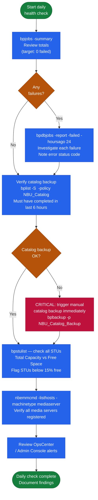

# NetBackup — Health Checks

## Daily Check Flow

## Daily Checklist

Run these checks each morning to confirm a healthy NetBackup environment.

- [ ] `bpjobs -summary` — review totals; zero failed is the target
- [ ] `bpdbjobs -report -failed -hoursago 24` — investigate each failure
- [ ] Confirm catalog backup job completed successfully
- [ ] `bpstulist` — check `Total Capacity` vs `Free Space` on all disk STUs
- [ ] `nbemmcmd -listhosts` — verify all media servers are registered and reachable
- [ ] OpsCenter / Admin Console — review any active alerts

**Weekly**

- Verify tape media inventory if tape library in use (`tpconfig -d`, `vmquery -b`)
- Review policy schedule calendar for upcoming full backup windows
- Confirm deduplication ratio on OST storage units (Data Domain DDOS UI)

## Job Monitoring

Use this section for practical NetBackup job monitoring notes, checks, troubleshooting, commands, change notes, and field references.

### Common checks

- Confirm current health
- Review active alerts
- Check recent changes
- Confirm dependencies
- Check logs, events, and monitoring
- Capture current state before changes

### Incident notes

Capture:

- Symptom
- Start time
- Impact
- System or service name
- Error message
- What changed
- What was checked
- Next action

### Change notes

- Confirm change approval
- Confirm maintenance window
- Confirm rollback plan
- Capture current state
- Make one change at a time
- Validate after the change

### Useful commands

Add tested commands here.

### Known issues

Add known issues here as they come up.

## Validation

Use this section for practical NetBackup Validation notes, checks, troubleshooting, commands, change notes, and field references.

### Common checks

- Confirm current health
- Review active alerts
- Check recent changes
- Confirm dependencies
- Check logs, events, and monitoring
- Capture current state before changes

### Incident notes

Capture:

- Symptom
- Start time
- Impact
- System or service name
- Error message
- What changed
- What was checked
- Next action

### Change notes

- Confirm change approval
- Confirm maintenance window
- Confirm rollback plan
- Capture current state
- Make one change at a time
- Validate after the change

### Useful commands

Add tested commands here.

### Known issues

Add known issues here as they come up.
