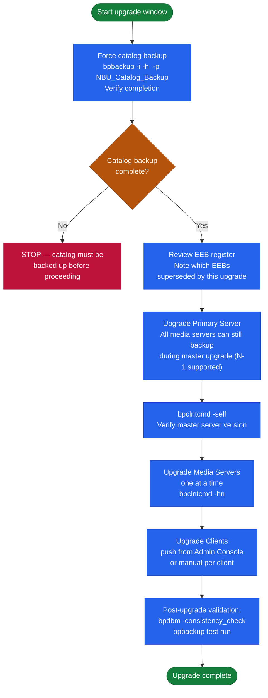

# NetBackup — Install & Upgrade

## Release Cadence

Veritas releases NetBackup on a major.minor cadence, with Long-Term Support (LTS) releases receiving maintenance updates for three years post-GA.

| Version | Type | EOS (check Veritas SORT) |
|---|---|---|
| 10.x | LTS | Check SORT tool |
| 9.1.x | Standard | Check SORT tool |
| 8.3.x | LTS (older) | Likely at or near EOL — review |

Check lifecycle dates at: [sort.veritas.com](https://sort.veritas.com) → EOL dates.

## Upgrade Order

### Upgrade Dependency Chain



**Critical: always upgrade Master Server first.**

1. **Pre-upgrade**: Run catalog backup; verify it completes successfully
   ```bash
   bpbackup -i -h <master_server> -p NBU_Catalog_Backup   # Force catalog backup
   bperror -r -backstat -l | head -20                        # Verify recent backup success
   ```

2. **Upgrade Master Server** — download installer from Veritas portal; run upgrade wizard

3. **Upgrade Media Servers** — one at a time; verify connectivity after each:
   ```bash
   bpclntcmd -hn <media_server> -chk   # Verify after each media server upgrade
   ```

4. **Upgrade Clients** — deploy via push from NetBackup Admin Console or manual installation

## Version Compatibility

| Scenario | Supported? |
|---|---|
| Client N-1 behind Master | Supported — upgrade within next cycle |
| Client N-2 behind Master | Not supported — immediate upgrade required |
| Media Server N-1 behind Master | Supported |
| OpsCenter different version from Master | Not supported — must match |

## EEB (Emergency Engineering Binary) Tracking

Maintain an EEB register:

| EEB ID | Version Targeted | Issue Fixed | Applied Date | Superseded By |
|---|---|---|---|---|
| EEB-XXXXXX | 10.1 | <description> | <date> | MR10.1.1 |

EEBs are not cumulative — re-apply after each maintenance release if not yet superseded.

## Pre-Upgrade Checklist

- [ ] All backup jobs complete (no active jobs)
- [ ] Full catalog backup completed and verified
- [ ] EEB register reviewed — note which EEBs will be superseded by this upgrade
- [ ] Compatibility confirmed for all integrated systems (vCenter version, Data Domain OS, OST plugin versions)
- [ ] Rollback plan: catalog backup can restore previous state if upgrade fails

## Post-Upgrade Validation

```bash
# Check NBU version across master and media servers
bpclntcmd -self   # On each server
/usr/openv/netbackup/bin/version   # Version file

# Run test backup after upgrade
bpbackup -p <policy_name> -s <schedule_name> -h <client>

# Verify catalog integrity post-upgrade
bpdbm -consistency_check   # Check for catalog corruption
```

## Migration: Physical Master to Appliance

Migrating from physical NetBackup installation to a NetBackup appliance requires catalog migration — do NOT upgrade and migrate in the same maintenance window:

1. Deploy appliance with matching NetBackup version
2. Migrate catalog: run `nbcatutil` to export and import catalog
3. Redirect media servers to new master
4. Decommission old master only after 24-48 hours validation

## License Lifecycle

Track license types:
- **APTARE/IT Analytics licenses**: annual subscription
- **Capacity-based licensing**: TB under management; audit monthly
- **Veritas support contract**: align renewal with SORT lifecycle dates
