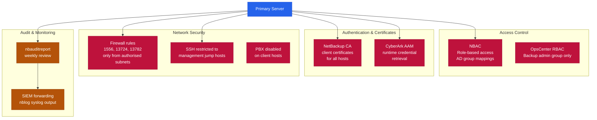

# NetBackup — Hardening

## NetBackup Security Architecture



## Hardening Checklist

- [ ] NBAC enabled; all access via AD group mappings
- [ ] NetBackup CA deployed; all client certificates valid
- [ ] Encryption enabled for policies covering regulated data
- [ ] Master server firewall: only ports 1556, 13724, 13782 open from authorised subnets
- [ ] PBX service disabled on client hosts where not required
- [ ] nbauditreport reviewed weekly; forwarded to SIEM
- [ ] CyberArk AAM integration for all service account credentials
- [ ] OpsCenter access restricted to backup admin AD group
- [ ] SSH to master server limited to management jump hosts only

## Audit Logging

```bash
# Enable audit logging
nbauditreport -enable

# View audit report
nbauditreport -reporttype all -startdate <date> -enddate <date>

# Output to file
nbauditreport -reporttype all -startdate 2026-01-01 > /tmp/nbu_audit.txt
```

Forward to SIEM: configure `nblog` syslog output or use a log shipper agent pointing to `/usr/openv/netbackup/logs/audit/`.

## Firewall Ports

| Source | Destination | Port | Purpose |
|---|---|---|---|
| Master | Media, Clients | 13724, 13782 | bpcd, bpbrm |
| Clients | Master | 1556 | vnetd |
| OpsCenter | Master | 1556 | Reporting |
| Admin workstation | Admin Console | 1556 | Management |
