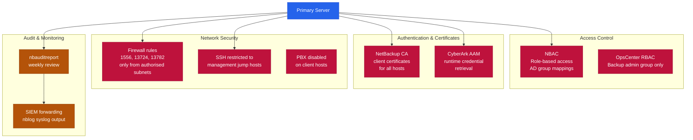

# NetBackup — Hardening

## NetBackup Security Architecture


```

Forward to SIEM: configure `nblog` syslog output or use a log shipper agent pointing to `/usr/openv/netbackup/logs/audit/`.

## Firewall Ports

| Source | Destination | Port | Purpose |
|---|---|---|---|
| Master | Media, Clients | 13724, 13782 | bpcd, bpbrm |
| Clients | Master | 1556 | vnetd |
| OpsCenter | Master | 1556 | Reporting |
| Admin workstation | Admin Console | 1556 | Management |
