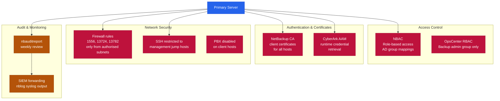

# NetBackup — Hardening

## NetBackup Security Architecture


┌──────────────────────────────────────── NetBackup — Hardening ────────────────────────────────────────┐
│                                                                                                       │
│   ┌───────────────────────────────────────────────────────────────────────────────────────────────┐   │
│   │                                NetBackup — Hardening Checklist                                │   │
│   │               [ ] Disable default/admin accounts; create named admin accounts only            │   │
│   │                   [ ] Enable MFA for all interactive logins via IdP / SAML SSO                │   │
│   │            [ ] Restrict management port (443 (Web UI)) to jump host / management VLAN         │   │
│   │               [ ] Enable audit logging and forward to SIEM (syslog, TLS port 6514)            │   │
│   │                 [ ] Apply all security patches within 30 days of vendor release               │   │
│   └───────────────────────────────────────────────────────────────────────────────────────────────┘   │
│                                                                                                       │
│   ┌───────────────────────────────────────────────────────────────────────────────────────────────┐   │
│   │                                       Network Hardening                                       │   │
│   │               [ ] Separate backup VLAN — no direct production host access to repo             │   │
│   │               [ ] Firewall: allow only 443 (Web UI) · 1556 (vnetd) · 13724 (bprd)             │   │
│   │                  [ ] Disable unused ports and protocols on management interface               │   │
│   │              [ ] Immutable repository: enable WORM or object lock on backup target            │   │
│   │                 [ ] Encryption in transit: disable TLS 1.0/1.1; enforce TLS 1.2+              │   │
│   └───────────────────────────────────────────────────────────────────────────────────────────────┘   │
│                                                                                                       │
│  Physical Infrastructure:                                                                             │
│  Linux/Windows rack servers · SAN HBAs for tape · 10 GbE NIC · SCSI tape robot connection             │
│  Key terms:                                                                                           │
│                                                                                                       │
│  Master Server = central controller: scheduler, catalog, job manager, policy engine                   │
│  Media Server  = data mover between client and storage; can be co-located with master                 │
│  MSDP          = Media Server Deduplication Pool; inline variable-length block dedup                  │
│  Storage Unit  = logical target: AdvancedDisk, MSDP pool, cloud LSU, or tape robot                    │
│  Policy        = defines what, when, and where to back up; contains schedules and clients             │
│  Schedule      = full / differential-incremental / cumulative-incremental timing within policy        │
│  Retention     = how long an image is kept; set per schedule, enforced by catalog expiry              │
│  Catalog       = internal PostgreSQL DB tracking all image metadata, host IDs, and config             │
│  NBU CA        = auto-issued certificate authority; signs host IDs for secure comms                   │
│  vnetd         = NetBackup network daemon; multiplexes all client-master-media on port 1556           │
│  bpdbjobs      = CLI to query job history: status, duration, exit code, errors                        │
│  bplist        = CLI to list available backup images for a client, policy, or date range              │
│  KMS           = Key Management Service for encryption keys used in backup data encryption            │
│  NDMP          = Network Data Management Protocol; direct NAS-to-storage backup path                  │
│                                                                                                       │
└───────────────────────────────────────────────────────────────────────────────────────────────────────┘
```

Forward to SIEM: configure `nblog` syslog output or use a log shipper agent pointing to `/usr/openv/netbackup/logs/audit/`.

## Firewall Ports

| Source | Destination | Port | Purpose |
|---|---|---|---|
| Master | Media, Clients | 13724, 13782 | bpcd, bpbrm |
| Clients | Master | 1556 | vnetd |
| OpsCenter | Master | 1556 | Reporting |
| Admin workstation | Admin Console | 1556 | Management |
