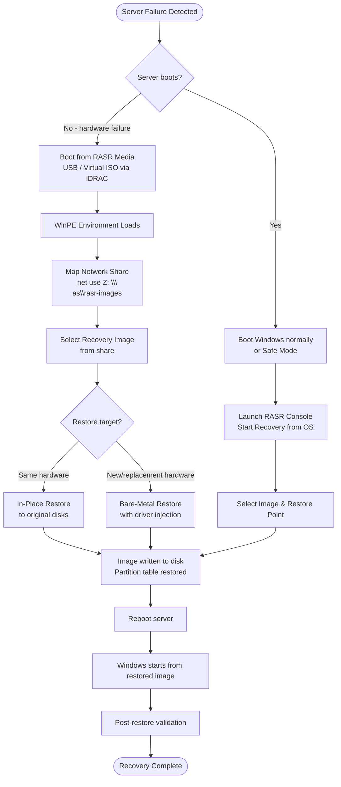

# RASR — Overview

## What is RASR?

**RASR (Recovery and System Restore)** is Dell's bare-metal recovery tool for Windows Server, shipped as a component of the **Dell OpenManage** suite. RASR allows administrators to capture a full system image of a Windows Server — including the OS volume, boot partition, and system state — and restore that image to either the original hardware or equivalent replacement hardware, without requiring a pre-installed OS.

RASR is particularly relevant in environments where:

- Physical servers must be recovered after a hardware failure without a spare pre-staged OS.
- Rapid recovery is required for servers that are not virtualized.
- Regulatory or operational requirements mandate a complete, validated OS image for each server.

RASR is distinct from file-level backup tools — it operates at the disk/partition image level and restores the complete system state in a single operation.

---

## Architecture

### Core Components

| Component | Description |
|---|---|
| **RASR Agent** | Windows service (`RASRAgent`) installed on the protected server; orchestrates image capture and communicates with OpenManage |
| **RASR Media** | Bootable WinPE-based USB drive or ISO; used to boot the server for bare-metal recovery |
| **Recovery Image** | A compressed, sector-level snapshot of the system volume(s), stored in `.wim` or proprietary RASR format on a network share or local media |
| **RASR Console** | GUI interface within Windows for initiating backups and managing recovery media |
| **Network Recovery Share** | NAS/SMB share where recovery images are stored and retrieved during restoration |

### Deployment Topology

```
Protected Windows Server
├── RASR Agent (Windows Service)
├── OS Volume Image captured → Network Share (SMB/NFS)
└── iDRAC virtual media → RASR Boot ISO
```

### WinPE Boot Environment

RASR recovery runs within **Windows Preinstallation Environment (WinPE)**. The WinPE image bundled with RASR includes:

- Network drivers (Broadcom, Intel, Mellanox) for the target Dell hardware generation.
- Storage controller drivers (PERC, HBA) for accessing local disks.
- RASR recovery engine and wizard UI.
- Tools: `diskpart`, `net use`, `wpeutil`, `notepad`, `regedit`.

The WinPE session has no persistent state — all recovery configuration (image path, credentials, target disk) is entered at boot time.

---

## Recovery Workflow



---

## Integration with Dell Server Hardware

RASR is designed specifically for Dell PowerEdge servers. It benefits from:

- **iDRAC Virtual Media** — boot the RASR ISO from iDRAC without physical USB, enabling remote bare-metal recovery.
- **PERC Storage Controller** support — WinPE includes current PERC drivers, ensuring the recovery environment can see all local disks.
- **Lifecycle Controller** — RASR can optionally be invoked from within the iDRAC Lifecycle Controller interface on compatible servers (R750, R650, R740 and later).
- **OpenManage Integration** — RASR Agent status appears within the OpenManage Server Administrator dashboard.

### Supported Dell Server Generations

| Server Generation | WinPE Driver Pack | Notes |
|---|---|---|
| PowerEdge 14G (R740, R640) | WinPE 10 | Full PERC H730/H740 support |
| PowerEdge 15G (R750, R650) | WinPE 10/11 | PERC H755, HBA355 |
| PowerEdge 16G (R760, R660) | WinPE 11 | PERC H965i, BOSS-N1 |

---

## RASR vs Alternative Recovery Methods

| Capability | RASR | Windows Server Backup | Commvault BMR | Veeam BMR |
|---|---|---|---|---|
| Bare-metal to physical | Yes | Yes | Yes | Yes |
| Dell hardware driver integration | Native | Manual | Manual | Manual |
| iDRAC boot integration | Yes | No | No | No |
| Agent-less image capture | No | Yes | No | No |
| Application-aware backup | No | Limited | Yes | Yes |
| Granular file restore | No | Yes | Yes | Yes |
| Suitable for DR-only physical | Yes | Yes | No (licensed) | No (licensed) |

RASR is best used as the last-resort bare-metal recovery mechanism for physical Dell servers, complementing an enterprise backup solution that handles file-level and application recovery.

---

## In this section

<div class="kb-grid kb-grid-3">
<a class="kb-card" href="components/"><strong>Components</strong><span>Core components, services, and technical specifications.</span></a>
<a class="kb-card" href="integrations/"><strong>Integrations</strong><span>Integration with other platforms and external systems.</span></a>
<a class="kb-card" href="standards/"><strong>Standards</strong><span>Sizing guidelines, design standards, and best practices.</span></a>
</div>
