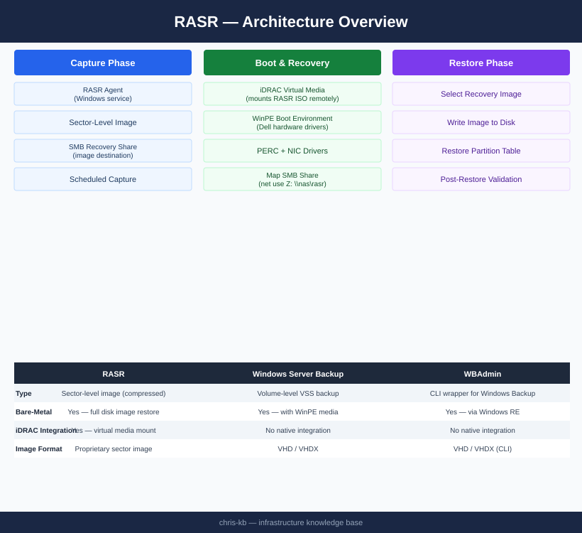
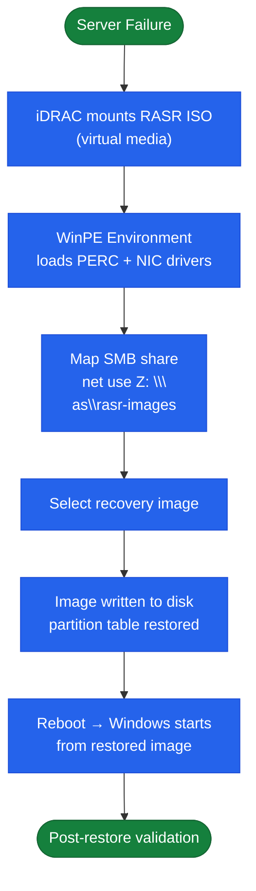

# RASR — Architecture

Dell RASR (Recovery and System Restore) bare-metal recovery for Windows Server — WinPE boot media, sector-level image capture, and iDRAC virtual media integration.

<a class="kb-card" href="how-it-works/"><strong>How It Works</strong>Recovery workflow, WinPE environment, Dell hardware integration, and RASR vs alternatives.</a>
<a class="kb-card" href="integrations/"><strong>Integrations</strong>iDRAC virtual media, OpenManage, and network share integration.</a>
<a class="kb-card" href="design-standards/"><strong>Design Standards</strong>Image naming, share layout, rotation policy, and testing schedule.</a>

| Component | Role |
|---|---|
| RASR Agent | Windows service on protected server; orchestrates image capture |
| RASR Boot Media | WinPE USB or ISO with PERC/NIC drivers; used for bare-metal recovery |
| Recovery Image | Compressed sector-level snapshot stored on SMB share |
| Network Recovery Share | SMB share where images are stored and retrieved |
| iDRAC Virtual Media | Mounts RASR ISO remotely — enables headless bare-metal recovery |

