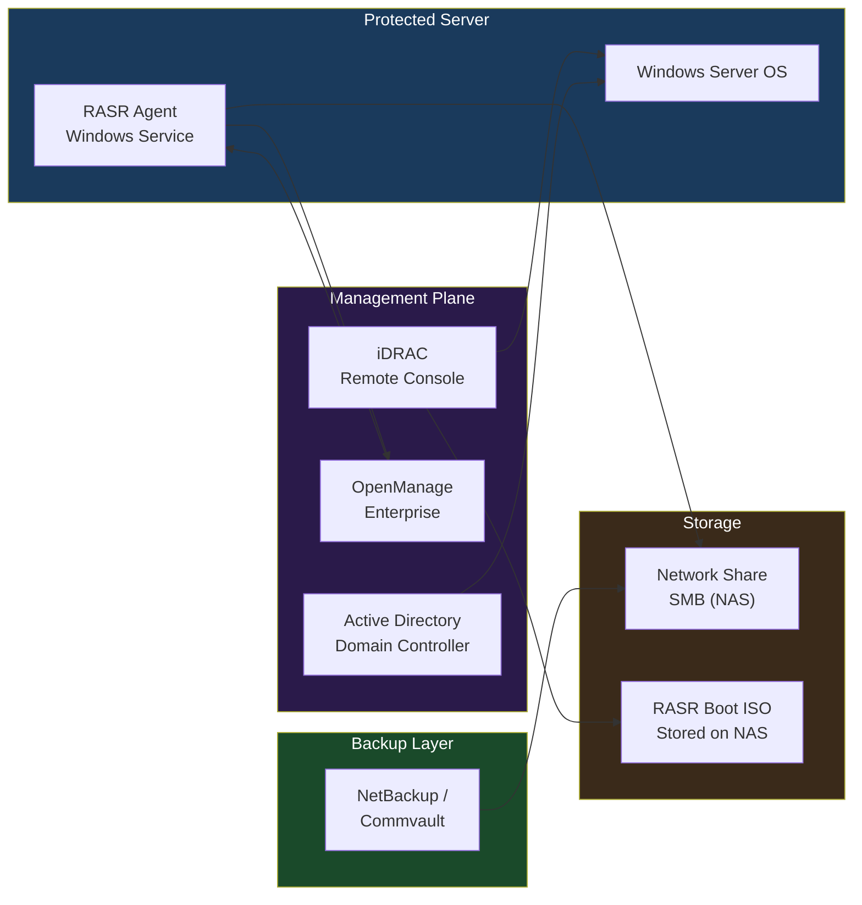

# RASR — Integrations

## Integration Overview

RASR does not operate in isolation. In a production environment it integrates with server management platforms, directory services, network storage, and backup software. Understanding these integration points is essential for both building a reliable recovery workflow and for post-restore remediation.

---

## Dell OpenManage Integration

RASR ships as part of the **Dell OpenManage Systems Management** bundle. The RASR Agent registers itself with OpenManage Server Administrator (OMSA), enabling:

- **Status reporting** — image creation success/failure visible in OMSA dashboard.
- **Event generation** — RASR events forwarded to OpenManage Essentials or OpenManage Enterprise via SNMP or WMI.
- **Centralized scheduling** — backup schedules configurable from OpenManage Enterprise (OME) in environments with OME 4.x+.

**RASR Agent service name:** `Dell RASR Service`

**Verify RASR Agent status via PowerShell:**

```powershell
Get-Service -Name "DellRASR" | Select-Object Status, StartType
```

**OpenManage Enterprise — RASR policy view:**

1. Log in to OME.
2. Navigate to **Configuration** → **Template Management** → **Recovery Templates**.
3. Review assigned RASR backup schedules per device group.

---

## iDRAC Integration (Boot from Virtual Media)

The most operationally critical integration is with **iDRAC (Integrated Dell Remote Access Controller)**. iDRAC allows the RASR recovery ISO to be mounted and booted remotely, enabling bare-metal recovery without physical access to the server room.

### Mounting RASR ISO via iDRAC Web UI

1. Log in to iDRAC web interface (`https://<idrac-ip>`).
2. Navigate to **Configuration** → **Virtual Media**.
3. Click **Connect Virtual Media**.
4. Select **Map CD/DVD** → browse to the RASR ISO on a network share or upload from local workstation.
5. Click **Map Device**.

### Booting from Virtual Media

1. **iDRAC** → **Server** → **Power** → **Boot Options**.
2. Select **Boot Once** → **Virtual CD/DVD/ISO**.
3. Perform **Power Cycle** or **Graceful Restart**.
4. Server boots into the RASR WinPE environment.

### Mounting via iDRAC racadm (CLI)

```bash
# Map virtual media ISO from a remote share
racadm remoteimage -c -u <username> -p <password> \
  -l //nas.example.com/rasr-media/RASR_Win2022.iso

# Boot once from virtual CD
racadm set iDRAC.ServerBoot.BootOnce 1
racadm set iDRAC.ServerBoot.FirstBootDevice VCD-DVD

# Power cycle
racadm serveraction powercycle
```

**Supported iDRAC versions:** iDRAC8 (14G), iDRAC9 (15G/16G). Virtual media ISO mount is available on Express and Enterprise licenses.

---

## Active Directory — Post-Recovery Domain Rejoin

After a bare-metal restore, the server's **machine account** in Active Directory may be out of sync with the restored OS image (particularly if the image is older than the machine account password rotation cycle — typically 30 days).

### Symptoms

- Event ID **3210** or **5719** in System log.
- "The secure channel to domain controller is broken."
- `nltest /sc_verify:<domain>` returns `ERROR_NO_LOGON_SERVERS`.

### Remediation Steps

**Option 1 — Reset secure channel (no rejoin required):**

```powershell
# Test the secure channel first
Test-ComputerSecureChannel -Verbose

# Repair without full rejoin
Test-ComputerSecureChannel -Repair -Credential (Get-Credential)
```

**Option 2 — Full domain rejoin:**

```powershell
# Remove from domain (local admin required)
Remove-Computer -UnjoinDomainCredential (Get-Credential) -Restart -Force

# Rejoin domain
Add-Computer -DomainName "corp.example.com" `
             -Credential (Get-Credential) `
             -OUPath "OU=Servers,DC=corp,DC=example,DC=com" `
             -Restart -Force
```

**Option 3 — Reset computer account from DC (run on a domain controller):**

```powershell
Reset-ComputerMachinePassword -Server "dc01.corp.example.com" `
                              -Credential (Get-Credential)
```

### GPO Re-application

After domain rejoin, force Group Policy application:

```cmd
gpupdate /force
```

Verify:

```cmd
gpresult /r /scope computer
```

---

## Backup Software Integration

RASR is a standalone bare-metal recovery tool and does not natively integrate at the API level with enterprise backup products. Integration is achieved operationally:

| Backup Product | Integration Method | Notes |
|---|---|---|
| Commvault | None — parallel protection | Commvault protects file/app data; RASR protects OS image |
| Veeam | None — parallel protection | Veeam instant VM recovery for VMs; RASR for physical |
| NetBackup | RASR image on NBU-protected share | NBU backs up the RASR image files on the network share |
| Windows Server Backup | Complementary | WSB for file-level; RASR for complete BMR |

**Best practice:** Store RASR images on a network share that is itself protected by your enterprise backup solution. This ensures the recovery images survive storage failures.

---

## Network Storage Integration

RASR images are stored on SMB (CIFS) network shares. The WinPE recovery environment must be able to reach this share to perform recovery.

### Share Requirements

| Requirement | Detail |
|---|---|
| Protocol | SMB 2.0 or 3.0 (SMB 1.0 not recommended) |
| Authentication | Domain service account or local share account |
| Minimum bandwidth | 1 Gbps recommended for acceptable restore times |
| Firewall | TCP 445 open between WinPE environment and NAS |
| Share permissions | Read/Write for backup service account; Read for recovery |

### Mapping a Share in WinPE

The WinPE environment does not automatically connect to network shares. During recovery, map the share manually in the WinPE shell before launching the RASR wizard:

```cmd
:: Map network share in WinPE
net use Z: \\nas01.example.com\rasr-images /user:DOMAIN\svc-rasr P@ssw0rd!

:: Verify connectivity
dir Z:\
```

### Recommended Share Structure

```text
\\nas01\rasr-images\
  ├── SERVER01\
  │     ├── SERVER01_20260101_Full.rasr
  │     └── SERVER01_20260201_Full.rasr
  ├── SERVER02\
  │     └── SERVER02_20260201_Full.rasr
  └── RASR-MEDIA\
        ├── RASR_WinSrv2019.iso
        └── RASR_WinSrv2022.iso
```

Separate directories per server simplify image selection during recovery and enable per-server retention policies.

---

## Integration Dependency Map


