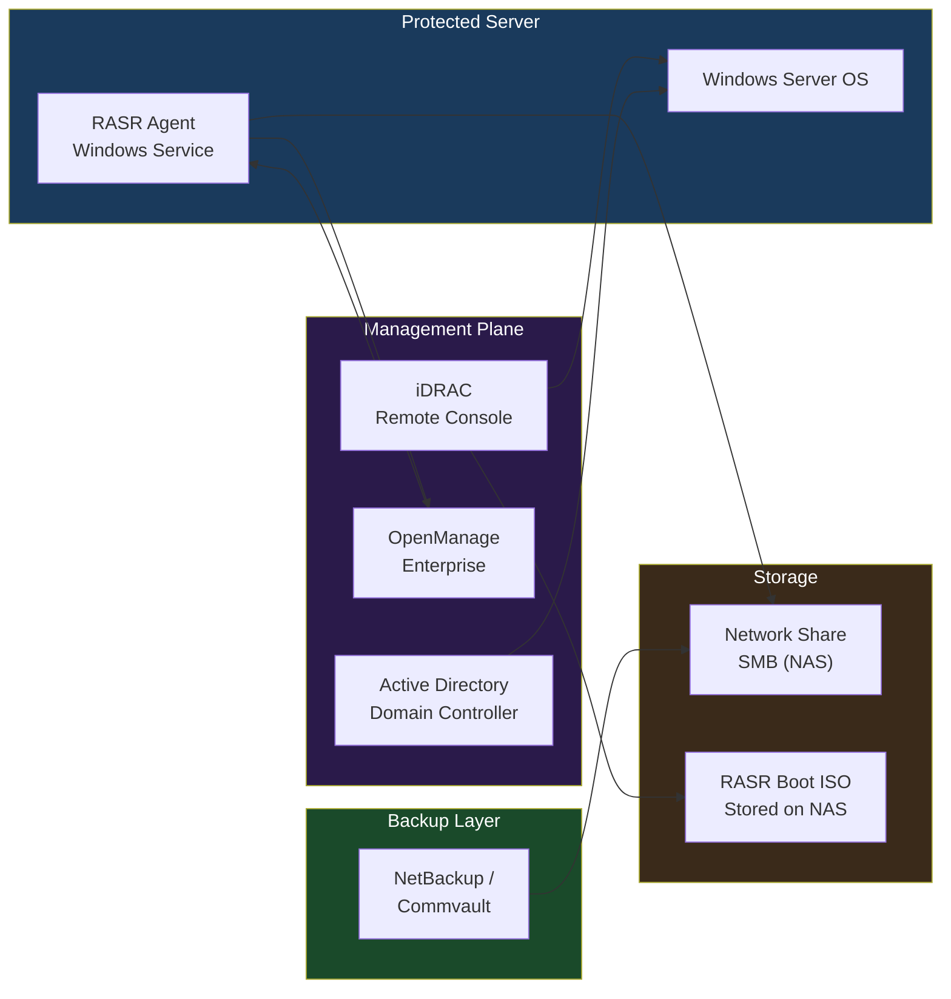

```powershell
Get-Service -Name "DellRASR" | Select-Object Status, StartType
```

```text
┌────────────────────────────────── RASR — Architecture Integrations ───────────────────────────────────┐
│                                                                                                       │
│   ┌───────────────────────────────────────────────────────────────────────────────────────────────┐   │
│   │                               RASR — External Integration Points                              │   │
│   │      Auth: Vault operator role; 2-person integrity for unlock; AD integration for PPDM UI     │   │
│   │                 Storage: connected via 443 (PPDM REST API) · 2049 (NFS vault)                 │   │
│   │            Monitoring: SNMP traps / syslog / REST API to ITSM and alerting systems            │   │
│   │        Encryption: AES-256 at rest on vault; TLS 1.3; vault lock enforces immutability        │   │
│   └───────────────────────────────────────────────────────────────────────────────────────────────┘   │
│                                                                                                       │
│                          ▼                        ▼                        ▼                          │
│                                                                                                       │
│   ┌─────────────────────────────┐  ┌─────────────────────────────┐  ┌─────────────────────────────┐   │
│   │           Identity          │  │           Storage           │  │          Monitoring         │   │
│   │          AD / LDAP          │  │     443 (PPDM REST API)     │  │        SNMP / syslog        │   │
│   │           SAML SSO          │  │       2049 (NFS vault)      │  │         REST webhook        │   │
│   │          RBAC roles         │  │       NFS / iSCSI / FC      │  │         Email alerts        │   │
│   │         MFA optional        │  │       Dedup appliance       │  │          ServiceNow         │   │
│   │          Cert auth          │  │        Object storage       │  │          Prometheus         │   │
│   └─────────────────────────────┘  └─────────────────────────────┘  └─────────────────────────────┘   │
│                                                                                                       │
│  Physical Infrastructure:                                                                             │
│  Isolated network segment (airgap switch) · Vault PowerStore/DD appliance · Clean-room ESXi hosts     │
│  Key terms:                                                                                           │
│                                                                                                       │
│  RASR          = Ransomware Air-gap Secure Recovery; full workflow from detection to clean rest       │
│  Vault         = isolated, air-gapped storage appliance receiving periodic replication copies         │
│  Vault Lock    = WORM lock applied after sync; prevents modification or deletion of vault copies      │
│  CyberSense    = ML analytics engine scanning vault data for corruption, encryption signatures        │
│  PPDM          = PowerProtect Data Manager; orchestrates protection policies, jobs, and recovery      │
│  Air Gap       = physical or logical network isolation preventing attacker lateral movement to        │
│  Delta Set     = incremental changed blocks replicated from production to vault each cycle            │
│  Clean Room    = isolated recovery environment: separate vCenter, network, and workstations           │
│  Recovery Point= specific vault snapshot timestamp from which clean recovery is performed             │
│  Integrity Lock= two-person authorization required to open vault; prevents insider unlock attac       │
│  Journal       = write-order-consistent journal on vault enabling point-in-time recovery              │
│  Scan Report   = CyberSense output: clean/suspect classification per file and block                   │
│  Retention     = vault copy lifespan; typically 30–90 days of daily snapshots kept                    │
│  RTO           = Recovery Time Objective; time from failover decision to restored service             │
│                                                                                                       │
└───────────────────────────────────────────────────────────────────────────────────────────────────────┘
```
```powershell
Reset-ComputerMachinePassword -Server "dc01.corp.example.com" `
                              -Credential (Get-Credential)
```
```cmd
gpupdate /force
```
```cmd
gpresult /r /scope computer
```
```cmd
:: Map network share in WinPE
net use Z: \\nas01.example.com\rasr-images /user:DOMAIN\svc-rasr P@ssw0rd!

:: Verify connectivity
dir Z:\
```
```text
\\nas01\rasr-images\
  ├── SERVER01\
  │     ├── SERVER01_20260101_Full.rasr
  │     └── SERVER01_20260201_Full.rasr
  ├── SERVER02\
  │     └── SERVER02_20260201_Full.rasr
  └── RASR-MEDIA\
        ├── RASR_WinSrv2019.iso
        └── RASR_WinSrv2022.iso
```

