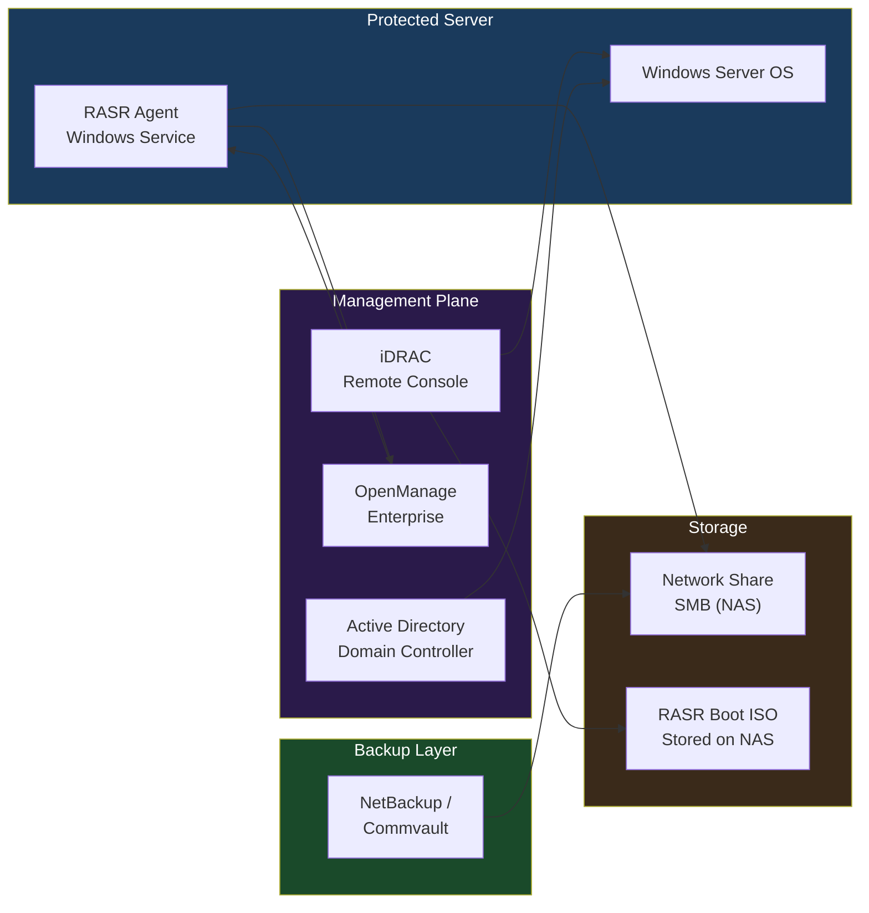

# RASR — Integrations

## Integration Overview

RASR does not operate in isolation. In a production environment it integrates with server management platforms, directory services, network storage, and backup software. Understanding these integration points is essential for both building a reliable recovery workflow and for post-restore remediation.

---

## Dell OpenManage Integration

RASR ships as part of the **Dell OpenManage Systems Management** bundle. The RASR Agent registers itself with OpenManage Server Administrator (OMSA), enabling:

- **Status reporting** — image creation success/failure visible in OMSA dashboard.
- **Event generation** — RASR events forwarded to OpenManage Essentials or OpenManage Enterprise via SNMP or WMI.
- **Centralized scheduling** — backup schedules configurable from OpenManage Enterprise (OME) in environments with OME 4.x+.

**RASR Agent service name:** `Dell RASR Service`

**Verify RASR Agent status via PowerShell:**

```powershell
Get-Service -Name "DellRASR" | Select-Object Status, StartType
```
┌────────────────────────────────── RASR — Architecture Integrations ───────────────────────────────────┐
│                                                                                                       │
│   ┌───────────────────────────────────────────────────────────────────────────────────────────────┐   │
│   │                               RASR — External Integration Points                              │   │
│   │      Auth: Vault operator role; 2-person integrity for unlock; AD integration for PPDM UI     │   │
│   │                 Storage: connected via 443 (PPDM REST API) · 2049 (NFS vault)                 │   │
│   │            Monitoring: SNMP traps / syslog / REST API to ITSM and alerting systems            │   │
│   │Encryption: AES-256 at rest on vault; TLS 1.3 for all management; vault lock enforces immutabil│   │
│   └───────────────────────────────────────────────────────────────────────────────────────────────┘   │
│                                                                                                       │
│                          ▼                        ▼                        ▼                          │
│                                                                                                       │
│   ┌─────────────────────────────┐  ┌─────────────────────────────┐  ┌─────────────────────────────┐   │
│   │           Identity          │  │           Storage           │  │          Monitoring         │   │
│   │          AD / LDAP          │  │     443 (PPDM REST API)     │  │        SNMP / syslog        │   │
│   │           SAML SSO          │  │       2049 (NFS vault)      │  │         REST webhook        │   │
│   │          RBAC roles         │  │       NFS / iSCSI / FC      │  │         Email alerts        │   │
│   │         MFA optional        │  │       Dedup appliance       │  │          ServiceNow         │   │
│   │          Cert auth          │  │        Object storage       │  │          Prometheus         │   │
│   └─────────────────────────────┘  └─────────────────────────────┘  └─────────────────────────────┘   │
│                                                                                                       │
│  Physical Infrastructure:                                                                             │
│  Isolated network segment (airgap switch) · Vault PowerStore/DD appliance · Clean-room ESXi hosts     │
│  Key terms:                                                                                           │
│                                                                                                       │
│  RASR          = Ransomware Air-gap Secure Recovery; full workflow from detection to clean rest       │
│  Vault         = isolated, air-gapped storage appliance receiving periodic replication copies         │
│  Vault Lock    = WORM lock applied after sync; prevents modification or deletion of vault copies      │
│  CyberSense    = ML analytics engine scanning vault data for corruption, encryption signatures        │
│  PPDM          = PowerProtect Data Manager; orchestrates protection policies, jobs, and recovery      │
│  Air Gap       = physical or logical network isolation preventing attacker lateral movement to        │
│  Delta Set     = incremental changed blocks replicated from production to vault each cycle            │
│  Clean Room    = isolated recovery environment: separate vCenter, network, and workstations           │
│  Recovery Point= specific vault snapshot timestamp from which clean recovery is performed             │
│  Integrity Lock= two-person authorization required to open vault; prevents insider unlock attac       │
│  Journal       = write-order-consistent journal on vault enabling point-in-time recovery              │
│  Scan Report   = CyberSense output: clean/suspect classification per file and block                   │
│  Retention     = vault copy lifespan; typically 30–90 days of daily snapshots kept                    │
│  RTO           = Recovery Time Objective; time from failover decision to restored service             │
│                                                                                                       │
└───────────────────────────────────────────────────────────────────────────────────────────────────────┘
```

**Supported iDRAC versions:** iDRAC8 (14G), iDRAC9 (15G/16G). Virtual media ISO mount is available on Express and Enterprise licenses.

---

## Active Directory — Post-Recovery Domain Rejoin

After a bare-metal restore, the server's **machine account** in Active Directory may be out of sync with the restored OS image (particularly if the image is older than the machine account password rotation cycle — typically 30 days).

### Symptoms

- Event ID **3210** or **5719** in System log.
- "The secure channel to domain controller is broken."
- `nltest /sc_verify:<domain>` returns `ERROR_NO_LOGON_SERVERS`.

### Remediation Steps

**Option 1 — Reset secure channel (no rejoin required):**

```powershell
# Test the secure channel first
Test-ComputerSecureChannel -Verbose

# Repair without full rejoin
Test-ComputerSecureChannel -Repair -Credential (Get-Credential)
```

**Option 2 — Full domain rejoin:**

```powershell
# Remove from domain (local admin required)
Remove-Computer -UnjoinDomainCredential (Get-Credential) -Restart -Force

# Rejoin domain
Add-Computer -DomainName "corp.example.com" `
             -Credential (Get-Credential) `
             -OUPath "OU=Servers,DC=corp,DC=example,DC=com" `
             -Restart -Force
```

**Option 3 — Reset computer account from DC (run on a domain controller):**

```powershell
Reset-ComputerMachinePassword -Server "dc01.corp.example.com" `
                              -Credential (Get-Credential)
```

### GPO Re-application

After domain rejoin, force Group Policy application:

```cmd
gpupdate /force
```

Verify:

```cmd
gpresult /r /scope computer
```

---

## Backup Software Integration

RASR is a standalone bare-metal recovery tool and does not natively integrate at the API level with enterprise backup products. Integration is achieved operationally:

| Backup Product | Integration Method | Notes |
|---|---|---|
| Commvault | None — parallel protection | Commvault protects file/app data; RASR protects OS image |
| Veeam | None — parallel protection | Veeam instant VM recovery for VMs; RASR for physical |
| NetBackup | RASR image on NBU-protected share | NBU backs up the RASR image files on the network share |
| Windows Server Backup | Complementary | WSB for file-level; RASR for complete BMR |

**Best practice:** Store RASR images on a network share that is itself protected by your enterprise backup solution. This ensures the recovery images survive storage failures.

---

## Network Storage Integration

RASR images are stored on SMB (CIFS) network shares. The WinPE recovery environment must be able to reach this share to perform recovery.

### Share Requirements

| Requirement | Detail |
|---|---|
| Protocol | SMB 2.0 or 3.0 (SMB 1.0 not recommended) |
| Authentication | Domain service account or local share account |
| Minimum bandwidth | 1 Gbps recommended for acceptable restore times |
| Firewall | TCP 445 open between WinPE environment and NAS |
| Share permissions | Read/Write for backup service account; Read for recovery |

### Mapping a Share in WinPE

The WinPE environment does not automatically connect to network shares. During recovery, map the share manually in the WinPE shell before launching the RASR wizard:

```cmd
:: Map network share in WinPE
net use Z: \\nas01.example.com\rasr-images /user:DOMAIN\svc-rasr P@ssw0rd!

:: Verify connectivity
dir Z:\
```

### Recommended Share Structure

```text
\\nas01\rasr-images\
  ├── SERVER01\
  │     ├── SERVER01_20260101_Full.rasr
  │     └── SERVER01_20260201_Full.rasr
  ├── SERVER02\
  │     └── SERVER02_20260201_Full.rasr
  └── RASR-MEDIA\
        ├── RASR_WinSrv2019.iso
        └── RASR_WinSrv2022.iso
```

Separate directories per server simplify image selection during recovery and enable per-server retention policies.

---

## Integration Dependency Map


