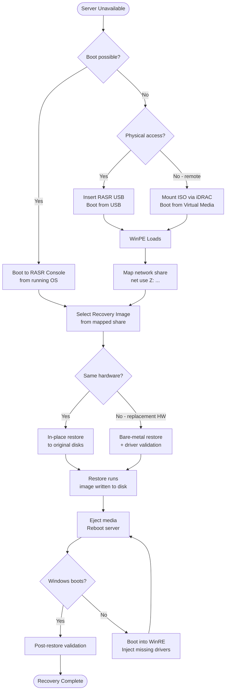

# RASR — Backup & Restore


<div class="kb-summary">
Backup & Restore reference covering Creating a System Image, Bare-Metal Restore to Replacement Hardware, Restore Decision Flowchart, Post-Restore Validation Checklist.
</div>

## Creating a System Image

### Prerequisites

- RASR Agent installed and running (`DellRASR` service).
- Sufficient space on the destination network share (typically 1.5–2x the used space on the OS volume).
- Service account with write access to the backup share.
- Server has network connectivity to the NAS target.

### Creating an Image via RASR Console (GUI)

1. Open **Dell RASR** from Start Menu → **Dell** → **Recovery and System Restore**.
2. Click **Create Recovery Image**.
3. Select volumes to include (at minimum: System Reserved, C:\ drive).
4. Set the destination:
   - **Local media** (USB drive): Select the drive letter.
   - **Network share**: Enter `\\nas01\rasr-images\SERVER01` → authenticate with service account.
5. Optionally configure compression level (Balanced or High).
6. Click **Create** — the wizard shows progress and elapsed time.
7. Confirm the image was written successfully and note the image filename.

### Creating an Image via Command Line

```cmd
:: Basic image to network share
rasrutil.exe /backup /dest \\nas01\rasr-images\SERVER01 /user DOMAIN\svc-rasr /pass P@ssw0rd!

:: With compression and verbose output
rasrutil.exe /backup /dest \\nas01\rasr-images\SERVER01 /compress /log C:\Logs\rasr-backup.log /user DOMAIN\svc-rasr /pass P@ssw0rd!
```
```
┌─────────────────────────────────────── RASR — Backup & Restore ───────────────────────────────────────┐
│                                                                                                       │
│    Backup flow: quiesce source → snapshot/copy → transfer → write to target → catalog                 │
│                                                                                                       │
│   ┌──────────────────────────────────────────────┐  ┌─────────────────────────────────────────────┐   │
│   │             Backup (Protection)              │  │              Restore (Recovery)             │   │
│   │              cr_vault_cli sync               │  │             cr_vault_cli status             │   │
│   │              Quiesce source I/O              │  │            Select recovery point            │   │
│   │             Take snapshot / CBT              │  │           Mount or copy to target           │   │
│   │           Transfer changed blocks            │  │              Validate integrity             │   │
│   │             Commit to repository             │  │             Restart application             │   │
│   └──────────────────────────────────────────────┘  └─────────────────────────────────────────────┘   │
│                                                                                                       │
│   ┌───────────────────────────────────────────────────────────────────────────────────────────────┐   │
│   │                                       Key RASR Commands                                       │   │
│   │                               Backup trigger  : cr_vault_cli sync                             │   │
│   │                              List points     : cr_vault_cli status                            │   │
│   │                                Health status   : cybersense scan                              │   │
│   │                                Retention mgmt  : ppdm recover vm                              │   │
│   └───────────────────────────────────────────────────────────────────────────────────────────────┘   │
│                                                                                                       │
│  Physical Infrastructure:                                                                             │
│  Isolated network segment (airgap switch) · Vault PowerStore/DD appliance · Clean-room ESXi hosts     │
│  Key terms:                                                                                           │
│                                                                                                       │
│  RASR          = Ransomware Air-gap Secure Recovery; full workflow from detection to clean rest       │
│  Vault         = isolated, air-gapped storage appliance receiving periodic replication copies         │
│  Vault Lock    = WORM lock applied after sync; prevents modification or deletion of vault copies      │
│  CyberSense    = ML analytics engine scanning vault data for corruption, encryption signatures        │
│  PPDM          = PowerProtect Data Manager; orchestrates protection policies, jobs, and recovery      │
│  Air Gap       = physical or logical network isolation preventing attacker lateral movement to        │
│  Delta Set     = incremental changed blocks replicated from production to vault each cycle            │
│  Clean Room    = isolated recovery environment: separate vCenter, network, and workstations           │
│  Recovery Point= specific vault snapshot timestamp from which clean recovery is performed             │
│  Integrity Lock= two-person authorization required to open vault; prevents insider unlock attac       │
│  Journal       = write-order-consistent journal on vault enabling point-in-time recovery              │
│  Scan Report   = CyberSense output: clean/suspect classification per file and block                   │
│  Retention     = vault copy lifespan; typically 30–90 days of daily snapshots kept                    │
│  RTO           = Recovery Time Objective; time from failover decision to restored service             │
│                                                                                                       │
└───────────────────────────────────────────────────────────────────────────────────────────────────────┘
```
```sql

### Phase 3 — Map Network Share

Before selecting an image, connect to the network share where images are stored:

```cmd
net use Z: \\nas01.example.com\rasr-images /user:DOMAIN\svc-rasr P@ssw0rd!
```

Verify the image directory is accessible:

```cmd
dir Z:\SERVER01\
```

### Phase 4 — Select Image and Restore

1. In the RASR wizard, click **Restore from Image**.
2. Browse to `Z:\SERVER01\` and select the desired `.rasr` image file.
3. Select the target disk (the wizard shows disk size and current partition layout).
4. Confirm the restore will overwrite the target disk.
5. Click **Restore** — progress bar shows bytes written and estimated time remaining.

**Typical restore times:**

| Image Size | 1 Gbps Network | 10 Gbps Network |
|---|---|---|
| 50 GB | ~45 min | ~8 min |
| 100 GB | ~90 min | ~15 min |
| 200 GB | ~3 hrs | ~30 min |

### Phase 5 — Reboot and Validate

1. After the wizard confirms completion, eject the RASR media or disconnect virtual media in iDRAC.
2. Reboot the server.
3. Monitor boot via iDRAC console.
4. Log in and proceed with post-restore validation.

---

## Bare-Metal Restore to Replacement Hardware

When restoring to a different physical server (e.g., hardware replacement), additional steps are required:

1. Ensure the replacement server is the same model or at minimum uses the same storage controller and NIC model.
2. RASR WinPE includes Dell hardware driver packs — most same-generation hardware is supported.
3. If the replacement is a different model, manually inject drivers into WinPE before restore:

```cmd
:: In WinPE — inject missing driver
Dism /Image:C:\ /Add-Driver /Driver:X:\drivers\perc_h755.inf
```

4. After restore, if Windows fails to boot due to missing drivers:
   - Boot into Windows Recovery Environment (WinRE).
   - Use `dism /online /Add-Driver` to inject the correct storage/NIC driver.

---

## Restore Decision Flowchart



---

## Post-Restore Validation Checklist

| # | Check | Command / Method |
|---|---|---|
| 1 | Server boots to login prompt | iDRAC console |
| 2 | OS version and patch level correct | `winver` |
| 3 | Hostname correct | `hostname` |
| 4 | IP address / DNS correct | `ipconfig /all` |
| 5 | Domain membership intact | `whoami /fqdn` or `systeminfo \| findstr /i domain` |
| 6 | Secure channel to DC valid | `Test-ComputerSecureChannel -Verbose` |
| 7 | Critical services running | `Get-Service \| Where Status -eq "Stopped"` |
| 8 | Application functional | Application-specific health check |
| 9 | Event Log — no critical boot errors | Event Viewer → System → Error/Critical |
| 10 | RASR Agent service running | `Get-Service DellRASR` |
| 11 | New backup image created post-restore | Run RASR backup immediately |
| 12 | Recovery documented in ITSM | Incident/change record updated |
