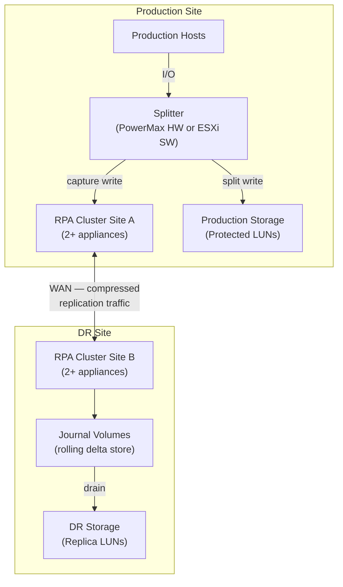
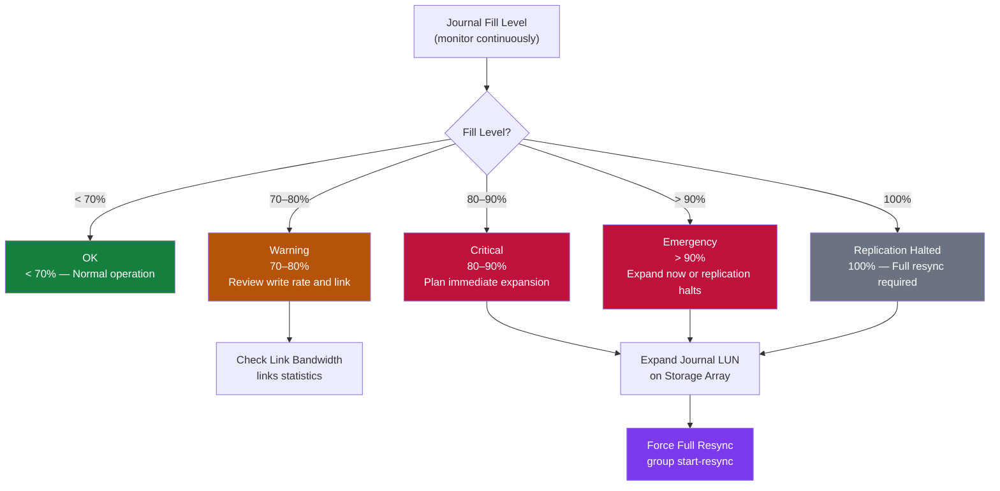

# RecoverPoint — Components

> Part of the [RecoverPoint](../../) > [Architecture](../) reference.

---

## Core Components

| Component | Role |
|---|---|
| RPA Cluster | Per-site appliance cluster; intercepts and forwards writes |
| Consistency Group (CG) | Replication unit grouping one or more volumes |
| Copy | A point-in-time image; each CG has at least a Production and DR copy |
| Journal Volume | Stores delta changes; governs how far back recovery can go |
| Splitter | Intercepts host I/O before it reaches the array |

---

## Component Hierarchy



## Consistency Groups

A Consistency Group (CG) is the primary replication unit in RecoverPoint. Each CG groups one or more volumes that must be recovered together as a consistent set — for example, all data and log LUNs for an Oracle database. RecoverPoint guarantees write-order consistency across all volumes in a CG.

| Property | Description |
|---|---|
| Production Copy | The live, writable copy of the data at the production site |
| DR Copy | The replica at the remote (DR) site — read-only unless image access is enabled |
| Local Copy | Optional CDP copy at the production site for local point-in-time recovery |
| Journal | Per-copy rolling delta store; determines recovery window |
| Bookmark | A named or automatic point-in-time marker within the journal |

### Viewing CG State

```bash
# SSH to RPA cluster management IP
ssh admin@<rpa-cluster-ip>

# All CGs and their current replication state
groups status

# Detailed CG state including RPO, lag, and journal utilization
groups status detail

# State of a specific CG
group status --gname <cg_name>

# Via REST API — summary of all CGs
RP="https://<rpa-ip>/fapi/rest/5_1"
AUTH="-u admin:password --insecure"
curl -s $AUTH "$RP/group/all_groups_details" | python3 -m json.tool
```

### Creating and Configuring a CG

CGs are created via the RecoverPoint Management Application (RPMA) or vSphere plugin (RP4VM). CLI steps below apply to RPMA-managed environments.

```bash
# Step 1 — Add volumes to a new CG (interactive via boxmgmt)
boxmgmt
# Navigate: Group Management → Add Group → follow wizard

# Step 2 — Set RPO alarm threshold for a CG
group set_rpo --gname <cg_name> --rpo_seconds 300   # 5-minute RPO

# Step 3 — Enable a CG after creation
group enable --gname <cg_name>

# Step 4 — Verify CG state post-creation
group status --gname <cg_name>
```

### Suspending and Resuming Replication

Suspend CGs before planned maintenance on protected storage or hosts.

```bash
# Suspend a single CG
group disable-replication --gname <cg_name>

# Suspend all CGs (pre-maintenance)
groups disable-replication

# Resume a single CG after maintenance
group enable-replication --gname <cg_name>

# Resume all CGs
groups enable-replication

# Monitor return to ACTIVE state after resume
watch -n 10 "ssh admin@<rpa-ip> 'groups status'"
```

### Bookmarks

Bookmarks are named points in time within the journal. Use them for application-consistent DR tests and recovery.

```bash
# Create a manual bookmark (e.g., before a patching window)
group create_bookmark --gname <cg_name> --name "pre-patch-$(date +%Y%m%d)"

# List available bookmarks for a CG
group list_bookmarks --gname <cg_name>

# Enable image access at a specific bookmark
group enable-image-access --gname <cg_name> --copy DR --image <bookmark_name>

# Disable image access (return to replication)
group disable-image-access --gname <cg_name>
```

### CG Pre-Test Checklist

Use before any DR test or planned failover.

| Check | Command | Expected | Why |
|---|---|---|---|
| CG state | `groups status` | All `ACTIVE` | Non-active CG means replication is not protecting data |
| Journal utilization | `journals list` | < 70% | High journal fill during test can trigger overflow and halt replication |
| RPO compliance | `group status --gname <n>` | Within SLA | Confirms DR copy is at an acceptable point in time for testing |
| Image access disabled | `groups status detail` | No active image access | Leftover image access from a previous test causes replication pause |
| No active alarms | `alarms list` | No critical alarms | Active hardware alarms may indicate instability before failover |
| DR site reachable | `network connectivity check` | Connected | DR site must be accessible before enabling image access |

---

## Journals

The RecoverPoint journal is a rolling delta store that records every write made to protected volumes. It enables recovery to any point in time within the journal window. Each copy (production, DR, local) has its own dedicated journal volumes.

| Concept | Description |
|---|---|
| Journal Window | How far back in time you can recover; determined by journal size and write rate |
| Journal Drain | The process of applying journal data to the DR copy during replication |
| Journal Overflow | When write rate exceeds journal drain rate and the journal fills to capacity |
| Bookmark | A named point-in-time marker stored in the journal |

### Viewing Journal State

```bash
# SSH to RPA cluster
ssh admin@<rpa-cluster-ip>

# List all journals with utilization and status
journals list

# Detailed journal information for a specific CG
journal status --gname <cg_name>

# REST API — journal volumes per CG copy
RP="https://<rpa-ip>/fapi/rest/5_1"
AUTH="-u admin:password --insecure"

curl -s $AUTH "$RP/group/all_groups_details" | python3 -c "
import sys, json
data = json.load(sys.stdin)
for g in data.get('innerSet', []):
    for copy in g.get('groupCopies', {}).get('innerSet', []):
        jvols = len(copy.get('journalVolumeList', {}).get('innerSet', []))
        print(f\"CG={g['name']:30s}  copy={copy.get('name','?'):15s}  journal_vols={jvols}\")
"
```

### Journal Sizing Guidelines

Journal size determines the recovery window. Size based on the average write rate and required retention.

```
Journal size (GB) = Write rate (MB/s) x 3600 x Retention hours / 1024

Example:
  Write rate: 50 MB/s
  Retention:  4 hours
  Journal size = 50 x 3600 x 4 / 1024 = ~703 GB

Minimum recommended: 10x hourly write rate
```

| Environment Write Rate | Minimum Journal Size | Recommended Retention |
|---|---|---|
| < 10 MB/s | 50 GB | 8 hours |
| 10–50 MB/s | 200–750 GB | 4–8 hours |
| 50–200 MB/s | 750 GB – 3 TB | 2–4 hours |
| > 200 MB/s | Size per calculation | Consult RecoverPoint sizing guide |

### Expanding a Journal

Journal volumes can be expanded non-disruptively on most arrays.

```bash
# Step 1 — Identify which journal needs expansion
journals list

# Step 2 — Expand the journal LUN on the storage array
# (PowerMax example via SYMCLI)
symdev -sid <SID> modify <dev_id> -cap <new_size_gb> -captype gb

# Step 3 — Rescan the journal volume in RecoverPoint
# Via RPMA: Group Management → <CG> → Volumes → Rescan

# Step 4 — Confirm expanded capacity
journal status --gname <cg_name>
```

### Journal Overflow Response

If a journal reaches 100%, replication halts and the CG enters an error state. A full resync will be required.

```bash
# Check which CG has a full journal
journals list | grep -i "100\|full\|overflow"

# Immediate triage — check link state (overflow may be caused by link down)
links statistics

# Check CG state
group status --gname <cg_name>

# If link is down: restore connectivity — RP will resume draining the journal automatically
# If link is up and journal is > 90%: expand journal immediately (see above)

# If journal overflowed and CG is in error — force full resync after journal is expanded
group start-resync --gname <cg_name>
```

### Journal Monitoring Thresholds

Set alerts at the RPMA level and forward events to SIEM via syslog.

| Threshold | Action | Why |
|---|---|---|
| > 70% | Warning alert; review write rate and link bandwidth | Early warning allows journal expansion before emergency action |
| > 80% | Critical alert; plan immediate journal expansion | Journal drain rate must exceed write rate to prevent overflow |
| > 90% | Emergency; expand journal before replication halts | At 100%, RP halts replication and a full resync is required |
| 100% | Replication halted; full resync required after expansion | Full overflow destroys the recovery window — full resync is the only recovery path |



```bash
# Set journal alarm threshold (via RPMA / boxmgmt)
# Navigate: Group Management → <CG> → Settings → Journal Alarms
# Set high-watermark threshold to 70%
```
