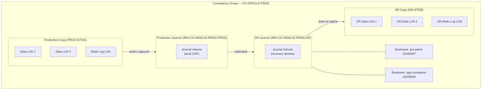

# RecoverPoint — Standards

> Part of the [RecoverPoint](../../index.md) > [Architecture](../index.md) reference.

---

## Naming Conventions

### Consistency Groups

```text
CG-<app>-<env>
```
```

Example: `JRN-CG-ORACLE-PROD-DR`

### RPA Cluster Names

```text
RPAC-<site>-<number>
```

Example: `RPAC-SITEA-01`, `RPAC-SITEB-01`

---

## Splitter Selection

| Environment | Recommended Splitter | Why |
|---|---|---|
| PowerMax / VMAX All Flash | Hardware splitter (array-embedded) | No host agent required; lower overhead; integrated with array microcode |
| VMware environment (non-PowerMax) | Software splitter (RP4VM) | Works at VMDK level independent of underlying storage array |
| iSCSI-attached storage | iSCSI splitter | FC hardware splitter not available; iSCSI splitter provides equivalent write capture |

---

## Configuration Baseline

- Each CG must have at minimum one production copy and one DR copy.
- Journal volumes should be dedicated LUNs; do not share with application data.
- Journal size: minimum 10x the hourly write rate; size for the required recovery window.
- Enable compression on the replication link for WAN-connected sites unless link is already dedicated DWDM.
- CGs protecting the same application tier (e.g., Oracle DB + redo logs) must be in the same consistency group to ensure write-order consistency.
- RPO target must be documented per CG and reviewed quarterly.

---

## Consistency Group Configuration Checklist

- [ ] CG name follows `CG-<app>-<env>` convention
- [ ] Production and DR copy names set correctly
- [ ] Journal volumes provisioned and sized per standard
- [ ] RPO target configured and alarms set
- [ ] Splitter type confirmed for array type
- [ ] Replication link bandwidth allocated
- [ ] Test failover scheduled and documented in change record
- [ ] CG owner and application contact recorded in CMDB

---

## RPO Tiers

| Tier | Target RPO | Review Frequency | Why |
|---|---|---|---|
| Tier 1 (Critical) | < 15 seconds | Monthly DR test | Financial, transactional, or regulatory systems where data loss is unacceptable |
| Tier 2 (Business) | < 5 minutes | Quarterly DR test | Business-critical apps where short data loss is tolerable but must be bounded |
| Tier 3 (Standard) | < 30 minutes | Semi-annual DR test | Dev/test or non-critical workloads with relaxed recovery expectations |

## RecoverPoint CG Architecture


