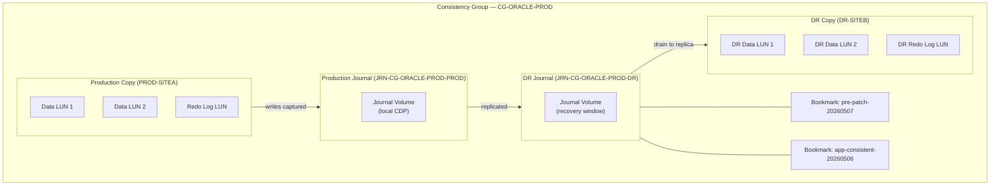

# RecoverPoint — Standards

> Part of the [RecoverPoint](../../index.md) > [Architecture](../index.md) reference.

---

## Naming Conventions

### Consistency Groups

```text
CG-<app>-<env>
```
┌─────────────────────────────────── RecoverPoint — Design Standards ───────────────────────────────────┐
│                                                                                                       │
│   ┌───────────────────────────────────────────────────────────────────────────────────────────────┐   │
│   │    Design principles: right-size RPAs, journal volumes, and WAN bandwidth before deployment   │   │
│   │  RPA count: 2 minimum per site; add one RPA per 50 protected VMs or 500 MB/s write throughput │   │
│   │       Journal size: (peak write MB/s) × (CDP window hours) × 3600 × 1.3 overhead factor       │   │
│   │   WAN bandwidth: match replication throughput; deduplicated traffic typically 30–50% of raw   │   │
│   └───────────────────────────────────────────────────────────────────────────────────────────────┘   │
│                                                                                                       │
│                  ▼                                ▼                                ▼                  │
│                                                                                                       │
│   ┌─────────────────────────────┐  ┌─────────────────────────────┐  ┌─────────────────────────────┐   │
│   │          RPA Sizing         │  │        Journal Sizing       │  │        Network Design       │   │
│   │        2 RPA minimum        │  │      2–24 hr CDP window     │  │     Dedicated repl VLAN     │   │
│   │        1 RPA / 50 VMs       │  │     ×1.3 overhead factor    │  │        MTU 9000 jumbo       │   │
│   │      4 vCPU / 8 GB RAM      │  │      Separate datastore     │  │      QoS priority class     │   │
│   │     Anti-affinity rules     │  │     VMDK thin provision     │  │      WAN dedup enabled      │   │
│   │       Mgmt IP per RPA       │  │      Alarm on >80% full     │  │       Latency <100 ms       │   │
│   └─────────────────────────────┘  └─────────────────────────────┘  └─────────────────────────────┘   │
│                                                                                                       │
│    Physical: RPA VMs pinned to dedicated ESXi hosts; journal on separate LUNs from prod               │
│                                                                                                       │
│    Key terms:                                                                                         │
│                                                                                                       │
│    RPA sizing          = Calculate RPA count from VM count and write throughput; minimum 2 per site   │
│    Journal sizing      = Peak writes × CDP window × overhead; use RP Sizer tool for accuracy          │
│    CDP window          = How far back in time the journal allows recovery; typically 2–24 hours       │
│    Overhead factor     = 1.3× buffer for journal metadata, sequencing, and burst write absorption     │
│    Anti-affinity       = DRS rule keeping RPA VMs on separate ESXi hosts for HA                       │
│    Dedicated VLAN      = Isolate RPA replication traffic from production VM and management traffic    │
│    Jumbo frames        = MTU 9000 on replication VLAN; reduces fragmentation; improves throughput     │
│    QoS                 = DSCP marking on replication traffic; prioritised over bulk data transfers    │
│    CG design           = Group VMs by application tier; same CG = same RPO and same failover unit     │
│    RP Sizer            = Dell sizing tool; inputs write rate, change rate, and WAN link speed         │
│    Thin provision      = Journal VMDKs thin-provisioned; grow on demand up to alarm threshold         │
│    WAN dedup           = RPA deduplicates replication stream; reduces bandwidth by ~30–50%            │
│                                                                                                       │
└───────────────────────────────────────────────────────────────────────────────────────────────────────┘
```

Example: `RPAC-SITEA-01`, `RPAC-SITEB-01`

---

## Splitter Selection

| Environment | Recommended Splitter | Why |
|---|---|---|
| PowerMax / VMAX All Flash | Hardware splitter (array-embedded) | No host agent required; lower overhead; integrated with array microcode |
| VMware environment (non-PowerMax) | Software splitter (RP4VM) | Works at VMDK level independent of underlying storage array |
| iSCSI-attached storage | iSCSI splitter | FC hardware splitter not available; iSCSI splitter provides equivalent write capture |

---

## Configuration Baseline

- Each CG must have at minimum one production copy and one DR copy.
- Journal volumes should be dedicated LUNs; do not share with application data.
- Journal size: minimum 10x the hourly write rate; size for the required recovery window.
- Enable compression on the replication link for WAN-connected sites unless link is already dedicated DWDM.
- CGs protecting the same application tier (e.g., Oracle DB + redo logs) must be in the same consistency group to ensure write-order consistency.
- RPO target must be documented per CG and reviewed quarterly.

---

## Consistency Group Configuration Checklist

- [ ] CG name follows `CG-<app>-<env>` convention
- [ ] Production and DR copy names set correctly
- [ ] Journal volumes provisioned and sized per standard
- [ ] RPO target configured and alarms set
- [ ] Splitter type confirmed for array type
- [ ] Replication link bandwidth allocated
- [ ] Test failover scheduled and documented in change record
- [ ] CG owner and application contact recorded in CMDB

---

## RPO Tiers

| Tier | Target RPO | Review Frequency | Why |
|---|---|---|---|
| Tier 1 (Critical) | < 15 seconds | Monthly DR test | Financial, transactional, or regulatory systems where data loss is unacceptable |
| Tier 2 (Business) | < 5 minutes | Quarterly DR test | Business-critical apps where short data loss is tolerable but must be bounded |
| Tier 3 (Standard) | < 30 minutes | Semi-annual DR test | Dev/test or non-critical workloads with relaxed recovery expectations |

## RecoverPoint CG Architecture


