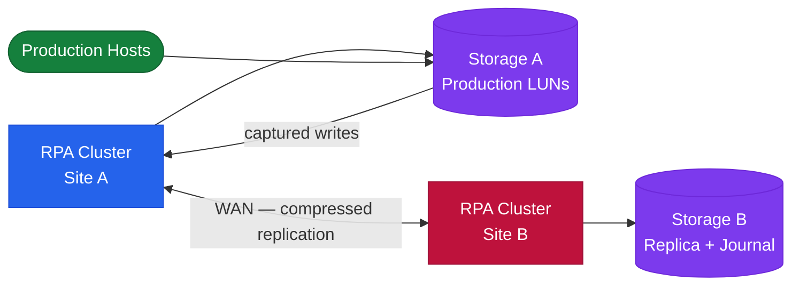

# RecoverPoint — How It Works


<div class="kb-summary">
How It Works reference covering Overview, Topology, Journal Sizing, Journal Monitoring Thresholds, High Availability.
</div>

## Overview

Dell EMC RecoverPoint provides continuous data protection (CDP) and continuous remote replication (CRR) through journal-based replication. RPA (RecoverPoint Appliance) clusters at each site intercept writes via splitters and maintain a rolling journal enabling point-in-time recovery to any point within the journal window. All volumes that must be recovered together are grouped into a Consistency Group (CG).

## Topology


```text
┌───────────────────────────────────── RecoverPoint — How It Works ─────────────────────────────────────┐
│                                                                                                       │
│   ┌───────────────────────────────────────────────────────────────────────────────────────────────┐   │
│   │         Write Flow: VM write → ESXi splitter forks I/O → production path + RPA buffer         │   │
│   │         RPA bundles writes into delta sets → compresses → sends to remote RPA over IP         │   │
│   │        Remote RPA applies delta set to journal; journal tracks sequence and timestamps        │   │
│   │       Recovery: select bookmark or time → RPA rolls journal forward/back → present image      │   │
│   └───────────────────────────────────────────────────────────────────────────────────────────────┘   │
│                                                                                                       │
│    Step 1: Write  ──► Step 2: Split  ──► Step 3: Journal  ──► Step 4: Replicate  ──► Step 5: Apply    │
│                                                                                                       │
│                          ▼                                                 ▼                          │
│                                                                                                       │
│   ┌──────────────────────────────────────────────┐  ┌─────────────────────────────────────────────┐   │
│   │                 Source Side                  │  │                 Target Side                 │   │
│   │             VM disk write issued             │  │          Remote RPA receives delta          │   │
│   │            Splitter forks to RPA             │  │           Writes to remote journal          │   │
│   │            RPA buffers in memory             │  │             Updates replica VMDK            │   │
│   │            Bundles into delta set            │  │           Advances journal pointer          │   │
│   │            Compresses, sends WAN             │  │           Logs bookmark timestamps          │   │
│   └──────────────────────────────────────────────┘  └─────────────────────────────────────────────┘   │
│                                                                                                       │
│    Physical: journal = dedicated VMDK on datastore; splitter = ESXi kernel module; RPA = VM appliance │
│                                                                                                       │
│    Key terms:                                                                                         │
│                                                                                                       │
│    Write splitting     = Non-blocking fork of every VM disk write at hypervisor layer                 │
│    Delta set           = Batch of compressed write deltas transferred from source to target RPA       │
│    Journal apply       = Process of writing delta sets to journal VMDK in sequence on target side     │
│    Journal pointer     = Current position in the journal; marks which deltas have been applied        │
│    Bookmark         = Named timestamp in journal; recovery to a known-good application state          │
│    Crash-consistent    = All VMs in CG captured at the same write sequence; safe for OS-level recovery│
│    App-consistent      = Quiesced snapshot of CG (VMware Tools quiesce); safe for DB-level recovery   │
│    Image access        = Temporary mount of journal image; test without committing; auto rolls back   │
│    CDP window          = Journal depth in time; configurable; determines how far back recovery reaches│
│    Replication lag     = Difference between source write time and target journal apply time (=RPO)    │
│    WAN throttle        = Bandwidth cap on replication link per CG; prevents production WAN saturation │
│    Compression ratio   = Typical 2:1–4:1 reduction on replication traffic via RPA dedup/compress      │
│                                                                                                       │
└───────────────────────────────────────────────────────────────────────────────────────────────────────┘
```
```

| Environment Write Rate | Minimum Journal Size | Recommended Retention |
|---|---|---|
| < 10 MB/s | 50 GB | 8 hours |
| 10–50 MB/s | 200–750 GB | 4–8 hours |
| 50–200 MB/s | 750 GB – 3 TB | 2–4 hours |

## Journal Monitoring Thresholds

| Threshold | Action |
|---|---|
| > 70% | Warning alert; review write rate and link bandwidth |
| > 80% | Critical alert; plan immediate journal expansion |
| > 90% | Emergency; expand journal before replication halts |
| 100% | Replication halted; full resync required after expansion |

## High Availability

- RPA clusters operate active-active within a site; an RPA failure causes automatic redistribution of CGs to surviving RPAs
- Quorum is maintained within the cluster; loss of majority halts replication to protect data consistency
- Minimum 2 RPAs per cluster for HA; 4+ for large environments
