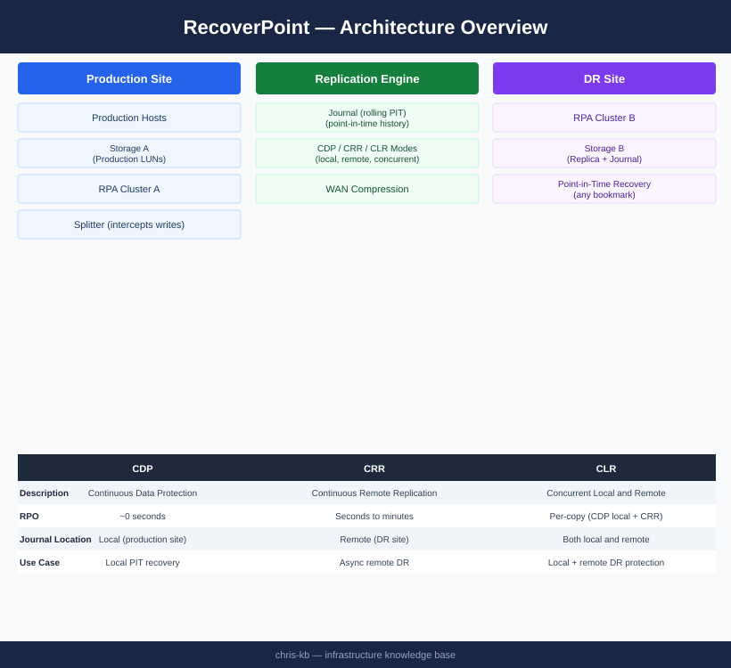

# RecoverPoint — Architecture

<div class="kb-summary">
Dell EMC RecoverPoint journal-based replication — RPA clusters intercept writes via splitters and maintain a rolling journal enabling point-in-time recovery across CDP, CRR, and CLR modes.
</div>

```
┌───────────────────────────────────── RecoverPoint — Architecture ─────────────────────────────────────┐
│                                                                                                       │
│   ┌───────────────────────────────────────────────────────────────────────────────────────────────┐   │
│   │      RP4VM Architecture: ESXi splitter ──► RPA cluster ──► journal volumes ──► remote RPA     │   │
│   │         RPA cluster: active/active pair; each RPA handles subset of consistency groups        │   │
│   │   Splitter intercepts every VM write at ESXi kernel; sends copy to RPA without blocking I/O   │   │
│   │     Journal stores delta writes; replication link carries deltas from source to target RPA    │   │
│   └───────────────────────────────────────────────────────────────────────────────────────────────┘   │
│                                                                                                       │
│                  ▼                                ▼                                ▼                  │
│                                                                                                       │
│   ┌─────────────────────────────┐  ┌─────────────────────────────┐  ┌─────────────────────────────┐   │
│   │          Write Path         │  │         RPA Cluster         │  │        Journal / Copy       │   │
│   │       VM issues write       │  │        2–8 RPA nodes        │  │        Local journal        │   │
│   │     ESXi splitter forks     │  │       Active/active HA      │  │        Remote journal       │   │
│   │      Prod write → array     │  │         Owns CG set         │  │       CDP depth = RPO       │   │
│   │      Copy → RPA buffer      │  │        vSphere plugin       │  │       Replica volumes       │   │
│   │     RPA applies to jrnl     │  │       WAN compression       │  │      Bookmark timeline      │   │
│   └─────────────────────────────┘  └─────────────────────────────┘  └─────────────────────────────┘   │
│                                                                                                       │
│    Physical: RPAs run as VMs (4 vCPU/8 GB) on dedicated ESXi host; journal vols on separate datastore │
│                                                                                                       │
│    Key terms:                                                                                         │
│                                                                                                       │
│    RPA cluster      = 2–8 RecoverPoint Appliance VMs per site; active/active; no SPOF                 │
│    ESXi splitter    = Kernel module on each ESXi host; intercepts VM disk writes non-disruptively     │
│    Local copy       = Protection within same site (cluster); journal on same or separate DS           │
│    Remote copy      = Cross-site replication; delta compressed over IP WAN; bandwidth-adaptive        │
│    Journal volume   = Dedicated VMDK per copy; stores write deltas; sized for desired CDP window      │
│    Replica volume   = Copy of production VMDK at target site; updated by journal apply process        │
│    Delta set        = Unit of replication transfer between source and target RPA                      │
│    WAN compression  = RPA compresses and deduplicates replication traffic before sending across WAN   │
│    Active/active    = Both RPAs handle I/O simultaneously; failover automatic on RPA loss             │
│    CG ownership     = Each CG assigned to one RPA; redistributed automatically on RPA failure         │
│    vSphere plugin   = RP4VM vCenter plugin; exposes CG management, failover, and image access in UI   │
│    Bubble network   = Isolated portgroup for test VMs; no production traffic reaches copies           │
│                                                                                                       │
└───────────────────────────────────────────────────────────────────────────────────────────────────────┘
```
```text
┌───────────────────────────────────── RecoverPoint — Architecture ─────────────────────────────────────┐
│                                                                                                       │
│   ┌───────────────────────────────────────────────────────────────────────────────────────────────┐   │
│   │      RP4VM Architecture: ESXi splitter ──► RPA cluster ──► journal volumes ──► remote RPA     │   │
│   │         RPA cluster: active/active pair; each RPA handles subset of consistency groups        │   │
│   │   Splitter intercepts every VM write at ESXi kernel; sends copy to RPA without blocking I/O   │   │
│   │     Journal stores delta writes; replication link carries deltas from source to target RPA    │   │
│   └───────────────────────────────────────────────────────────────────────────────────────────────┘   │
│                                                                                                       │
│                  ▼                                ▼                                ▼                  │
│                                                                                                       │
│   ┌─────────────────────────────┐  ┌─────────────────────────────┐  ┌─────────────────────────────┐   │
│   │          Write Path         │  │         RPA Cluster         │  │        Journal / Copy       │   │
│   │       VM issues write       │  │        2–8 RPA nodes        │  │        Local journal        │   │
│   │     ESXi splitter forks     │  │       Active/active HA      │  │        Remote journal       │   │
│   │      Prod write → array     │  │         Owns CG set         │  │       CDP depth = RPO       │   │
│   │      Copy → RPA buffer      │  │        vSphere plugin       │  │       Replica volumes       │   │
│   │     RPA applies to jrnl     │  │       WAN compression       │  │      Bookmark timeline      │   │
│   └─────────────────────────────┘  └─────────────────────────────┘  └─────────────────────────────┘   │
│                                                                                                       │
│    Physical: RPAs run as VMs (4 vCPU/8 GB) on dedicated ESXi host; journal vols on separate datastore │
│                                                                                                       │
│    Key terms:                                                                                         │
│                                                                                                       │
│    RPA cluster      = 2–8 RecoverPoint Appliance VMs per site; active/active; no SPOF                 │
│    ESXi splitter    = Kernel module on each ESXi host; intercepts VM disk writes non-disruptively     │
│    Local copy       = Protection within same site (cluster); journal on same or separate DS           │
│    Remote copy      = Cross-site replication; delta compressed over IP WAN; bandwidth-adaptive        │
│    Journal volume   = Dedicated VMDK per copy; stores write deltas; sized for desired CDP window      │
│    Replica volume   = Copy of production VMDK at target site; updated by journal apply process        │
│    Delta set        = Unit of replication transfer between source and target RPA                      │
│    WAN compression  = RPA compresses and deduplicates replication traffic before sending across WAN   │
│    Active/active    = Both RPAs handle I/O simultaneously; failover automatic on RPA loss             │
│    CG ownership     = Each CG assigned to one RPA; redistributed automatically on RPA failure         │
│    vSphere plugin   = RP4VM vCenter plugin; exposes CG management, failover, and image access in UI   │
│    Bubble network   = Isolated portgroup for test VMs; no production traffic reaches copies           │
│                                                                                                       │
└───────────────────────────────────────────────────────────────────────────────────────────────────────┘
```


<div class="kb-grid kb-grid-3">
<a class="kb-card" href="how-it-works/"><strong>How It Works</strong><span>RPA topology, splitter types, consistency groups, journal sizing, and HA model.</span></a>
<a class="kb-card" href="integrations/"><strong>Integrations</strong><span>PowerMax, Unity, VPLEX, and RecoverPoint for VMs (RP4VM).</span></a>
<a class="kb-card" href="design-standards/"><strong>Design Standards</strong><span>CG naming, journal sizing formula, RPO targets, and RPA cluster placement.</span></a>
</div>

| Mode | Description | RPO |
|---|---|---|
| CDP (Continuous Data Protection) | Local journal; recover to any point in time | ~0 seconds |
| CRR (Continuous Remote Replication) | Async replication to DR site | Seconds to minutes |
| CLR (Concurrent Local and Remote) | Simultaneous local CDP + remote CRR | Per-copy |


