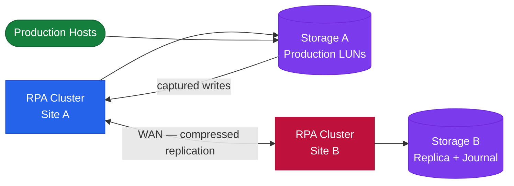

# RecoverPoint — Architecture
## Overview

Dell EMC RecoverPoint provides continuous data protection (CDP) and continuous remote replication (CRR) through journal-based replication. RPA (RecoverPoint Appliance) clusters at each site intercept writes via splitters and maintain a rolling journal that enables point-in-time recovery to any point within the journal window.

## Components

| Component | Role |
|---|---|
| RPA Cluster | Per-site appliance cluster; intercepts and forwards writes |
| Consistency Group (CG) | Replication unit grouping one or more volumes |
| Copy | A point-in-time image; each CG has at least a Production and DR copy |
| Journal Volume | Stores delta changes; governs how far back recovery can go |
| Splitter | Intercepts host I/O before it reaches the array |

## Splitter Types

- **PowerMax / VMAX Hardware Splitter** — embedded in the array microcode; preferred for PowerMax environments; no host-side agent required
- **Software Splitter (vRPA)** — ESXi kernel module used in RecoverPoint for VMs (RP4VM) deployments; installed per host
- **iSCSI Splitter** — used where FC splitters are unavailable

## Topology

## Replication Modes

| Mode | Description | RPO |
|---|---|---|
| CDP (Continuous Data Protection) | Local journal; recover to any point in time | ~0 seconds |
| CRR (Continuous Remote Replication) | Async replication to DR site | Seconds to minutes |
| CLR (Concurrent Local and Remote) | Simultaneous local CDP + remote CRR | Per-copy |

## Supported Arrays

- Dell PowerMax / VMAX All Flash
- Dell Unity
- Dell VPLEX (journal can reside on VPLEX volumes)
- RecoverPoint for VMs (RP4VM) — any VMFS/NFS datastore

## Sizing Considerations

- RPA cluster sizing is driven by write rate (MB/s) across all protected CGs
- Journal volume should be sized for at least the desired recovery window multiplied by the average write rate
- Minimum 2 RPAs per cluster for HA; 4+ for large environments
- WAN bandwidth must sustain steady-state replication throughput; bursts buffered in journal

## High Availability

- RPA clusters operate in active-active within a site; an RPA failure causes automatic redistribution of CGs to surviving RPAs
- Quorum is maintained within the cluster; loss of majority halts replication to protect data consistency
