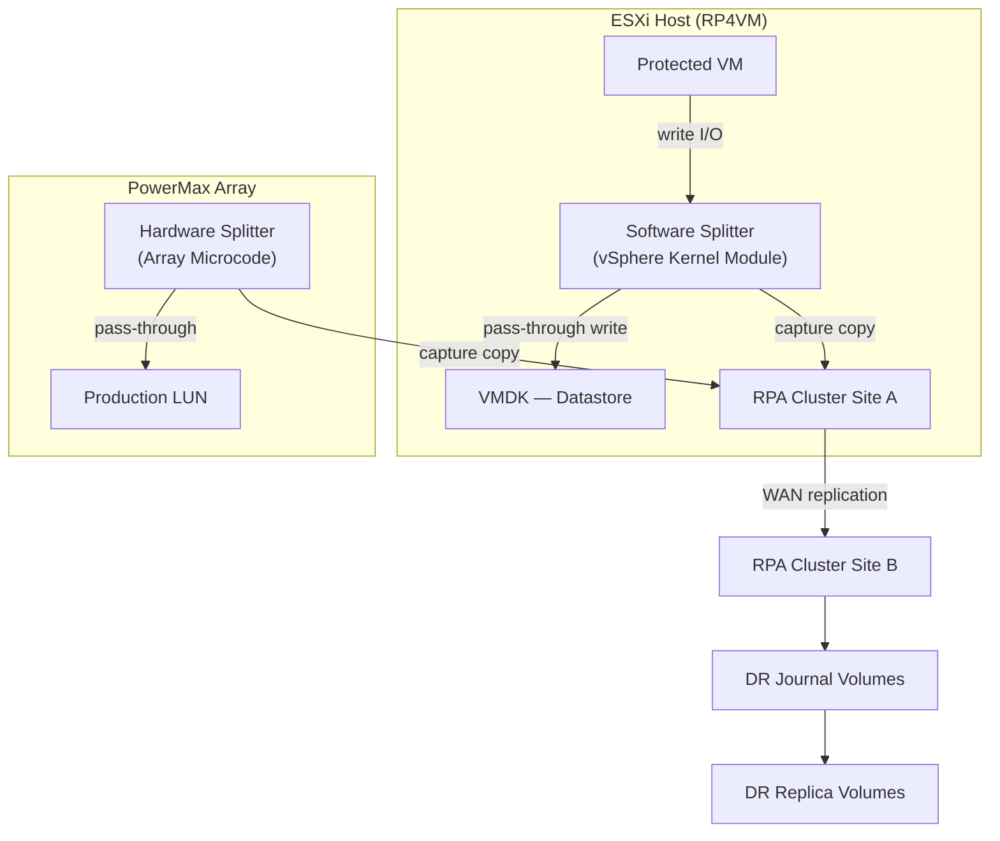

# RecoverPoint — Integrations

> Part of the [RecoverPoint](../../) > [Architecture](../) reference.

---

## Splitter Topology



## RecoverPoint for VMs (RP4VM) — vCenter Plugin

RP4VM integrates directly with vCenter, installing a vSphere plugin and a splitter component that intercepts VM writes at the VMDK level.

### Installation

1. Deploy the RP4VM OVA to each vCenter (protected and recovery sites)
2. Log in to the RP4VM appliance VAMI → register the vCenter
3. Install the vSphere Client plugin (deployed automatically after vCenter registration)
4. Create a consistency group (CG) via the vSphere Client → RecoverPoint → New Consistency Group

### Consistency Group Configuration

```
CG settings:
  - Production volumes: select VMDKs or datastores to protect
  - Replica volumes: select equivalent capacity at recovery site
  - Journal volumes: minimum 10GB per volume pair (size for required retention window)
  - Target RPO: continuous (near-zero) or user-defined bookmarks
```

### Verify Replication State

```bash
# Via RecoverPoint CLI (SSH to RPA)
get_group_info -g "<CG_name>"    # Full CG status
monitor_group -g "<CG_name>"     # Live lag monitor
```

---

## VPLEX Integration

RecoverPoint splitter on VPLEX director enables distributed CGs spanning VPLEX metro/geo fabrics:

- Splitter installed on VPLEX director (not on ESXi hosts)
- Supports metro (synchronous) and geo (asynchronous) configurations
- Mixed topologies: VPLEX Metro + RecoverPoint → three-site continuous replication

Configure VPLEX splitter via RecoverPoint CLI:
```bash
add_splitter_vplex -site production -vplex_ip <vplex_mgmt_ip>
```

---

## VMware SRM Integration

The RecoverPoint SRA enables SRM to use RecoverPoint consistency groups as protection sources:

1. Download RecoverPoint SRA from Dell support portal
2. Install on each SRM server (both sites)
3. Register in SRM → Array Managers:
   - Manager type: EMC RecoverPoint
   - Management IP: `<rpa-cluster-ip>`
   - Username/password: dedicated svc_srm account

SRM recovery plans reference RecoverPoint CGs — failover steps include:
1. Enabling image access on the RecoverPoint CG (exposes the replica copy)
2. Registering VMs at the recovery site
3. Powering on VMs
4. Finalising the recovery (disabling image access, making replica writable)

---

## Storage Array Integration

| Array | Splitter Type | Notes | Why preferred |
|---|---|---|---|
| Dell PowerMax | Array-based (XtremIO or SRDF co-existence) | Integrates via Unisphere | No host agent overhead; best performance |
| Dell Unity | Array-based splitter | Native Unity support | Embedded in array; managed from Unity Unisphere |
| VMware vSphere | Software splitter (RP4VM) | VMDK-level — no array integration needed | Works with any underlying storage — most flexible |

---

## Aria Operations Integration

The RecoverPoint management pack surfaces:
- RPA health (CPU, memory, link state)
- CG lag per consistency group
- Journal fill level and utilisation
- Transfer rate and bandwidth utilisation

Install from Aria Marketplace: Solutions → Browse → "RecoverPoint" → Deploy.

---

## API Integration

RecoverPoint REST API for automation:

```bash
# Authenticate
curl -k -u admin:password -X POST https://<rpa-ip>/rest/users/sessions

# List consistency groups
GET /rest/consistency_groups

# Enable image access (for test failover)
PUT /rest/consistency_groups/{id}/clusters/{clusterId}/image_access/enable
Body: {"scenario": "LOGGED_ACCESS", "consistency": "CRASH_CONSISTENT"}
```
