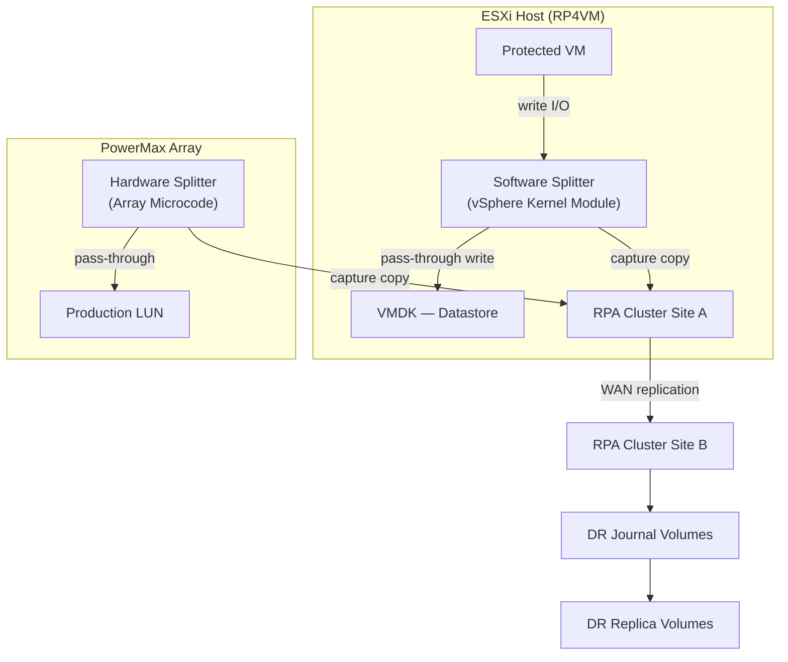

# RecoverPoint — Integrations

> Part of the [RecoverPoint](../../index.md) > [Architecture](../index.md) reference.

---

## Splitter Topology


┌───────────────────────────────────── RecoverPoint — Integrations ─────────────────────────────────────┐
│                                                                                                       │
│   ┌───────────────────────────────────────────────────────────────────────────────────────────────┐   │
│   │      RP4VM integrates with vCenter, VMware SRM, PowerMax/VMAX array splitters, and VPLEX      │   │
│   │    SRM integration: RP4VM SRA enables SRM to orchestrate failover via RecoverPoint journals   │   │
│   │       Array splitter (PowerMax): writes intercepted at array; no ESXi splitter required       │   │
│   │     VPLEX integration: RP4VM protects VPLEX virtual volumes across geo-stretched clusters     │   │
│   └───────────────────────────────────────────────────────────────────────────────────────────────┘   │
│                                                                                                       │
│    vCenter ◄──► RP4VM plugin ◄──► RPA cluster ◄──► SRM SRA ◄──► SRM recovery plans                    │
│                                                                                                       │
│                          ▼                                                 ▼                          │
│                                                                                                       │
│   ┌──────────────────────────────────────────────┐  ┌─────────────────────────────────────────────┐   │
│   │          vSphere / SRM Integration           │  │          Array / VPLEX Integration          │   │
│   │             RP4VM vCenter plugin             │  │           PowerMax array splitter           │   │
│   │           SRM SRA for RecoverPoint           │  │             VMAX array splitter             │   │
│   │           Protection group mapping           │  │            VPLEX virtual volumes            │   │
│   │           Recovery plan execution            │  │           No ESXi splitter needed           │   │
│   │           Test failover automation           │  │             XtremIO integration             │   │
│   └──────────────────────────────────────────────┘  └─────────────────────────────────────────────┘   │
│                                                                                                       │
│    Physical: SRA plugin on SRM server; array splitter on PowerMax; VPLEX needs RP licence             │
│                                                                                                       │
│    Key terms:                                                                                         │
│                                                                                                       │
│    SRA              = Storage Replication Adapter; on SRM server; translates SRM → RP API             │
│    RP4VM plugin     = vCenter plugin; CG management, failover, image access in UI                     │
│    Array splitter   = Intercepts writes in array firmware; higher performance than ESXi               │
│    VPLEX integration= RP journals VPLEX virtual volumes; enables CDP for geo-stretched metro clusters │
│    Protection group = SRM construct; maps to RP4VM consistency group; defines what SRM protects       │
│    Recovery plan    = SRM ordered script of steps for failover; calls RP4VM SRA at failover step      │
│    XtremIO          = All-flash array from Dell; supports RP4VM via array splitter licence            │
│    PowerMax splitter= Writes forked inside PowerMax engine; RPA receives copy without ESXi module     │
│    API endpoint     = RP REST API on RPA management IP; used by SRA and automation scripts            │
│    CG-to-PG mapping = Each SRM protection group maps 1:1 to an RP4VM consistency group                │
│    Bubble network   = Isolated VLAN created by SRM for test failover; test VMs unreachable from prod  │
│    VPLEX Metro      = Synchronous stretch cluster; RP adds CDP layer for any-point recovery on top    │
│                                                                                                       │
└───────────────────────────────────────────────────────────────────────────────────────────────────────┘
```

---

## VPLEX Integration

RecoverPoint splitter on VPLEX director enables distributed CGs spanning VPLEX metro/geo fabrics:

- Splitter installed on VPLEX director (not on ESXi hosts)
- Supports metro (synchronous) and geo (asynchronous) configurations
- Mixed topologies: VPLEX Metro + RecoverPoint → three-site continuous replication

Configure VPLEX splitter via RecoverPoint CLI:
```bash
add_splitter_vplex -site production -vplex_ip <vplex_mgmt_ip>
```

---

## VMware SRM Integration

The RecoverPoint SRA enables SRM to use RecoverPoint consistency groups as protection sources:

1. Download RecoverPoint SRA from Dell support portal
2. Install on each SRM server (both sites)
3. Register in SRM → Array Managers:
   - Manager type: EMC RecoverPoint
   - Management IP: `<rpa-cluster-ip>`
   - Username/password: dedicated svc_srm account

SRM recovery plans reference RecoverPoint CGs — failover steps include:
1. Enabling image access on the RecoverPoint CG (exposes the replica copy)
2. Registering VMs at the recovery site
3. Powering on VMs
4. Finalising the recovery (disabling image access, making replica writable)

---

## Storage Array Integration

| Array | Splitter Type | Notes | Why preferred |
|---|---|---|---|
| Dell PowerMax | Array-based (XtremIO or SRDF co-existence) | Integrates via Unisphere | No host agent overhead; best performance |
| Dell Unity | Array-based splitter | Native Unity support | Embedded in array; managed from Unity Unisphere |
| VMware vSphere | Software splitter (RP4VM) | VMDK-level — no array integration needed | Works with any underlying storage — most flexible |

---

## Aria Operations Integration

The RecoverPoint management pack surfaces:
- RPA health (CPU, memory, link state)
- CG lag per consistency group
- Journal fill level and utilisation
- Transfer rate and bandwidth utilisation

Install from Aria Marketplace: Solutions → Browse → "RecoverPoint" → Deploy.

---

## API Integration

RecoverPoint REST API for automation:

```bash
# Authenticate
curl -k -u admin:password -X POST https://<rpa-ip>/rest/users/sessions

# List consistency groups
GET /rest/consistency_groups

# Enable image access (for test failover)
PUT /rest/consistency_groups/{id}/clusters/{clusterId}/image_access/enable
Body: {"scenario": "LOGGED_ACCESS", "consistency": "CRASH_CONSISTENT"}
```
