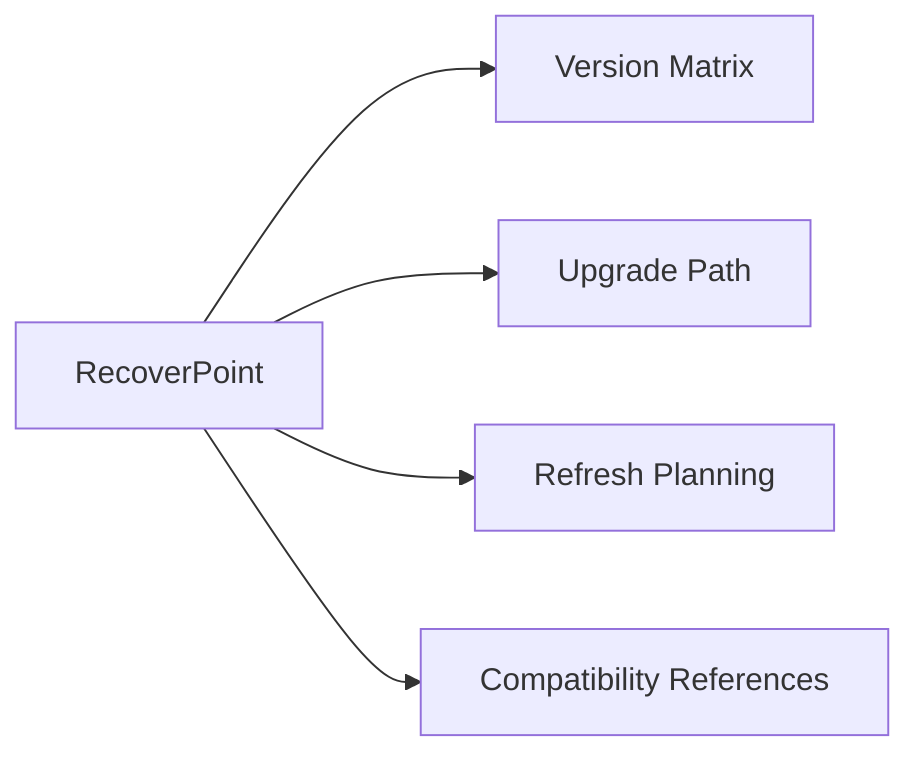

# RecoverPoint — Lifecycle



## Version Matrix

| RecoverPoint Version | Status | End of Support | Notes |
|---|---|---|---|
| 5.3.x | Current GA | TBD | Latest feature release |
| 5.2.x | General Availability | TBD | Widely deployed |
| 5.1.x | Limited Support | Check Dell lifecycle page | Feature frozen |
| 5.0.x | End of Support | Past EOL | Upgrade required |
| 4.x | End of Life | Past EOL | No patches issued |

Always verify against the [Dell EMC Support Lifecycle Policy](https://www.dell.com/support/lifecycle) before planning upgrades.

## Upgrade Path

RecoverPoint upgrades are performed via the **RecoverPoint EasyInstaller** tool.

### Pre-Upgrade Checklist

- [ ] Review release notes for the target version
- [ ] Confirm supported splitter versions for target RP version
- [ ] Confirm vSphere/hypervisor compatibility (for RP4VM)
- [ ] Back up current configuration via `boxmgmt` → `system` → `export configuration`
- [ ] Verify journal is not full and all CGs are in a healthy state
- [ ] Schedule maintenance window and notify application owners
- [ ] Open a Dell support case to have support on standby

### Upgrade Sequence

1. Download the RP upgrade ISO from Dell Support (https://www.dell.com/support)
2. Boot EasyInstaller on a management station
3. Connect to the RPA cluster at Site A
4. Perform rolling upgrade of RPA nodes (EasyInstaller handles node-by-node)
5. Validate CG states after Site A upgrade
6. Repeat for Site B RPA cluster
7. Upgrade splitter packages on arrays if required (PowerMax microcode level)
8. Update RP4VM software splitters on ESXi hosts if applicable
9. Run post-upgrade health check

### Post-Upgrade Validation

```bash
boxmgmt system status
boxmgmt list cg
boxmgmt cg check_cg <CG-name>
```

- Confirm all CGs return to `Enabled` / `Replicating` state
- Confirm RPO compliance on all Tier 1 CGs
- Run a test failover on at least one CG to confirm image access works

## Refresh Planning

- Hardware RPA appliances have a typical 5-year refresh cycle aligned with Dell hardware support
- Plan RP upgrades alongside PowerMax / VMAX microcode upgrades to maintain splitter compatibility
- Track EOL dates in CMDB with 12-month lead time for refresh planning

## Compatibility References

- RecoverPoint compatibility matrix: available via Dell Simple Support Matrix (SSM)
- Confirm SRA version if integration with VMware SRM is in use
