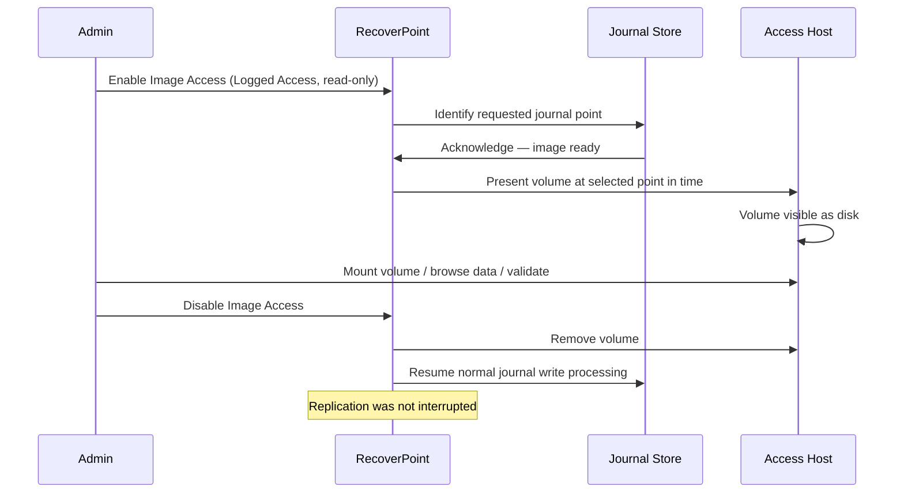

# RecoverPoint — Backup & Restore


<div class="kb-summary">
> Part of the [RecoverPoint](../../index.md) > [Operations](../index.md) reference.
</div>

## Core Recovery Concepts

Dell EMC RecoverPoint provides continuous data protection (CDP) by maintaining a rolling journal of I/O writes. Recovery is performed by accessing a point-in-time snapshot within the journal — there is no discrete "backup job"; protection is continuous.

| Concept | Description |
|---|---|
| **Bookmark** | A named, user-defined point in the journal — equivalent to a snapshot label |
| **Journal** | Circular log of all writes to a consistency group, maintained at the replica |
| **Image Access** | Mounting a journal point for read/testing without impacting ongoing replication |
| **Failover** | Permanently promoting the replica to production; replication link breaks |
| **Failback** | After failover, reversing direction — re-syncing from DR back to primary |
| **Test Copy** | Creating a writeable copy of a journal image for DR testing without affecting live replication |
| **Consistency Group (CG)** | A group of volumes protected together, ensuring write-order consistency |

---

## Creating Bookmarks

Bookmarks mark a specific point in the journal for easy retrieval. Create bookmarks before planned changes (patches, upgrades) or at regular intervals.

### Via RecoverPoint Management Application (RPMA)

1. Log in to the RecoverPoint Management Application.
2. Navigate to **Consistency Groups** → select the CG.
3. Click **Add Bookmark**.
4. Enter a descriptive name: `Pre-Patch-2026-05-08`.
5. Select **Crash-Consistent** or **Application-Consistent** (requires VSS/application quiesce).
6. Click **OK**.

### Via CLI (boxmgmt / rpsc)

```bash
# Connect to RecoverPoint appliance
ssh admin@rpa01.example.com

# List consistency groups
get_consistency_groups

# Add a bookmark to a specific CG
add_bookmark --cg "CG_PROD_SQL" --name "Pre-Patch-2026-05-08" --type CRASH_CONSISTENT

# List bookmarks for a CG
get_bookmarks --cg "CG_PROD_SQL"
```text
┌─────────────────────────────────── RecoverPoint — Backup & Restore ───────────────────────────────────┐
│                                                                                                       │
│   ┌───────────────────────────────────────────────────────────────────────────────────────────────┐   │
│   │RecoverPoint provides CDP-based recovery; no traditional backup agent needed for replicated VMs│   │
│   │Recovery options: image access (non-disruptive), test copy, failover, and restore to production│   │
│   │  RPA config backup: export system settings from Unisphere; store off-site after every change  │   │
│   │              Recovery granularity: any point in journal window, or named bookmark             │   │
│   └───────────────────────────────────────────────────────────────────────────────────────────────┘   │
│                                                                                                       │
│    Recovery flow: select CG ──► choose point-in-time ──► image access or failover ──► validate        │
│                                                                                                       │
│                          ▼                                                 ▼                          │
│                                                                                                       │
│   ┌──────────────────────────────────────────────┐  ┌─────────────────────────────────────────────┐   │
│   │               Recovery Methods               │  │                Config Backup                │   │
│   │           Image access (read-only)           │  │           Export system config XML          │   │
│   │          Image access (r/w enabled)          │  │           Store after every change          │   │
│   │           Test copy (bubble VLAN)            │  │            RPA appliance snapshot           │   │
│   │           Failover (prod cutover)            │  │             Re-import on rebuild            │   │
│   │         Failback (resync + cutback)          │  │              Test import on lab             │   │
│   └──────────────────────────────────────────────┘  └─────────────────────────────────────────────┘   │
│                                                                                                       │
│    Physical: failover powers on replica VMs at DR site; requires pre-configured networks              │
│                                                                                                       │
│    Key terms:                                                                                         │
│                                                                                                       │
│    Image access     = Non-disruptive mount of journal image; source VMs continue running unchanged    │
│    Read/write image = Enable writes to image copy; journal paused; useful for data mining recovery    │
│    Test copy        = Full VM boot of replica in isolated bubble network; validates recoverability    │
│    Failover         = Commit image to replica; power on VMs at DR site; redirect production traffic   │
│    Failback         = After failover; reverse replicate from DR to prod; restore original direction   │
│    Bookmark         = Named time marker; set before patching, app changes, or maintenance windows     │
│    Config export    = Unisphere → System → Export Config; saves all CG definitions and RPA settings   │
│    Journal rollback = Roll journal pointer back to earlier timestamp; expose older write sequence     │
│    Bubble VLAN      = Isolated portgroup; test copy VMs powered on here; no prod network access       │
│    RPO validation   = Confirm lag at time of failover; determines actual data loss window             │
│    Resync           = After failback; re-establish replication from production to DR direction        │
│    Recovery point   = Specific second-level timestamp in journal window chosen for recovery           │
│                                                                                                       │
└───────────────────────────────────────────────────────────────────────────────────────────────────────┘
```

### Creating a Test Copy via RPMA

1. **Consistency Groups** → select CG → **Test Copy**.
2. Choose the journal point (bookmark or date/time).
3. Select the target host where the test volume should be presented.
4. Click **Create Test Copy**.
5. The test volume appears on the test host. Boot test VMs, run application checks.
6. Click **Delete Test Copy** when done — writes are discarded.

---

## Image Access Sequence Diagram



---

## Post-Recovery Validation Steps

| # | Check | Method |
|---|---|---|
| 1 | CG in correct state post-operation | RPMA → CG → Status: Active |
| 2 | Volumes presented to correct host | OS disk manager / `lsblk` |
| 3 | File system consistent | `chkdsk` (Windows) / `fsck` (Linux) |
| 4 | Application data integrity | Application-level query (SQL select, AD objects) |
| 5 | RPO acceptable at time of recovery | RPMA → CG → RPO indicator |
| 6 | Replication re-established after failback | RPMA → CG → Replication state: Replicating |
| 7 | Journal space sufficient | RPMA → Journal → Space utilization |
| 8 | Bookmarks removed after test | RPMA → Bookmarks → cleanup stale entries |
| 9 | Test copy fully discarded | RPMA → Test Copy → state: None |
| 10 | Recovery documented | Incident / DR test report updated |
