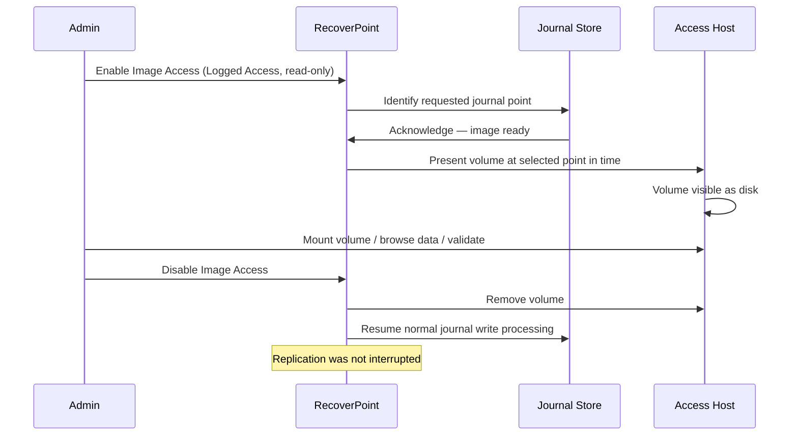

# RecoverPoint — Backup & Restore

```bash
# Connect to RecoverPoint appliance
ssh admin@rpa01.example.com

# List consistency groups
get_consistency_groups

# Add a bookmark to a specific CG
add_bookmark --cg "CG_PROD_SQL" --name "Pre-Patch-2026-05-08" --type CRASH_CONSISTENT

# List bookmarks for a CG
get_bookmarks --cg "CG_PROD_SQL"
```

```text
┌─────────────────────────────────── RecoverPoint — Backup & Restore ───────────────────────────────────┐
│                                                                                                       │
│   ┌───────────────────────────────────────────────────────────────────────────────────────────────┐   │
│   │RecoverPoint provides CDP-based recovery; no traditional backup agent needed for replicated VMs│   │
│   │Recovery options: image access (non-disruptive), test copy, failover, and restore to production│   │
│   │  RPA config backup: export system settings from Unisphere; store off-site after every change  │   │
│   │              Recovery granularity: any point in journal window, or named bookmark             │   │
│   └───────────────────────────────────────────────────────────────────────────────────────────────┘   │
│                                                                                                       │
│    Recovery flow: select CG ──► choose point-in-time ──► image access or failover ──► validate        │
│                                                                                                       │
│                          ▼                                                 ▼                          │
│                                                                                                       │
│   ┌──────────────────────────────────────────────┐  ┌─────────────────────────────────────────────┐   │
│   │               Recovery Methods               │  │                Config Backup                │   │
│   │           Image access (read-only)           │  │           Export system config XML          │   │
│   │          Image access (r/w enabled)          │  │           Store after every change          │   │
│   │           Test copy (bubble VLAN)            │  │            RPA appliance snapshot           │   │
│   │           Failover (prod cutover)            │  │             Re-import on rebuild            │   │
│   │         Failback (resync + cutback)          │  │              Test import on lab             │   │
│   └──────────────────────────────────────────────┘  └─────────────────────────────────────────────┘   │
│                                                                                                       │
│    Physical: failover powers on replica VMs at DR site; requires pre-configured networks              │
│                                                                                                       │
│    Key terms:                                                                                         │
│                                                                                                       │
│    Image access     = Non-disruptive mount of journal image; source VMs continue running unchanged    │
│    Read/write image = Enable writes to image copy; journal paused; useful for data mining recovery    │
│    Test copy        = Full VM boot of replica in isolated bubble network; validates recoverability    │
│    Failover         = Commit image to replica; power on VMs at DR site; redirect production traffic   │
│    Failback         = After failover; reverse replicate from DR to prod; restore original direction   │
│    Bookmark         = Named time marker; set before patching, app changes, or maintenance windows     │
│    Config export    = Unisphere → System → Export Config; saves all CG definitions and RPA settings   │
│    Journal rollback = Roll journal pointer back to earlier timestamp; expose older write sequence     │
│    Bubble VLAN      = Isolated portgroup; test copy VMs powered on here; no prod network access       │
│    RPO validation   = Confirm lag at time of failover; determines actual data loss window             │
│    Resync           = After failback; re-establish replication from production to DR direction        │
│    Recovery point   = Specific second-level timestamp in journal window chosen for recovery           │
│                                                                                                       │
└───────────────────────────────────────────────────────────────────────────────────────────────────────┘
```

