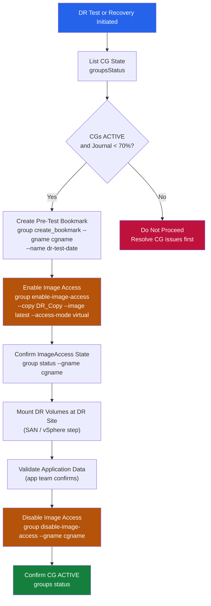

# RecoverPoint CLI Reference


<div class="kb-summary">
> Part of the [RecoverPoint](../../index.md) > [Operations](../index.md) reference.
</div>

---

## Overview

RecoverPoint management interfaces:

| Interface | Access | Purpose | When to use |
|---|---|---|---|
| `boxmgmt` CLI | SSH to RPA appliance | Menu-driven system management | On-call triage; image access; manual failover |
| RPAPI REST | HTTPS to cluster IP | Automation, CG control, status | Scripted DR tests; monitoring integrations |
| Unisphere for RecoverPoint | Web UI | GUI management | Configuration, visual health checks |

## Image Access Flow


┌──────────────────────────────────── RecoverPoint — CLI Reference ─────────────────────────────────────┐
│                                                                                                       │
│   ┌───────────────────────────────────────────────────────────────────────────────────────────────┐   │
│   │   RecoverPoint CLI: SSH to RPA management IP; login as admin; CLI mode (boxmgmt is hardware)  │   │
│   │      Main commands: get all cgs, set group, set bookmark, failover, enable/disable group      │   │
│   │       boxmgmt: low-level RPA appliance management; hardware status, NTP, network config       │   │
│   │           Scripting: RP REST API (port 443); JSON responses; auth via basic or token          │   │
│   └───────────────────────────────────────────────────────────────────────────────────────────────┘   │
│                                                                                                       │
│    SSH admin@<RPA-IP> ──► CLI prompt ──► get all cgs / set group <n> / failover group <n>             │
│                                                                                                       │
│                          ▼                                                 ▼                          │
│                                                                                                       │
│   ┌──────────────────────────────────────────────┐  ┌─────────────────────────────────────────────┐   │
│   │             Monitoring Commands              │  │               Control Commands              │   │
│   │                 get all cgs                  │  │            failover group <name>            │   │
│   │               get group <name>               │  │             enable group <name>             │   │
│   │                  get system                  │  │             disable group <name>            │   │
│   │                  get links                   │  │             set bookmark <name>             │   │
│   │                get rpa status                │  │              start image access             │   │
│   └──────────────────────────────────────────────┘  └─────────────────────────────────────────────┘   │
│                                                                                                       │
│    Physical: SSH to RPA management IP on mgmt VLAN; boxmgmt for hardware; admin CLI for CG ops        │
│                                                                                                       │
│    Key terms:                                                                                         │
│                                                                                                       │
│    boxmgmt          = Hardware-level CLI; configure NTP, network, passwords, and factory reset        │
│    get all cgs      = List all consistency groups with state, lag, and journal fill                   │
│    get group        = Detailed view of single CG; copies, VMs, lag, policy, bookmarks                 │
│    get system       = RPA cluster health; node states, link status, and replication summary           │
│    failover group   = Initiate failover for named CG; confirms before executing                       │
│    enable/disable   = Start or pause replication for a CG; disable before maintenance                 │
│    set bookmark     = Create named timestamp in journal; specify CG and bookmark name                 │
│    start image access = Mount journal image at selected time; choose read-only or read-write          │
│    get links        = Show replication links; bandwidth utilisation, latency, packet loss             │
│    REST API         = RP REST endpoint; same operations as CLI; used by SRA and automation            │
│    admin CLI        = SSH-accessible CLI; differs from boxmgmt; all CG and replication commands       │
│    failback         = CLI command to reverse replication after failover; requires resync first        │
│                                                                                                       │
└───────────────────────────────────────────────────────────────────────────────────────────────────────┘
```python

### Image Access (CG Operations)

Image access enables read/write access to a point-in-time copy at the DR site.

```bash
# Enable image access for a CG (DR copy — read/write, virtual access)
boxmgmt> enable image access
  → Select CG: <cg_name>
  → Select copy: DR_Copy
  → Select image: <point-in-time-timestamp>
  → Access type: Virtual (no data movement) or Logged (allows writes, tracked)

# Disable image access (return to normal replication)
boxmgmt> disable image access
  → Select CG: <cg_name>

# Test failover (non-disruptive validation — accesses a snapshot without impacting replication)
boxmgmt> test failover
  → Select CG: <cg_name>
  → Confirm: yes

# Group suspend (pause replication for maintenance)
boxmgmt> groups suspend
  → Select CG or all

# Group resume (resume replication)
boxmgmt> groups resume
  → Select CG or all
```

---

## RPAPI REST

Base URL: `https://<cluster-mgmt-ip>/fapi/rest/5_1`  
Authentication: HTTP Basic (admin credentials).

```bash
RP="https://recoverpoint.example.com/fapi/rest/5_1"
AUTH="-u admin:password --insecure"
```

### Cluster Information

```bash
# All cluster details
curl -s $AUTH "$RP/cluster/all_clusters_details" | python3 -m json.tool

# Cluster connectivity (inter-site links)
curl -s $AUTH "$RP/cluster/all_clusters_details" | python3 -c "
import sys, json
data = json.load(sys.stdin)
for cluster in data.get('clustersDetails', []):
    print(f\"Cluster: {cluster.get('clusterUID',{}).get('id','?')}  \
name={cluster.get('name','?')}\")
"
```

### Consistency Groups

```bash
# All CG details (state, links, copies)
curl -s $AUTH "$RP/group/all_groups_details" | python3 -m json.tool

# Summary: CG name + enabled/disabled + replication state
curl -s $AUTH "$RP/group/all_groups_details" | python3 -c "
import sys, json
data = json.load(sys.stdin)
for grp in data.get('innerSet', []):
    gname = grp.get('name','?')
    enabled = grp.get('enabled', '?')
    copies  = [c.get('name','?') for c in grp.get('groupCopies', {}).get('innerSet', [])]
    print(f\"CG={gname:30s}  enabled={str(enabled):5s}  copies={copies}\")
"

# Get specific CG details by UID
CG_UID="1"
curl -s $AUTH "$RP/group/${CG_UID}/all_details" | python3 -m json.tool
```

### CG Operations via REST

```bash
# Suspend a CG
curl -s -X PUT $AUTH "$RP/group/${CG_UID}/suspend" | python3 -m json.tool

# Resume a CG
curl -s -X PUT $AUTH "$RP/group/${CG_UID}/resume" | python3 -m json.tool

# Enable image access (virtual) for a CG copy
curl -s -X PUT $AUTH "$RP/group/${CG_UID}/copy/${COPY_UID}/enable_image_access" \
  -H "Content-Type: application/json" \
  -d '{
    "imageAccessMode": "VIRTUAL_ACCESS",
    "scenario": "DR"
  }' | python3 -m json.tool

# Disable image access (resume replication)
curl -s -X PUT $AUTH "$RP/group/${CG_UID}/copy/${COPY_UID}/disable_image_access" | \
  python3 -m json.tool

# Test consistency of a CG (verify RPO bookmarks)
curl -s -X PUT $AUTH "$RP/group/${CG_UID}/test_consistency" | python3 -m json.tool
```

### RPA Health

```bash
# All RPA hardware details
curl -s $AUTH "$RP/rp/all_rps_details" | python3 -c "
import sys, json
data = json.load(sys.stdin)
for rp in data.get('innerSet', []):
    rpid  = rp.get('rpUID', {}).get('id','?')
    state = rp.get('rpState','?')
    print(f\"RPA ID={rpid}  state={state}\")
"

# Cluster quorum status
curl -s $AUTH "$RP/cluster/all_clusters_details" | python3 -c "
import sys, json
data = json.load(sys.stdin)
for c in data.get('clustersDetails', []):
    quorum = c.get('quorum','?')
    print(f\"Cluster: {c.get('name','?'):20s}  Quorum: {quorum}\")
"
```

### Journal Usage

```bash
# Journal usage per CG copy
curl -s $AUTH "$RP/group/all_groups_details" | python3 -c "
import sys, json
data = json.load(sys.stdin)
for grp in data.get('innerSet', []):
    for copy in grp.get('groupCopies', {}).get('innerSet', []):
        journal = copy.get('journalVolumeList', {})
        print(f\"CG={grp['name']:25s}  copy={copy.get('name','?'):15s}  \
journal_vols={len(journal.get('innerSet',[]))}\")
"
```

---

## Key Operational Scenarios

### DR Failover with Image Access

```bash
# 1. Check CG state — confirm replication is healthy
curl -s $AUTH "$RP/group/all_groups_details" | python3 -m json.tool

# 2. Enable image access on the DR copy (virtual, read-write)
curl -s -X PUT $AUTH "$RP/group/${CG_UID}/copy/${COPY_UID}/enable_image_access" \
  -H "Content-Type: application/json" \
  -d '{"imageAccessMode":"VIRTUAL_ACCESS","scenario":"DR"}' | python3 -m json.tool

# 3. Mount volumes at DR site (ESX or host level — outside RecoverPoint)
# 4. Start applications, validate data
# 5. When done — disable image access to resume replication
curl -s -X PUT $AUTH "$RP/group/${CG_UID}/copy/${COPY_UID}/disable_image_access" | \
  python3 -m json.tool
```
