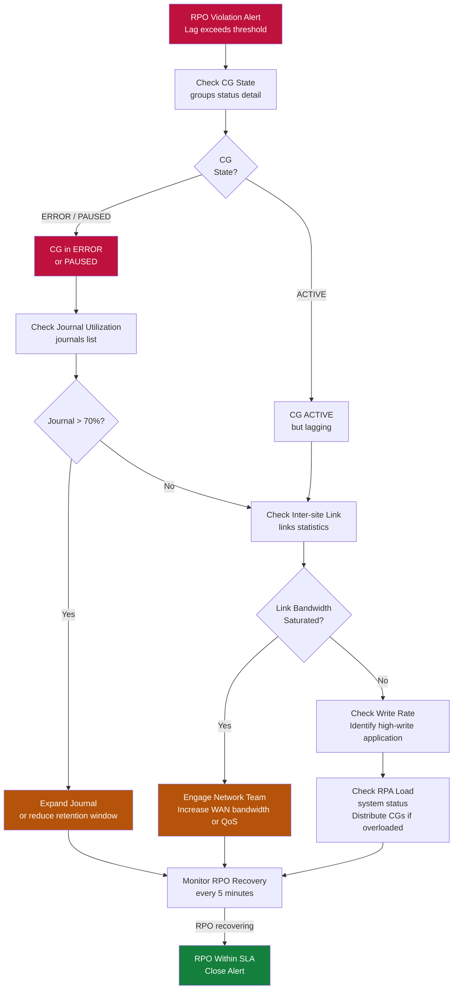

# RecoverPoint — Health Checks

> Part of the [RecoverPoint](../../index.md) > [Operations](../index.md) reference.

---

## Overview

RecoverPoint health checks cover four areas: RPA cluster node health, consistency group (CG) replication state, journal utilization, and inter-site link status. Run these checks daily as a minimum, and before/after any change window.

| Area | Tool | Frequency |
|---|---|---|
| RPA cluster nodes | SSH `system status` | Daily |
| CG replication state | SSH `groups status` | Daily |
| Journal utilization | SSH `journals list` | Daily |
| Link statistics | SSH `links statistics` | Pre/post change |
| RPO compliance | REST API or RPMA | Daily (automated) |

---

## Daily Checks

| Check | Command | Expected | Why |
|---|---|---|---|
| [ ] All Consistency Groups (CGs) are in ACTIVE replication state | `groups status` | All ACTIVE | Non-active CGs mean data is not being protected |
| [ ] All RPA nodes are online and clustered | `system status` | All nodes running | Lost RPA node reduces cluster HA headroom |
| [ ] Journal capacity | `journals list` | < 70% | Journal overflow halts replication without warning |
| [ ] Replication lag / RPO is within the acceptable threshold | `group status --gname n` | Within SLA | Lag = data exposure window at time of failure |
| [ ] No image access sessions are left enabled from a previous DR test | `groups status detail` | No active image access | Active image access pauses live replication |
| [ ] Confirm both production and DR site RecoverPoint clusters are reachable | `network connectivity check` | Connected | Inter-site link health determines replication continuity |

---

## Daily Health Check Commands

```bash
# SSH to RPA cluster management IP
ssh admin@<rpa-cluster-ip>

# RPA cluster and node health
system status

# All CGs — expect ACTIVE for all production CGs
groups status

# Detailed CG view including lag, RPO, and journal fill
groups status detail

# Journal utilization for all CGs
journals list

# Active alarms (hardware and software)
alarms list

# Inter-site link statistics (latency, bandwidth)
links statistics

# Cluster quorum state
cluster quorum check
```

---

## RPO Violation Triage Decision Tree



## RPO Compliance Check

```bash
# Check per-CG RPO against current lag (SSH)
group status --gname <cg_name>

# Expected output fields:
#   Replication state:  ACTIVE
#   Current lag:        3s
#   Configured RPO:     300s
#   Compliant:          YES
```

| RPO Tier | Target | Alert Threshold |
|---|---|---|
| Tier 1 (Critical) | < 15 seconds | > 60 seconds |
| Tier 2 (Business) | < 5 minutes | > 15 minutes |
| Tier 3 (Standard) | < 30 minutes | > 60 minutes |

---

## Journal Utilization Check

Journal overflow causes CG replication to halt. Alert thresholds:

```bash
# List journal volumes with utilization
journals list

# Expected output columns:
#   Journal Name   CG Name         Used%   Free%   Status
#   JRN-CG-ORA-DR  CG-ORACLE-PROD  34%     66%     OK
```

| Utilization | Status | Action |
|---|---|---|
| 0–69% | OK | No action |
| 70–79% | Warning | Monitor; investigate write rate spike |
| 80–89% | Critical | Plan journal expansion; check link state |
| 90%+ | Emergency | Immediate action — expand or CG will halt |

---

## Weekly and Monthly Checks

```bash
# Confirm splitter health (for RP4VM software splitters on ESXi)
esxcli software vib list | grep -i rp

# Confirm RPA software versions are consistent across cluster
boxmgmt verify_rpa_version

# Review audit log for unexpected operations (logins, image access events)
get_audit_log -last 500

# Confirm DR site RPA cluster is also healthy
ssh admin@<dr-rpa-cluster-ip> "system status"
ssh admin@<dr-rpa-cluster-ip> "groups status"
```
