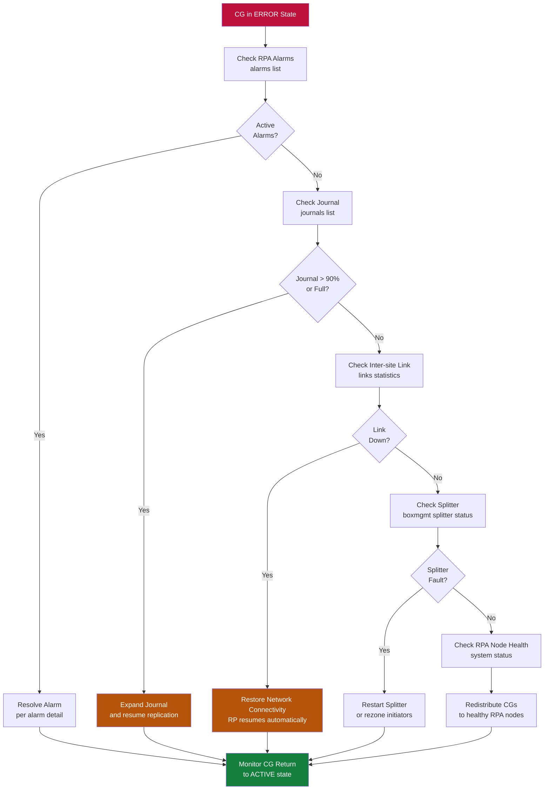

# RecoverPoint — Common Issues

> Part of the [RecoverPoint](../../index.md) > [Troubleshooting](../index.md) reference.

---

## CG in Error State

**Symptoms:** CG status shows `Error` or `Communication Problem` in the RecoverPoint Management Application (RPMA).

**Diagnostic Steps:**

```bash
# Via boxmgmt SSH to RPA
boxmgmt cg check_cg <CG-name>
boxmgmt list cg
boxmgmt system status
```

**Common causes:**

| Cause | Why it happens | Resolution |
|---|---|---|
| Journal volume full | Write rate exceeds journal drain rate (link or bandwidth issue) | Expand journal LUN or reduce retention window |
| WAN link down | Inter-site network outage; writes accumulate in local journal | Restore connectivity; RP will resume replication automatically once link recovers |
| Splitter communication failure | Splitter lost contact with RPA due to network or array issue | See Splitter section below |
| RPA node offline | Hardware fault or hypervisor issue on the RPA VM | Check RPA cluster health; redistribute CGs if node is failed |
| Storage path failure | Zoning or masking change removed RPA access to journal LUNs | Verify zoning and array paths to journal volumes |



---

## Journal Overflow

**Symptoms:** CG RPO alarm triggered; journal shows > 90% utilization.

```bash
boxmgmt journal list
boxmgmt journal status <journal-name>
```

**Resolution:**
1. Identify which CG is generating excess writes
2. Expand journal volume (can be done non-disruptively on most arrays)
3. If link is down and journal is exhausted, a full resync may be required after link restoration
4. Review if RPO target is realistic for the write rate

---

## Splitter Communication Failure

**Symptoms:** CG shows `Splitter connection problem`; writes may be blocked or split-brain situation.

**PowerMax hardware splitter:**
```bash
# On PowerMax (via Solutions Enabler / SYMCLI)
symrdf -sid <SID> list

# Check splitter registration in RP
boxmgmt splitter list
boxmgmt splitter status <splitter-name>
```

**RP4VM software splitter (ESXi):**
- Check ESXi host kernel module: `esxcli software vib list | grep rp`
- Restart splitter on ESXi if needed (requires brief I/O pause — schedule maintenance)

---

## RPO Violation

**Symptoms:** RPO alarm fires; CG reports lag exceeding threshold.

**Diagnostic Steps:**
1. Check WAN link utilization — is bandwidth saturated?
2. Check write rate increase (application change or batch job)
3. Verify RPA cluster load — distribute CGs if one RPA is overloaded
4. Review journal state for overflow

```bash
boxmgmt cg check_cg <CG-name>
boxmgmt system performance
```

---

## Failover Did Not Complete Cleanly

**Symptoms:** After a failover, CG is stuck in `Failover in progress` or production site does not become accessible on DR.

**Steps:**
1. Verify all journal data has been applied at DR site
2. Check image access logs in RPMA
3. If failover is incomplete, use `Enable Image Access` manually for the desired recovery point
4. After application validation, use `Recover Production` to complete the failover

```bash
boxmgmt cg enable_image_access <CG-name> <copy-name>
boxmgmt cg recover_production <CG-name>
```

**If re-sync is required after failover:**
- Use `Direct Access` mode to start recovery, then initiate resync back to production

---

## Link Down / WAN Outage

**During outage:**
- CGs accumulate in journal at production site
- Monitor journal capacity; alert if > 70%
- No action needed if journal has capacity; RP resumes automatically when link restores

**After link restores:**
- Monitor resync rate and lag reduction
- Verify RPO returns to compliance within expected window
- Check for any CGs that failed to resume automatically
