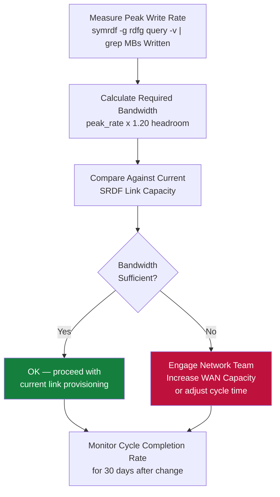

# SRDF/A — Design Standards

```bash
symrdf -g <rdfg> query -v | grep "Minimum Cycle Time"
```text
┌────────────────────────────────────── SRDF/A — Design Standards ──────────────────────────────────────┐
│                                                                                                       │
│   ┌──────────────────────────────────────────────┐  ┌─────────────────────────────────────────────┐   │
│   │              Sizing Guidelines               │  │               HA Requirements               │   │
│   │         Deduplicate where supported          │  │           N+1 component redundancy          │   │
│   │          Bandwidth: 10 GbE minimum           │  │          Heartbeat / health monitor         │   │
│   │          Storage: 130% of raw data           │  │          Separate mgmt / data VLANs         │   │
│   │         Latency: < 10 ms to storage          │  │          Out-of-band access (IPMI)          │   │
│   │           CPU: 8+ vCPU for engine            │  │          Anti-affinity VM placement         │   │
│   └──────────────────────────────────────────────┘  └─────────────────────────────────────────────┘   │
│                                                                                                       │
│    Ports: FC dark fiber / DWDM · FCIP (TCP 3225) · 9443 (Unisphere HTTPS)                             │
│                                                                                                       │
│   ┌───────────────────────────────────────────────────────────────────────────────────────────────┐   │
│   │                                  Standard SRDF/A Design Rules                                 │   │
│   │            RPO target drives snapshot/cycle frequency — document in service design            │   │
│   │            RTO target drives recovery tier: instant, warm standby, or cold restore            │   │
│   │                  Dedicated backup network VLAN — no shared production traffic                 │   │
│   │          Encryption: SRDF at FA/RF port level; Unisphere HTTPS; Solutions Enabler TLS         │   │
│   │               Service accounts: minimum privilege; rotate credentials quarterly               │   │
│   └───────────────────────────────────────────────────────────────────────────────────────────────┘   │
│                                                                                                       │
│  Physical Infrastructure:                                                                             │
│  Two PowerMax arrays (production + DR site) · FC/FCIP SRDF link (dedicated bandwidth) · RF ports      │
│  Key terms:                                                                                           │
│                                                                                                       │
│  SRDF          = Symmetrix Remote Data Facility; EMC array-based replication technology               │
│  R1            = source SRDF volume on production array; host writes flow here                        │
│  R2            = target SRDF volume on DR array; receives replicated data asynchronously              │
│  Delta Set     = batch of host writes accumulated per SRDF/A cycle; shipped to R2 atomically          │
│  Cycle Time    = SRDF/A replication interval (15–60 seconds); determines maximum RPO                  │
│  symrdf        = Solutions Enabler CLI for SRDF operations: establish, split, failover, restore       │
│  SRDF Link     = FC or FCIP path between R1 and R2 arrays; dedicated, monitored bandwidth             │
│  Suspended     = SRDF pair state where replication is paused; R2 data frozen at last cycle            │
│  Failover      = SRDF operation making R2 read-write; R1 becomes Not Ready to hosts                   │
│  Restore       = after failover resolution, re-establishes replication with R1 as source              │
│  Establish     = initial sync or re-sync operation that copies R1 to R2 in full                       │
│  Split         = breaks SRDF pair temporarily; both R1 and R2 are R/W; no replication                 │
│  FCIP          = Fibre Channel over IP; tunnels FC SRDF traffic over IP WAN link                      │
│  Unisphere     = Dell PowerMax management GUI; REST API; array health and provisioning                │
│                                                                                                       │
└───────────────────────────────────────────────────────────────────────────────────────────────────────┘
```
```bash
symrdf -g <rdfg> query -v | grep "MBs Written"
```
```bash
symdev show -sid <target_SID> <dev_id> | grep -E "Size|Track"
```

