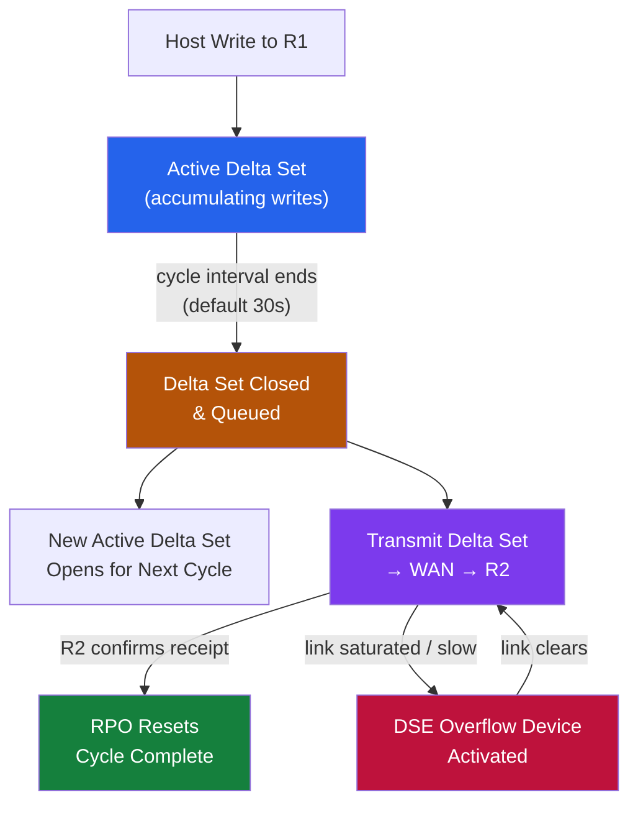

# SRDF/A — How It Works

## Overview

SRDF/A (Asynchronous) replicates data from a source PowerMax to a target PowerMax by capturing writes into time-bounded delta sets (cycles) and transmitting them in order. The source array acknowledges writes to the host before transmission — host write latency is not affected by WAN latency. RPO is determined by cycle time (default 30 seconds). R1 is the source (production); R2 is the target (DR).

## Delta Set Mechanics

1. Host writes to R1 go into the **active delta set** for the current cycle.
2. At the end of the cycle interval, the active delta set is **closed** and queued for transmission.
3. A new delta set opens for the next cycle.
4. The closed delta set is transmitted to R2 in sequence — each delta set applied in order, maintaining consistency.
5. When R2 confirms receipt, the cycle is complete and RPO resets.


```

## Components

| Component | Role |
|---|---|
| R1 device | Source (production) SRDF device |
| R2 device | Target (DR) SRDF device |
| RDF group | Logical pairing of R1 and R2 devices sharing cycle boundaries |
| Delta set | Set of writes captured during one cycle interval |
| SRDF director | PowerMax back-end port handling SRDF I/O over FCIP or FC |
| DSE (Delta Set Extension) | Dedicated storage device used as overflow when write traffic exceeds in-memory delta set capacity |

## Pair States

| State | Meaning | Normal? |
|---|---|---|
| Consistent | R2 is consistent and receiving cycles; latest cycle applied | Yes — normal SRDF/A state |
| Transmit Idle | No data being transmitted — link idle or no new writes | Investigate if unexpected |
| Suspended | Replication manually suspended | Expected if suspension was performed |
| DSE Active | Cache overflow to DSE device; high write load | Monitor closely |
| Failed Over | R1 devices are read-only; R2 devices are R/W | Active failover underway |
| Inconsistent | R2 cannot be made consistent | Immediate investigation required |

## Key Commands

```bash
# Show cycle state for all devices in an SRDF/A group
symrdf -g 20 -type A query

# Detailed view including cycle time and lag
symrdf -g 20 -type A query -detail

# List all RDFG groups
symcfg list -rdfg all

# Check if DSE is active
symrdf -g 20 -type A query -detail | grep DSE

# Suspend / resume replication
symrdf -g 20 -type A suspend -noprompt
symrdf -g 20 -type A resume -noprompt

# Show lag value
symrdf -g 20 -type A query -detail | grep -E "Lag|Cycle Age"
```

## Lag Reference

| Lag Range | Assessment | Action |
|---|---|---|
| ≤ configured cycle time | Healthy — RPO is met | None — monitor |
| 2–5× cycle time | Warning — investigate link or write rate | Check link utilization and write rate |
| > 5× cycle time | Critical — RPO SLA breached | Immediate escalation; consider suspending non-critical groups |

## Connectivity

| Link Type | Use Case |
|---|---|
| FCIP (FC over IP) | Most common — FC-to-IP gateway over WAN |
| Dark fibre (FC) | Short distances only — adds no additional latency |
| iSLR (IP Short Range) | Newer PowerMax connectivity via IP directors |

**Bandwidth sizing:** Required bandwidth = peak_change_rate_MB_per_cycle / cycle_time_s × 1.20 (20% headroom).
