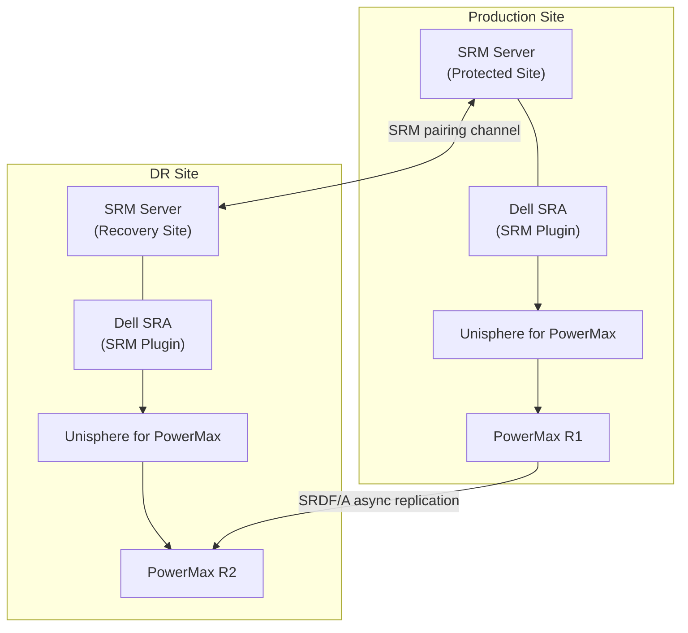

# SRDF/A — Integrations


<div class="kb-summary">
> Part of the [SRDF/A](../../index.md) reference.
</div>

---
## SRM Integration Topology


```
┌───────────────────────────────── SRDF/A — Architecture Integrations ──────────────────────────────────┐
│                                                                                                       │
│   ┌───────────────────────────────────────────────────────────────────────────────────────────────┐   │
│   │                              SRDF/A — External Integration Points                             │   │
│   │  Auth: Symmetrix/PowerMax admin credentials; Solutions Enabler (SYMAPI); role-based Unisphere │   │
│   │                 Storage: connected via FC dark fiber / DWDM · FCIP (TCP 3225)                 │   │
│   │            Monitoring: SNMP traps / syslog / REST API to ITSM and alerting systems            │   │
│   │      Encryption: SRDF encryption at the FA/RF port level; Unisphere HTTPS; SE service TLS     │   │
│   └───────────────────────────────────────────────────────────────────────────────────────────────┘   │
│                                                                                                       │
│                          ▼                        ▼                        ▼                          │
│                                                                                                       │
│   ┌─────────────────────────────┐  ┌─────────────────────────────┐  ┌─────────────────────────────┐   │
│   │           Identity          │  │           Storage           │  │          Monitoring         │   │
│   │          AD / LDAP          │  │     FC dark fiber / DWDM    │  │        SNMP / syslog        │   │
│   │           SAML SSO          │  │       FCIP (TCP 3225)       │  │         REST webhook        │   │
│   │          RBAC roles         │  │       NFS / iSCSI / FC      │  │         Email alerts        │   │
│   │         MFA optional        │  │       Dedup appliance       │  │          ServiceNow         │   │
│   │          Cert auth          │  │        Object storage       │  │          Prometheus         │   │
│   └─────────────────────────────┘  └─────────────────────────────┘  └─────────────────────────────┘   │
│                                                                                                       │
│  Physical Infrastructure:                                                                             │
│  Two PowerMax arrays (production + DR site) · FC/FCIP SRDF link (dedicated bandwidth) · RF ports      │
│  Key terms:                                                                                           │
│                                                                                                       │
│  SRDF          = Symmetrix Remote Data Facility; EMC array-based replication technology               │
│  R1            = source SRDF volume on production array; host writes flow here                        │
│  R2            = target SRDF volume on DR array; receives replicated data asynchronously              │
│  Delta Set     = batch of host writes accumulated per SRDF/A cycle; shipped to R2 atomically          │
│  Cycle Time    = SRDF/A replication interval (15–60 seconds); determines maximum RPO                  │
│  symrdf        = Solutions Enabler CLI for SRDF operations: establish, split, failover, restore       │
│  SRDF Link     = FC or FCIP path between R1 and R2 arrays; dedicated, monitored bandwidth             │
│  Suspended     = SRDF pair state where replication is paused; R2 data frozen at last cycle            │
│  Failover      = SRDF operation making R2 read-write; R1 becomes Not Ready to hosts                   │
│  Restore       = after failover resolution, re-establishes replication with R1 as source              │
│  Establish     = initial sync or re-sync operation that copies R1 to R2 in full                       │
│  Split         = breaks SRDF pair temporarily; both R1 and R2 are R/W; no replication                 │
│  FCIP          = Fibre Channel over IP; tunnels FC SRDF traffic over IP WAN link                      │
│  Unisphere     = Dell PowerMax management GUI; REST API; array health and provisioning                │
│                                                                                                       │
└───────────────────────────────────────────────────────────────────────────────────────────────────────┘
```
```
