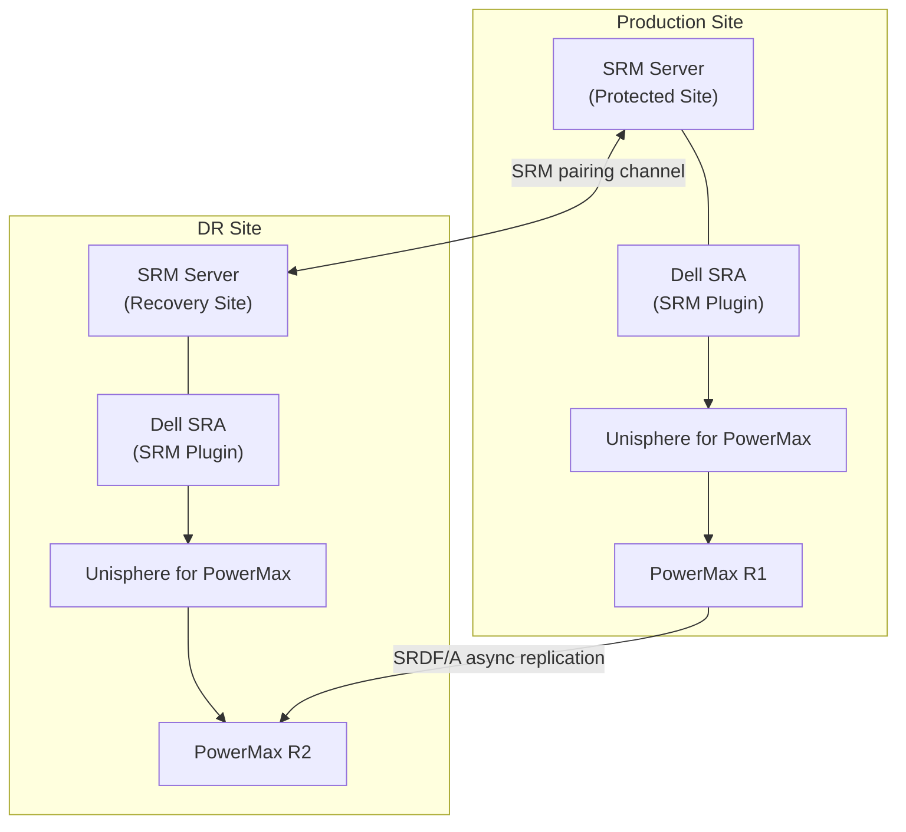

# SRDF/A — Integrations

> Part of the [SRDF/A](../../index.md) reference.

---
## SRM Integration Topology


```

This pattern ensures production I/O is not affected by backup processing and provides a consistent point-in-time copy independent of the SRDF/A cycle boundary.

**Important:** Confirm the R2 SRDF/A pair is in a consistent state before creating the snapshot — taking a snapshot mid-cycle may capture a transitional state.

---

## RecoverPoint Co-existence

RecoverPoint (RP) journaling and SRDF/A can co-exist on the same PowerMax array provided:

- RecoverPoint journal volumes are **not in the same SRDF device groups** as SRDF/A volumes.
- RP-protected LUNs use separate SRDF groups if they also require SRDF replication (cascaded protection).
- Zone isolation prevents RP I/O splitters from interfering with SRDF director ports.

Consult Dell Professional Services before deploying RecoverPoint and SRDF/A on the same array if the configuration is non-trivial.

---

## SYMCLI Integration Points

SRDF/A can be scripted via SYMCLI for automated pre/post hooks in SRM and DR runbooks:

```bash
# Query all SRDF/A pairs for a device group
symrdf -g <dgname> -sid <r1_sid> query

# Suspend SRDF/A before maintenance (pre-hook in SRM custom scripts)
symrdf -g <dgname> -sid <r1_sid> suspend -noprompt

# Resume after maintenance (post-hook)
symrdf -g <dgname> -sid <r1_sid> resume -noprompt

# Verify pair state after resume before confirming maintenance complete
symrdf -g <dgname> -sid <r1_sid> verify -consistent
```
