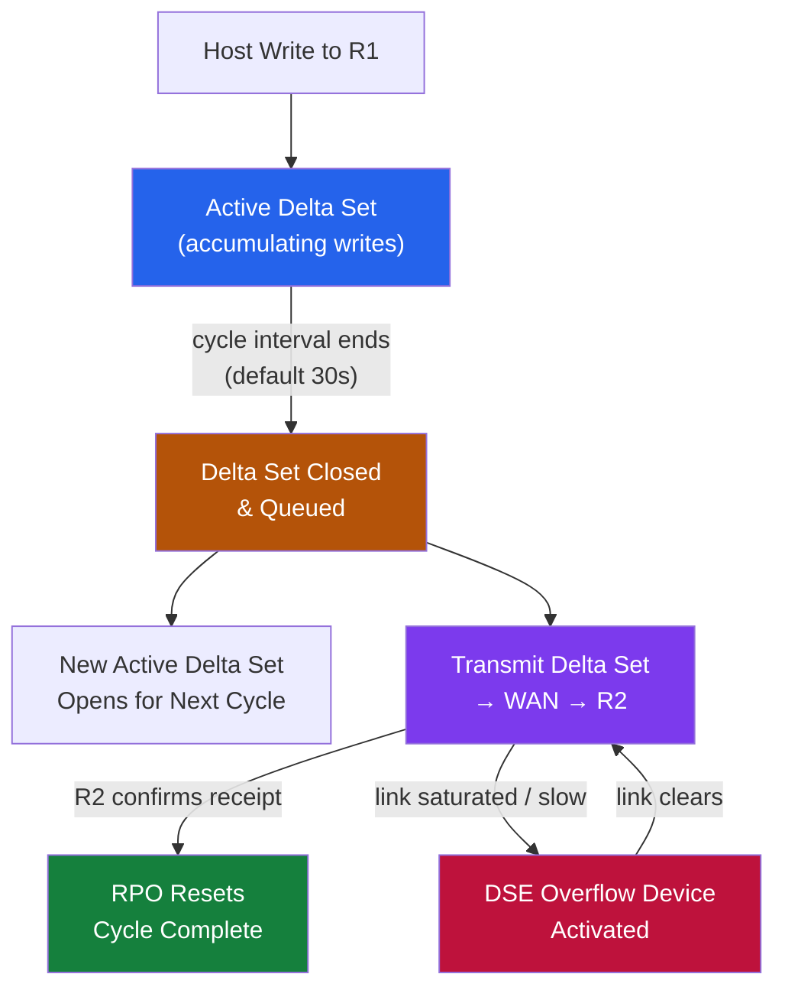
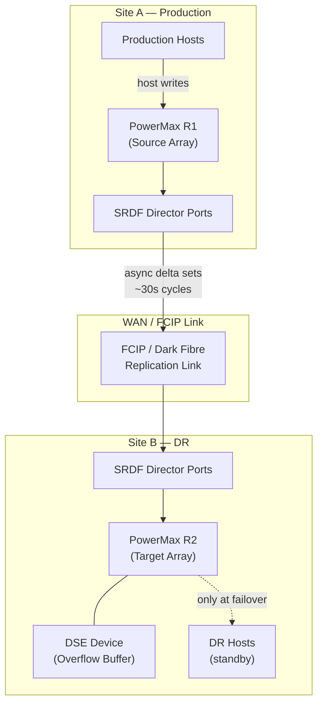
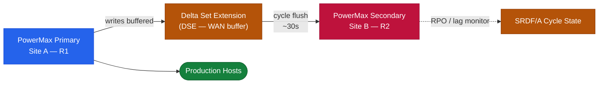

# SRDF/A — Overview

> Part of the [SRDF/A](../../) reference.

---
## Overview

SRDF/A (Asynchronous) replicates data from a source PowerMax to a target PowerMax by capturing writes into time-bounded delta sets (cycles) and transmitting them in order. The source array acknowledges writes to the host before transmission, so host write latency is not directly affected by WAN latency — this is the key difference from SRDF/S.

**RPO** is determined by cycle time (default 30 seconds). If the WAN link fails, the R1 (source) continues accepting writes while the R2 (target) falls behind; RPO exposure equals the time since the last successful cycle completed at the target.

---

## Delta Set Mechanics

1. Host writes to R1 go into the **active delta set** for the current cycle.
2. At the end of the cycle interval, the active delta set is **closed** and queued for transmission.
3. A new delta set opens for the next cycle.
4. The closed delta set is transmitted to R2 in sequence — each delta set is applied in order, maintaining consistency.
5. When R2 confirms receipt, the cycle is complete and RPO resets.

Two delta sets are maintained simultaneously: one being transmitted (transmit delta set) and one accepting new writes (active delta set). A third set (overflow) is used when the transmit delta set is not clearing fast enough.

---

## SRDF Group Design

An SRDF group (RDF group) is a logical container for R1/R2 device pairs. All pairs in a group share the same cycle boundary, meaning they are consistent with each other at failover.

- All devices representing a single application or workload should be in the **same SRDF group** to guarantee write-order consistency.
- Multiple SRDF groups can exist between the same two arrays, but each has independent cycle timers.
- Device group (`symdg`) is the management boundary for controlling replication (`symrdf -g <dgname>`).

---

## Connectivity

SRDF/A transmits over:

| Link Type | Use Case |
|---|---|
| FCIP (FC over IP) | Most common — FC-to-IP gateway over a WAN |
| Dark fibre (FC) | Short distances only — adds no additional latency |
| iSLR (IP Short Range) | Newer PowerMax connectivity via IP directors |

**Bandwidth sizing:** The required bandwidth equals the average write I/O rate × average block size × replication overhead (~1.1–1.2x). For SRDF/A, bandwidth headroom above the average is also needed to handle peak delta set sizes without cycle delay.

---

## Dual-Site Topology

## Pair States

| State | Meaning | Normal? |
|---|---|---|
| Synchronized | R2 is up to date; no active delta sets pending | Yes — for SRDF/S only |
| Consistent | R2 is consistent and receiving cycles; the latest cycle is applied | Yes — normal SRDF/A state |
| SyncInProg | Synchronisation in progress after resume | Transient |
| Transmit Idle | No data being transmitted — link idle, no new writes, or link saturation | Investigate if unexpected |
| Suspended | Replication manually suspended | Expected if a suspension was performed |
| Failed Over | R1 devices are read-only; R2 devices are R/W | Active failover underway |
| Split | Devices are split — both R1 and R2 are R/W (data diverges from this point) | Only for planned operations |

---

## Licensing

SRDF/A requires:
- **SRDF/A license** on both source and target PowerMax arrays
- SRDF port licenses on the directors used for replication
- Optional: **TimeFinder/SnapVX** on the target to create local snapshots of R2 devices for backup offload

---

## Architecture Diagram (Logical)

