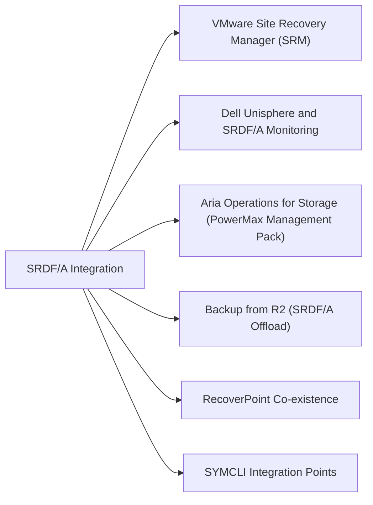

# SRDF/A Integration

> Part of the [SRDF/A](../) reference.

---



## VMware Site Recovery Manager (SRM)

SRDF/A integrates with VMware SRM via the **Dell EMC Storage Replication Adapter (SRA)**, enabling automated orchestration of SRDF failover as part of SRM Recovery Plans.

**Setup steps:**

1. Install the Dell SRA on both protected-site and recovery-site SRM servers.
2. In SRM, configure the array manager on both sites by providing PowerMax Unisphere credentials.
3. SRM discovers SRDF groups via the SRA and lists available replicated datastores.
4. Create **Protection Groups** in SRM — map each SRDF device group to an SRM protection group.
5. Create a **Recovery Plan** that defines the power-on order, IP customisation rules, and pre/post scripts.
6. Run **Test Failover** (non-disruptive — SRM creates a temporary snapshot on R2 and powers on VMs in a test bubble network).

**Key operational notes:**

- SRM test failover uses SnapVX on the R2 devices — ensure SnapVX capacity exists on the DR array.
- SRM and SRDF/A must agree on which SRDF groups are protected — do not add or remove devices from an SRDF group while an SRM protection group references it without updating SRM.
- SRDF group suspension during maintenance should be coordinated with SRM — SRM health checks will alarm if the SRDF pair state is not "Consistent" or "Synchronized."

---

## Dell Unisphere and SRDF/A Monitoring

Unisphere for PowerMax provides the primary monitoring interface for SRDF/A health:

- **Storage → Replication → SRDF Groups** — shows pair state, cycle time, and delta mark count per group.
- **Performance → SRDF** — historical bandwidth and latency metrics.
- **Alerts** — configure threshold alerts for:
  - Cycle time exceeding the RPO target (e.g., > 60s for a 30s cycle target)
  - Delta mark count growing (indicates link cannot keep pace with writes)
  - Pair state moving to Transmit Idle or Suspended

---

## Aria Operations for Storage (PowerMax Management Pack)

The Dell PowerMax management pack for Aria Operations surfaces SRDF/A metrics directly in the Aria dashboard:

- SRDF group health (consistent / degraded / failed)
- RPO lag in seconds
- Delta set queue depth
- WAN link utilisation

Configure alerts in Aria to page on-call when the SRDF/A lag exceeds the agreed RPO threshold.

---

## Backup from R2 (SRDF/A Offload)

Rather than running backup agents against production (R1) volumes, backups can be taken from R2 (DR site) to avoid production I/O impact.

**Approach using SnapVX on R2:**

```bash
# Create a consistent snapshot of all R2 devices in the device group
symsnap -g <dgname> -sid <r2_sid> establish -name BACKUP_<date>

# Mount the snapshot on a backup host (using symclone or direct mount)
# Run the backup from the mounted snapshot
# Terminate the snapshot after backup completes
symsnap -g <dgname> -sid <r2_sid> terminate -name BACKUP_<date>
```

This pattern ensures production I/O is not affected by backup processing and provides a consistent point-in-time copy independent of the SRDF/A cycle boundary.

**Important:** Confirm the R2 SRDF/A pair is in a consistent state before creating the snapshot — taking a snapshot mid-cycle may capture a transitional state.

---

## RecoverPoint Co-existence

RecoverPoint (RP) journaling and SRDF/A can co-exist on the same PowerMax array provided:

- RecoverPoint journal volumes are **not in the same SRDF device groups** as SRDF/A volumes.
- RP-protected LUNs use separate SRDF groups if they also require SRDF replication (cascaded protection).
- Zone isolation prevents RP I/O splitters from interfering with SRDF director ports.

Consult Dell Professional Services before deploying RecoverPoint and SRDF/A on the same array if the configuration is non-trivial.

---

## SYMCLI Integration Points

SRDF/A can be scripted via SYMCLI for automated pre/post hooks in SRM and DR runbooks:

```bash
# Query all SRDF/A pairs for a device group
symrdf -g <dgname> -sid <r1_sid> query

# Suspend SRDF/A before maintenance (pre-hook in SRM custom scripts)
symrdf -g <dgname> -sid <r1_sid> suspend -noprompt

# Resume after maintenance (post-hook)
symrdf -g <dgname> -sid <r1_sid> resume -noprompt

# Verify pair state after resume before confirming maintenance complete
symrdf -g <dgname> -sid <r1_sid> verify -consistent
```
