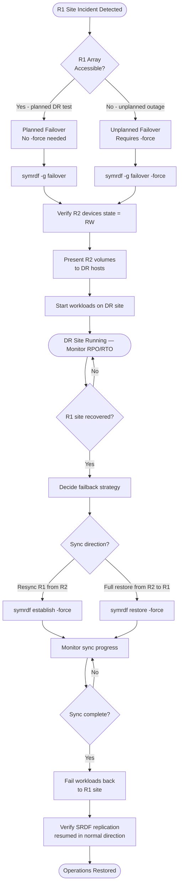

# SRDF/A — Backup & Restore

## SRDF/A Overview

**SRDF/A (Asynchronous)** replicates I/O from the source (R1) array to a remote target (R2) array in asynchronous cycles. A delta set of writes is accumulated on the source, then transmitted to the target as a single atomic update. This allows replication over high-latency WAN links with a defined RPO (typically seconds to minutes, depending on cycle time and bandwidth).

| Property | SRDF/A |
|---|---|
| Mode | Asynchronous |
| RPO | Seconds to minutes (cycle-dependent) |
| Impact on host I/O | Minimal — host I/O completes when written to R1 |
| WAN requirement | Lower bandwidth requirement vs SRDF/S |
| Consistency | Cycle-consistent — all writes in a delta set arrive atomically |
| Use case | DR site > 100 km, or constrained WAN bandwidth |

---

## SYMCLI Command Reference

All SRDF operations use `symrdf` from the **Symmetrix Command Line Interface (SYMCLI)** suite.

### Environment Setup

```bash
# Set the Symmetrix/VMAX SID (array serial number)
export SYMCLI_SID=000123456789

# Or use -sid flag on each command
symrdf -sid 000123456789 query -g <rdf_group>
```

**Device states to understand:**

| State | Meaning |
|---|---|
| `WD` (Write Disabled) | R2 is synchronized and write-protected |
| `NR` (Not Ready) | Device offline or not accessible |
| `RW` (Read/Write) | Device is accessible for reads and writes (post-failover) |
| `Suspended` | Replication paused |
| `Failed Over` | Failover has occurred; R1 link broken |

---

## SRDF/A Failover Procedure

### Pre-Failover Requirements

- [ ] Confirm R1 (source) site is unavailable or inaccessible.
- [ ] Identify the latest consistent delta set received at R2.
- [ ] Coordinate with application owners — failover causes brief I/O disruption on R2.
- [ ] Confirm R2 storage and compute infrastructure is operational.

### Failover Steps

```bash
# 1. Verify current SRDF state — confirm it is not in a transient state
symrdf query -g PROD_RDF_GROUP

# 2. Execute failover — promotes R2 devices to RW, isolates from R1
symrdf -g PROD_RDF_GROUP failover -force

# 3. Confirm R2 devices are now RW and R1 link shows "Failed Over"
symrdf query -g PROD_RDF_GROUP

# 4. Present R2 volumes to DR hosts (if not using host-based failover automation)
# This step is environment-specific — SRM, host scripts, or manual masking

# 5. Start production workloads on DR site
```

**Important:** The `-force` flag is required when R1 is inaccessible and the link cannot confirm synchronization. Without it, `symrdf failover` will refuse to proceed if the link is already down.

### Failover with Storage Group (SG-based management)

In modern VMAX/PowerMax environments, RDF operations are performed at the Storage Group level:

```bash
# Storage Group failover (preferred for VMAX3/PowerMax)
symrdf -sg PROD_SG failover -force

# Query by storage group
symrdf -sg PROD_SG query
```

---

## SRDF/A vs SRDF/S Differences

| Feature | SRDF/A | SRDF/S |
|---|---|---|
| Write acknowledgement | After write to R1 cache | After write confirmed at both R1 and R2 |
| Host I/O latency impact | Minimal | Adds round-trip latency for every write |
| RPO | Cycle time (seconds to minutes) | Near-zero (synchronous) |
| WAN distance | Any (limited by bandwidth, not latency) | Typically <200 km (latency constrained) |
| Consistency model | Delta-set consistent (cycle boundary) | Write-order consistent |
| Failover data loss | Up to one cycle of writes | Zero data loss |

---

## Re-establishing Replication After Recovery

After the primary (R1) site is restored, reverse the replication or re-establish the original direction.

### Option A: Establish (Reverse Direction, DR to Production)

```bash
# Re-establish SRDF from R2 (current production) back to R1 (recovered site)
# This syncs changes made on R2 back to R1
symrdf -g PROD_RDF_GROUP establish -force

# Monitor sync state
symrdf query -g PROD_RDF_GROUP
# Wait until: R1 St = WD, R2 St = WD (synchronized)
```

### Option B: Restore (Full Resync, Production to DR)

After a full recovery where R1 is rebuilt from scratch:

```bash
# Restore re-syncs R1 from R2 in full
symrdf -g PROD_RDF_GROUP restore -force

# Monitor
symrdf query -g PROD_RDF_GROUP
```

### Option C: Failback to R1 After Failover

```bash
# 1. Ensure R1 site volumes are accessible and array is healthy
# 2. Perform a 'failover' back in the original direction (now R2→R1)
symrdf -g PROD_RDF_GROUP failover -force

# 3. Flip replication direction so R1 is again the source
symrdf -g PROD_RDF_GROUP establish

# 4. Monitor until synchronized
symrdf query -g PROD_RDF_GROUP
```

---

## SRDF/A Failover Flowchart



---

## Validation with symrdf query

After any SRDF operation, validate the state thoroughly before declaring recovery complete.

```bash
# Detailed query — shows RPO, link state, device state
symrdf query -g PROD_RDF_GROUP -detail

# Check RDF group information
symrdf list -rdfg <rdfg_number> -detail

# Verify RDF director status on the array
symcfg list -rdfg all

# Check RPO for async groups
symrdf -g PROD_RDF_GROUP verify -consistent

# Alert if RPO exceeds threshold
symrdf -g PROD_RDF_GROUP query | grep -E "RPO|Mode"
```

### Expected States at Each Stage

| Stage | R1 State | R2 State | Link State |
|---|---|---|---|
| Normal replication | WD | WD | Transmit/Receive |
| Mid-failover | NR | Transitioning | Suspended |
| Post-failover (DR active) | NR/Suspended | RW | Failed Over |
| Re-establish in progress | WD | WD | Synchronizing |
| Fully re-established | WD | WD | Synchronized |

---

## Post-Recovery Validation Checklist

| # | Check | Command |
|---|---|---|
| 1 | R2 devices in RW state | `symrdf query -g <group>` |
| 2 | Volumes presented to DR hosts | `symdev list -v` or host-level `lsblk` |
| 3 | File systems mounted | `df -h` / `Get-PSDrive` |
| 4 | Applications started and healthy | App-level health check |
| 5 | RPO at time of failover documented | `symrdf query` output saved to incident ticket |
| 6 | R1 array status confirmed (degraded/unavailable) | Array management console |
| 7 | Re-establishment scheduled | Track sync progress in SYMCLI |
| 8 | SRDF link re-established after recovery | `symrdf query` shows Synchronized |
| 9 | Backup jobs re-targeted to DR site | Check backup policy pointing to R2 volumes |
| 10 | Incident documented | DR exercise report or incident record |
