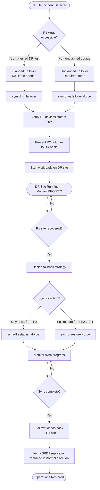

# SRDF/A — Backup & Restore


<div class="kb-summary">
Backup & Restore reference covering SRDF/A Overview, SYMCLI Command Reference, SRDF/A vs SRDF/S Differences, Re-establishing Replication After Recovery, SRDF/A Failover Flowchart and 2 more sections.
</div>

## SRDF/A Overview

**SRDF/A (Asynchronous)** replicates I/O from the source (R1) array to a remote target (R2) array in asynchronous cycles. A delta set of writes is accumulated on the source, then transmitted to the target as a single atomic update. This allows replication over high-latency WAN links with a defined RPO (typically seconds to minutes, depending on cycle time and bandwidth).

| Property | SRDF/A |
|---|---|
| Mode | Asynchronous |
| RPO | Seconds to minutes (cycle-dependent) |
| Impact on host I/O | Minimal — host I/O completes when written to R1 |
| WAN requirement | Lower bandwidth requirement vs SRDF/S |
| Consistency | Cycle-consistent — all writes in a delta set arrive atomically |
| Use case | DR site > 100 km, or constrained WAN bandwidth |

---

## SYMCLI Command Reference

All SRDF operations use `symrdf` from the **Symmetrix Command Line Interface (SYMCLI)** suite.

### Environment Setup

```bash
# Set the Symmetrix/VMAX SID (array serial number)
export SYMCLI_SID=000123456789

# Or use -sid flag on each command
symrdf -sid 000123456789 query -g <rdf_group>
```
```
┌────────────────────────────────────── SRDF/A — Backup & Restore ──────────────────────────────────────┐
│                                                                                                       │
│    Backup flow: quiesce source → snapshot/copy → transfer → write to target → catalog                 │
│                                                                                                       │
│   ┌──────────────────────────────────────────────┐  ┌─────────────────────────────────────────────┐   │
│   │             Backup (Protection)              │  │              Restore (Recovery)             │   │
│   │               symrdf establish               │  │          symrdf failover / failback         │   │
│   │              Quiesce source I/O              │  │            Select recovery point            │   │
│   │             Take snapshot / CBT              │  │           Mount or copy to target           │   │
│   │           Transfer changed blocks            │  │              Validate integrity             │   │
│   │             Commit to repository             │  │             Restart application             │   │
│   └──────────────────────────────────────────────┘  └─────────────────────────────────────────────┘   │
│                                                                                                       │
│   ┌───────────────────────────────────────────────────────────────────────────────────────────────┐   │
│   │                                      Key SRDF/A Commands                                      │   │
│   │                                Backup trigger  : symrdf establish                             │   │
│   │                           List points     : symrdf failover / failback                        │   │
│   │                                  Health status   : symrdf query                               │   │
│   │                                 Retention mgmt  : symrdf verify                               │   │
│   └───────────────────────────────────────────────────────────────────────────────────────────────┘   │
│                                                                                                       │
│  Physical Infrastructure:                                                                             │
│  Two PowerMax arrays (production + DR site) · FC/FCIP SRDF link (dedicated bandwidth) · RF ports      │
│  Key terms:                                                                                           │
│                                                                                                       │
│  SRDF          = Symmetrix Remote Data Facility; EMC array-based replication technology               │
│  R1            = source SRDF volume on production array; host writes flow here                        │
│  R2            = target SRDF volume on DR array; receives replicated data asynchronously              │
│  Delta Set     = batch of host writes accumulated per SRDF/A cycle; shipped to R2 atomically          │
│  Cycle Time    = SRDF/A replication interval (15–60 seconds); determines maximum RPO                  │
│  symrdf        = Solutions Enabler CLI for SRDF operations: establish, split, failover, restore       │
│  SRDF Link     = FC or FCIP path between R1 and R2 arrays; dedicated, monitored bandwidth             │
│  Suspended     = SRDF pair state where replication is paused; R2 data frozen at last cycle            │
│  Failover      = SRDF operation making R2 read-write; R1 becomes Not Ready to hosts                   │
│  Restore       = after failover resolution, re-establishes replication with R1 as source              │
│  Establish     = initial sync or re-sync operation that copies R1 to R2 in full                       │
│  Split         = breaks SRDF pair temporarily; both R1 and R2 are R/W; no replication                 │
│  FCIP          = Fibre Channel over IP; tunnels FC SRDF traffic over IP WAN link                      │
│  Unisphere     = Dell PowerMax management GUI; REST API; array health and provisioning                │
│                                                                                                       │
└───────────────────────────────────────────────────────────────────────────────────────────────────────┘
```
```text

---

## SRDF/A vs SRDF/S Differences

| Feature | SRDF/A | SRDF/S |
|---|---|---|
| Write acknowledgement | After write to R1 cache | After write confirmed at both R1 and R2 |
| Host I/O latency impact | Minimal | Adds round-trip latency for every write |
| RPO | Cycle time (seconds to minutes) | Near-zero (synchronous) |
| WAN distance | Any (limited by bandwidth, not latency) | Typically <200 km (latency constrained) |
| Consistency model | Delta-set consistent (cycle boundary) | Write-order consistent |
| Failover data loss | Up to one cycle of writes | Zero data loss |

---

## Re-establishing Replication After Recovery

After the primary (R1) site is restored, reverse the replication or re-establish the original direction.

### Option A: Establish (Reverse Direction, DR to Production)

```bash
# Re-establish SRDF from R2 (current production) back to R1 (recovered site)
# This syncs changes made on R2 back to R1
symrdf -g PROD_RDF_GROUP establish -force

# Monitor sync state
symrdf query -g PROD_RDF_GROUP
# Wait until: R1 St = WD, R2 St = WD (synchronized)
```

### Option B: Restore (Full Resync, Production to DR)

After a full recovery where R1 is rebuilt from scratch:

```bash
# Restore re-syncs R1 from R2 in full
symrdf -g PROD_RDF_GROUP restore -force

# Monitor
symrdf query -g PROD_RDF_GROUP
```

### Option C: Failback to R1 After Failover

```bash
# 1. Ensure R1 site volumes are accessible and array is healthy
# 2. Perform a 'failover' back in the original direction (now R2→R1)
symrdf -g PROD_RDF_GROUP failover -force

# 3. Flip replication direction so R1 is again the source
symrdf -g PROD_RDF_GROUP establish

# 4. Monitor until synchronized
symrdf query -g PROD_RDF_GROUP
```

---

## SRDF/A Failover Flowchart



---

## Validation with symrdf query

After any SRDF operation, validate the state thoroughly before declaring recovery complete.

```bash
# Detailed query — shows RPO, link state, device state
symrdf query -g PROD_RDF_GROUP -detail

# Check RDF group information
symrdf list -rdfg <rdfg_number> -detail

# Verify RDF director status on the array
symcfg list -rdfg all

# Check RPO for async groups
symrdf -g PROD_RDF_GROUP verify -consistent

# Alert if RPO exceeds threshold
symrdf -g PROD_RDF_GROUP query | grep -E "RPO|Mode"
```

### Expected States at Each Stage

| Stage | R1 State | R2 State | Link State |
|---|---|---|---|
| Normal replication | WD | WD | Transmit/Receive |
| Mid-failover | NR | Transitioning | Suspended |
| Post-failover (DR active) | NR/Suspended | RW | Failed Over |
| Re-establish in progress | WD | WD | Synchronizing |
| Fully re-established | WD | WD | Synchronized |

---

## Post-Recovery Validation Checklist

| # | Check | Command |
|---|---|---|
| 1 | R2 devices in RW state | `symrdf query -g <group>` |
| 2 | Volumes presented to DR hosts | `symdev list -v` or host-level `lsblk` |
| 3 | File systems mounted | `df -h` / `Get-PSDrive` |
| 4 | Applications started and healthy | App-level health check |
| 5 | RPO at time of failover documented | `symrdf query` output saved to incident ticket |
| 6 | R1 array status confirmed (degraded/unavailable) | Array management console |
| 7 | Re-establishment scheduled | Track sync progress in SYMCLI |
| 8 | SRDF link re-established after recovery | `symrdf query` shows Synchronized |
| 9 | Backup jobs re-targeted to DR site | Check backup policy pointing to R2 volumes |
| 10 | Incident documented | DR exercise report or incident record |
