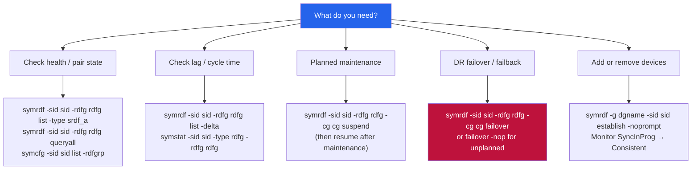

# SRDF/A — CLI Reference

> Part of the [SRDF/A](../../index.md) reference.
---

## Overview

SRDF/A (Asynchronous) is managed via SYMCLI on a Solutions Enabler (SE) host that has access to the PowerMax/VMAX gatekeeper devices. All commands require `-sid <SymmID>` and typically `-rdfg <rdfg_number>`.

Run `symcfg list` to identify your SID. Run `symrdf -sid <sid> list` to identify RDF group numbers.

---

## SRDF/A Command Decision Map


┌─────────────────────────────────────── SRDF/A — CLI Reference ────────────────────────────────────────┐
│                                                                                                       │
│   ┌───────────────────────────────────────────────────────────────────────────────────────────────┐   │
│   │                                   SRDF/A — Command Reference                                  │   │
│   │           Use these commands for routine operations, scripting, and troubleshooting           │   │
│   │                                         symrdf establish                                      │   │
│   │                                    symrdf failover / failback                                 │   │
│   │                                           symrdf query                                        │   │
│   │                                     symrdf suspend / resume                                   │   │
│   │                                          symrdf verify                                        │   │
│   └───────────────────────────────────────────────────────────────────────────────────────────────┘   │
│                                                                                                       │
│    Ports: FC dark fiber / DWDM · FCIP (TCP 3225) · 9443 (Unisphere HTTPS)                             │
│                                                                                                       │
│   ┌───────────────────────────────────────────────────────────────────────────────────────────────┐   │
│   │                                       Command Categories                                      │   │
│   │                  Status / Query  — check current state, list jobs, show config                │   │
│   │                  Operations      — start, stop, failover, restore, sync, expire               │   │
│   │                Configuration   — add/modify policies, schedules, storage targets              │   │
│   │               Diagnostics     — collect logs, run health checks, test connectivity            │   │
│   │                  Scripting       — REST API or CLI for automation and reporting               │   │
│   └───────────────────────────────────────────────────────────────────────────────────────────────┘   │
│                                                                                                       │
│  Physical Infrastructure:                                                                             │
│  Two PowerMax arrays (production + DR site) · FC/FCIP SRDF link (dedicated bandwidth) · RF ports      │
│  Key terms:                                                                                           │
│                                                                                                       │
│  SRDF          = Symmetrix Remote Data Facility; EMC array-based replication technology               │
│  R1            = source SRDF volume on production array; host writes flow here                        │
│  R2            = target SRDF volume on DR array; receives replicated data asynchronously              │
│  Delta Set     = batch of host writes accumulated per SRDF/A cycle; shipped to R2 atomically          │
│  Cycle Time    = SRDF/A replication interval (15–60 seconds); determines maximum RPO                  │
│  symrdf        = Solutions Enabler CLI for SRDF operations: establish, split, failover, restore       │
│  SRDF Link     = FC or FCIP path between R1 and R2 arrays; dedicated, monitored bandwidth             │
│  Suspended     = SRDF pair state where replication is paused; R2 data frozen at last cycle            │
│  Failover      = SRDF operation making R2 read-write; R1 becomes Not Ready to hosts                   │
│  Restore       = after failover resolution, re-establishes replication with R1 as source              │
│  Establish     = initial sync or re-sync operation that copies R1 to R2 in full                       │
│  Split         = breaks SRDF pair temporarily; both R1 and R2 are R/W; no replication                 │
│  FCIP          = Fibre Channel over IP; tunnels FC SRDF traffic over IP WAN link                      │
│  Unisphere     = Dell PowerMax management GUI; REST API; array health and provisioning                │
│                                                                                                       │
└───────────────────────────────────────────────────────────────────────────────────────────────────────┘

---

## Operations on Storage Groups (CG-based)

SRDF/A operations are performed on Composite Groups (CG) or Storage Groups (SG). Using `-cg` is recommended for SRDF/A to ensure consistency across all devices.

```bash
# Suspend SRDF/A (pause replication — hold at DR site)
symrdf -sid 000123456789 -rdfg 10 -cg cg_oracle_prod suspend

# Resume SRDF/A after suspend
symrdf -sid 000123456789 -rdfg 10 -cg cg_oracle_prod resume

# Update (force a manual sync cycle)
symrdf -sid 000123456789 -rdfg 10 -cg cg_oracle_prod update

# Failover — activate R2 devices for production use at DR site
symrdf -sid 000123456789 -rdfg 10 -cg cg_oracle_prod failover

# Failover without establishing reverse replication
symrdf -sid 000123456789 -rdfg 10 -cg cg_oracle_prod failover -nop

# Failback — return to normal after failover (resync R2 to R1)
symrdf -sid 000123456789 -rdfg 10 -cg cg_oracle_prod failback

# Establish / re-establish SRDF/A pair (from scratch or after failover)
symrdf -sid 000123456789 -rdfg 10 -cg cg_oracle_prod establish

# Split (break mirror, R1 and R2 both R/W — for maintenance)
symrdf -sid 000123456789 -rdfg 10 -cg cg_oracle_prod split

# Swap personalities (R1 becomes R2, DR site becomes source)
symrdf -sid 000123456789 -rdfg 10 -cg cg_oracle_prod swap
```

---

## Device-Level Operations

For per-device inspection or scripted operations:

```bash
# List devices in an RDF group with their state
symdev -sid 000123456789 list -rdfg 10 -rdf

# Show specific device SRDF/A detail
symdev -sid 000123456789 show 00B5 -rdf

# Query a specific device pair
symrdf -sid 000123456789 -rdfg 10 query dev 00B5

# Verify device states match expected (exits non-zero on mismatch)
symrdf -sid 000123456789 -rdfg 10 verify dev 00B5

# Device group operations (legacy — prefer SG-based operations above)
symdg show cg_oracle_prod
symrdf -g cg_oracle_prod -sid 000123456789 query
```

---

## SRDF/A Consistency Protection

SRDF/A uses transmit idle to ensure consistency. Monitor with:

```bash
# Show SRDF/A consistency state per group
symrdf -sid 000123456789 -rdfg 10 list -v | grep -E "Consistency|SRDF/A|Mode"

# Check if any devices are in "Not Ready" or "Failed Over" state
symrdf -sid 000123456789 -rdfg 10 queryall | grep -v "Synchronized\|SyncInProg"
```

---

## Unisphere REST API

Base URL: `https://<unisphere-host>:8443/univmax/restapi`  
Authentication: HTTP Basic.

```bash
UNISPHERE="https://unisphere.example.com:8443/univmax/restapi"
SID="000123456789"
AUTH="-u smc:password --insecure"

# List all RDF groups for an array
curl -s $AUTH "$UNISPHERE/100/replication/symmetrix/${SID}/rdf_group" | \
  python3 -m json.tool

# Get details of a specific RDF group
RDFG=10
curl -s $AUTH "$UNISPHERE/100/replication/symmetrix/${SID}/rdf_group/${RDFG}" | \
  python3 -m json.tool

# List replication volumes (SRDF device pairs) in a group
curl -s $AUTH "$UNISPHERE/100/replication/symmetrix/${SID}/rdf_group/${RDFG}/volume" | \
  python3 -m json.tool

# SRDF/A group state summary
curl -s $AUTH "$UNISPHERE/100/replication/symmetrix/${SID}/rdf_group/${RDFG}" | \
  python3 -c "
import sys, json
data = json.load(sys.stdin)
print('Mode:        ', data.get('remoteSymmetrix','?'))
print('SRDF/A State:', data.get('states','?'))
print('Label:       ', data.get('label','?'))
"

# StorageGroup-level replication details
SG="sg_oracle_prod"
curl -s $AUTH "$UNISPHERE/100/replication/symmetrix/${SID}/storagegroup/${SG}/rdf_group" | \
  python3 -m json.tool

# Performance metrics for an RDF group (KPIs)
curl -s $AUTH "$UNISPHERE/performance/RDFGroup/metrics" \
  -H "Content-Type: application/json" \
  -d "{
    \"symmetrixId\": \"${SID}\",
    \"rdfgNumber\": ${RDFG},
    \"dataFormat\": \"Average\",
    \"metrics\": [\"MBSentPerSec\",\"MBReceivedPerSec\",\"AvgCycleTime\",\"CyclesPerSec\"]
  }" | python3 -m json.tool
```
