```mermaid
flowchart TD
    startCheck["Daily Health Check Start"]
    checkPairState["Check Pair States\nsymrdf -g 20 -type A query"]
    allConsistent{"All Pairs\nConsistent?"}
    checkLag["Check Lag Value\nsymrdf -g 20 -type A query -detail | grep Lag"]
    lagOk{"Lag within\nSLA threshold?"}
    checkDSE["Check DSE Utilization\nsymstat -rdf -g 20 | grep DSE"]
    dseOk{"DSE < 30%?"}
    checkLink["Check RDF Link\nsymcfg list -rdfg 20 -detail"]
    linkOnline{"Link Online\nand < 80%?"}
    allHealthy["All Checks Passed\nDocument in log"]
    investigatePair["Investigate Pair State\nCheck for link/network issues"]
    investigateLag["Investigate Lag Growth\nCheck write rate and link utilization"]
    investigateDSE["Investigate DSE\nCheck for write burst or undersized DSE device"]
    escalate["Escalate to Storage / Network Team"]

    startCheck --> checkPairState
    checkPairState --> allConsistent
    allConsistent -->|"Yes"| checkLag
    allConsistent -->|"No"| investigatePair
    investigatePair --> escalate
    checkLag --> lagOk
    lagOk -->|"Yes"| checkDSE
    lagOk -->|"No"| investigateLag
    investigateLag --> escalate
    checkDSE --> dseOk
    dseOk -->|"Yes"| checkLink
    dseOk -->|"No"| investigateDSE
    investigateDSE --> escalate
    checkLink --> linkOnline
    linkOnline -->|"Yes"| allHealthy
    linkOnline -->|"No"| escalate

    style allHealthy fill:#15803d,color:#fff
    style escalate fill:#be123c,color:#fff
    style startCheck fill:#2563eb,color:#fff
```

# SRDF/A — Health Checks

```bash
# Show cycle state and lag for all devices in group 20
symrdf -g 20 -type A query -detail

# Quick summary — look for Consistent state on all devices
symrdf -g 20 -type A query

# Check lag value specifically
symrdf -g 20 -type A query -detail | grep -E "Lag|Cycle Age"

# Compare lag against SLA threshold (example: alert if > 60 seconds)
LAG=$(symrdf -g 20 -type A query -detail | grep "Lag" | awk '{print $NF}')
echo "Current lag: ${LAG} seconds"
```text
┌─────────────────────────────────────── SRDF/A — Health Checks ────────────────────────────────────────┐
│                                                                                                       │
│   ┌───────────────────────────────────────────────────────────────────────────────────────────────┐   │
│   │                                SRDF/A — Health Check Procedures                               │   │
│   │                 Run these checks daily/weekly to confirm protection is working                │   │
│   │                                           symrdf query                                        │   │
│   │                  Review job completion rate — target 100%; investigate failures               │   │
│   │                         Check replication/backup lag against RPO target                       │   │
│   └───────────────────────────────────────────────────────────────────────────────────────────────┘   │
│                                                                                                       │
│   │      Check       │  What to verify  │      Expected     │    Frequency     │  Action if bad   │   │
│   │    Job status    │All jobs complete │    100% success   │      Daily       │ Triage failures  │   │
│   │    Lag / RPO     │ Replication lag  │    < RPO target   │      Daily       │  Tune bandwidth  │   │
│   │     Capacity     │ Repo space used  │     < 80% full    │      Weekly      │ Expand or expire │   │
│   │   Restore test   │  Random restore  │    Data intact    │     Monthly      │ Fix backup chain │   │
│   └───────────────────────────────────────────────────────────────────────────────────────────────┘   │
│                                                                                                       │
│  Physical Infrastructure:                                                                             │
│  Two PowerMax arrays (production + DR site) · FC/FCIP SRDF link (dedicated bandwidth) · RF ports      │
│  Key terms:                                                                                           │
│                                                                                                       │
│  SRDF          = Symmetrix Remote Data Facility; EMC array-based replication technology               │
│  R1            = source SRDF volume on production array; host writes flow here                        │
│  R2            = target SRDF volume on DR array; receives replicated data asynchronously              │
│  Delta Set     = batch of host writes accumulated per SRDF/A cycle; shipped to R2 atomically          │
│  Cycle Time    = SRDF/A replication interval (15–60 seconds); determines maximum RPO                  │
│  symrdf        = Solutions Enabler CLI for SRDF operations: establish, split, failover, restore       │
│  SRDF Link     = FC or FCIP path between R1 and R2 arrays; dedicated, monitored bandwidth             │
│  Suspended     = SRDF pair state where replication is paused; R2 data frozen at last cycle            │
│  Failover      = SRDF operation making R2 read-write; R1 becomes Not Ready to hosts                   │
│  Restore       = after failover resolution, re-establishes replication with R1 as source              │
│  Establish     = initial sync or re-sync operation that copies R1 to R2 in full                       │
│  Split         = breaks SRDF pair temporarily; both R1 and R2 are R/W; no replication                 │
│  FCIP          = Fibre Channel over IP; tunnels FC SRDF traffic over IP WAN link                      │
│  Unisphere     = Dell PowerMax management GUI; REST API; array health and provisioning                │
│                                                                                                       │
└───────────────────────────────────────────────────────────────────────────────────────────────────────┘
```
```bash
# Full health check — save output with timestamp
symrdf -g 20 -type A query -detail > /tmp/srdf_a_health_$(date +%Y%m%d_%H%M%S).txt

# Check for any non-Consistent devices
symrdf -g 20 -type A query | grep -iv "consistent\|transmitting\|await"

# Check cycle completion statistics across all type-A groups
for rdfg in 20 21 22; do
  echo "=== RDFG ${rdfg} ===" 
  symrdf -g ${rdfg} -type A query | tail -5
done
```

