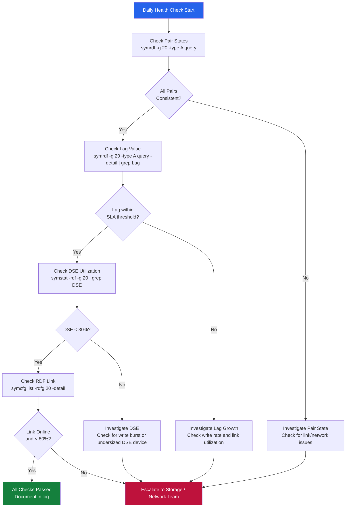

# SRDF/A — Health Checks


<div class="kb-summary">
> Part of the [SRDF/A](../../index.md) reference.
</div>

---

## Daily Checks

| Check | Command | Notes |
|---|---|---|
| [ ] All SRDF/A pairs are in Consistent or Synchronized state |  | no pairs in Transmit Idle, Split, or Mixed state without an open change ticket |
| [ ] Delta mark count is stable |  | a steadily growing delta mark count indicates the link cannot keep pace with writes |
| [ ] Cycle time is within the expected range (default 30 seconds) |  | confirm via `symrdf queryall` |
| [ ] No pairs in Transmit Idle state (indicates link saturation or bandwidth issue) |  |  |
| [ ] SRDF/A link utilization is below saturation threshold |  | check that bandwidth headroom exists for peak write periods |

---

## Cycle and Lag Status Check

SRDF/A health checks verify that asynchronous replication cycles are completing on schedule, lag is within SLA, DSE is not under pressure, and RDF links are stable. Unlike SRDF/S where the primary indicator is pair synchronization, SRDF/A health is primarily measured by **cycle completion rate** and **lag time**. Run these checks daily and always before any planned activity that touches the DR environment.

```bash
# Show cycle state and lag for all devices in group 20
symrdf -g 20 -type A query -detail

# Quick summary — look for Consistent state on all devices
symrdf -g 20 -type A query

# Check lag value specifically
symrdf -g 20 -type A query -detail | grep -E "Lag|Cycle Age"

# Compare lag against SLA threshold (example: alert if > 60 seconds)
LAG=$(symrdf -g 20 -type A query -detail | grep "Lag" | awk '{print $NF}')
echo "Current lag: ${LAG} seconds"
```
```
┌─────────────────────────────────────── SRDF/A — Health Checks ────────────────────────────────────────┐
│                                                                                                       │
│   ┌───────────────────────────────────────────────────────────────────────────────────────────────┐   │
│   │                                SRDF/A — Health Check Procedures                               │   │
│   │                 Run these checks daily/weekly to confirm protection is working                │   │
│   │                                           symrdf query                                        │   │
│   │                  Review job completion rate — target 100%; investigate failures               │   │
│   │                         Check replication/backup lag against RPO target                       │   │
│   └───────────────────────────────────────────────────────────────────────────────────────────────┘   │
│                                                                                                       │
│   │      Check       │  What to verify  │      Expected     │    Frequency     │  Action if bad   │   │
│   │    Job status    │All jobs complete │    100% success   │      Daily       │ Triage failures  │   │
│   │    Lag / RPO     │ Replication lag  │    < RPO target   │      Daily       │  Tune bandwidth  │   │
│   │     Capacity     │ Repo space used  │     < 80% full    │      Weekly      │ Expand or expire │   │
│   │   Restore test   │  Random restore  │    Data intact    │     Monthly      │ Fix backup chain │   │
│   └───────────────────────────────────────────────────────────────────────────────────────────────┘   │
│                                                                                                       │
│  Physical Infrastructure:                                                                             │
│  Two PowerMax arrays (production + DR site) · FC/FCIP SRDF link (dedicated bandwidth) · RF ports      │
│  Key terms:                                                                                           │
│                                                                                                       │
│  SRDF          = Symmetrix Remote Data Facility; EMC array-based replication technology               │
│  R1            = source SRDF volume on production array; host writes flow here                        │
│  R2            = target SRDF volume on DR array; receives replicated data asynchronously              │
│  Delta Set     = batch of host writes accumulated per SRDF/A cycle; shipped to R2 atomically          │
│  Cycle Time    = SRDF/A replication interval (15–60 seconds); determines maximum RPO                  │
│  symrdf        = Solutions Enabler CLI for SRDF operations: establish, split, failover, restore       │
│  SRDF Link     = FC or FCIP path between R1 and R2 arrays; dedicated, monitored bandwidth             │
│  Suspended     = SRDF pair state where replication is paused; R2 data frozen at last cycle            │
│  Failover      = SRDF operation making R2 read-write; R1 becomes Not Ready to hosts                   │
│  Restore       = after failover resolution, re-establishes replication with R1 as source              │
│  Establish     = initial sync or re-sync operation that copies R1 to R2 in full                       │
│  Split         = breaks SRDF pair temporarily; both R1 and R2 are R/W; no replication                 │
│  FCIP          = Fibre Channel over IP; tunnels FC SRDF traffic over IP WAN link                      │
│  Unisphere     = Dell PowerMax management GUI; REST API; array health and provisioning                │
│                                                                                                       │
└───────────────────────────────────────────────────────────────────────────────────────────────────────┘
```

---

## Health Check Summary

```bash
# Full health check — save output with timestamp
symrdf -g 20 -type A query -detail > /tmp/srdf_a_health_$(date +%Y%m%d_%H%M%S).txt

# Check for any non-Consistent devices
symrdf -g 20 -type A query | grep -iv "consistent\|transmitting\|await"

# Check cycle completion statistics across all type-A groups
for rdfg in 20 21 22; do
  echo "=== RDFG ${rdfg} ===" 
  symrdf -g ${rdfg} -type A query | tail -5
done
```

## Health Status Reference Table

| Metric | Healthy | Warning | Critical | Why it matters |
|---|---|---|---|---|
| Cycle state | Consistent / Transmitting | Awaiting Cycle > 2x cycle time | Suspended / Inconsistent | State directly indicates whether R2 has up-to-date data |
| Lag | < configured cycle time | 2-5x cycle time | > 5x cycle time or SLA breach | Lag = RPO exposure at time of failure |
| DSE utilization | 0% | > 30% | > 70% or Full | Full DSE halts replication automatically |
| RDF link | Online | Marginal (> 80% utilization) | Offline / Partitioned | Link health determines whether cycles can complete |
| Cycle duration | <= configured cycle time | 1.5x cycle time | > 2x cycle time | Extended cycles delay RPO recovery after a burst |

---

## Known Issues — Health Checks

- **Lag spikes during backup windows**: Backup jobs generating large sequential writes can push DSE into active use and extend cycle times. Coordinate backup schedules with the storage team to avoid overlap with SRDF/A monitoring windows.
- **Cycle state shows Consistent but lag is growing**: This usually means cycles are completing but taking longer than the configured cycle time. The Consistent flag refers to the last completed cycle, not the current one. Review `Cycle Age` in the detailed query output.
- **Health check script hangs on large RDFG groups**: Increase the SYMAPI timeout in `/var/symapi/config/daemon_options` if queries time out on groups with > 500 devices.
- **DSE jumps from 0 to 80% overnight**: Points to a batch job or database maintenance task generating large write bursts. Work with the application team to stagger jobs across the week or adjust DSE device size.

---

## Health Check Flow



## Validation

### Post-Change Validation

- [ ] All SRDF/A pairs have returned to Consistent state (`symrdf list -sid <r1_sid> -rdfg <rdf_group_number>`)
- [ ] Delta mark count is stable and trending down to zero after resync
- [ ] Cycle time has returned to the configured default (typically 30 seconds)
- [ ] No pairs remain in Transmit Idle, Split, or Mixed state
- [ ] SRDF/A link utilization has returned to normal operating levels
- [ ] Application-level data integrity test confirms no data loss (e.g., confirm last transaction on R2 matches R1)
