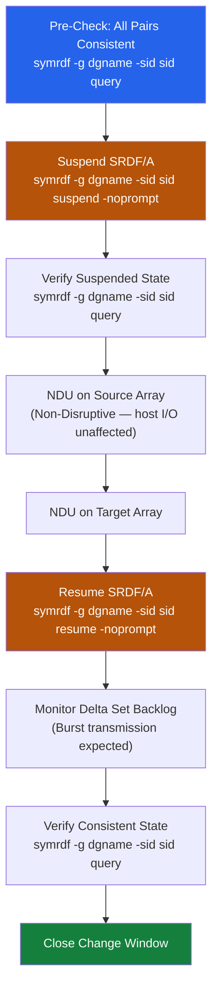

# SRDF/A — Install & Upgrade


<div class="kb-summary">
> Part of the [SRDF/A](../../index.md) reference.
</div>

---
## Version Compatibility

SRDF/A feature availability is tied to the HYPERMAX OS version running on each PowerMax array. Both source and target arrays must run a mutually supported version — check the **Dell EMC Simple Support Matrix** before any firmware upgrade.

For mixed-version environments (e.g., during staged upgrades), confirm the specific SRDF/A features in use (cascade, adaptive copy, SRDF/Metro) are supported across both array OS versions.

---

## Firmware Upgrade Procedure

Active SRDF/A pairs must be handled carefully during array firmware upgrades (Non-Disruptive Upgrades — NDU).

**Standard procedure:**

```bash
# Step 1 — Suspend SRDF/A replication on the device group
symrdf -g <dgname> -sid <r1_sid> suspend -noprompt

# Step 2 — Verify pair state is Suspended
symrdf -g <dgname> -sid <r1_sid> query

# Step 3 — Perform NDU on source array (via Unisphere or Dell support)
# NDU on PowerMax is non-disruptive to host I/O — suspension is only for SRDF/A cycle management

# Step 4 — Perform NDU on target array

# Step 5 — Resume SRDF/A replication
symrdf -g <dgname> -sid <r1_sid> resume -noprompt

# Step 6 — Verify pair state returns to Consistent
symrdf -g <dgname> -sid <r1_sid> query
# Wait for SyncInProg → Consistent transition before closing the change window
```
┌───────────────────────────────────── SRDF/A — Install & Upgrade ──────────────────────────────────────┐
│                                                                                                       │
│   ┌───────────────────────────────────────────────────────────────────────────────────────────────┐   │
│   │                              SRDF/A — Installation Prerequisites                              │   │
│   │             OS: supported Linux or Windows Server (see vendor compatibility matrix)           │   │
│   │          Network: FC dark fiber / DWDM · FCIP (TCP 3225) — ensure firewall allows these       │   │
│   │   Auth: Symmetrix/PowerMax admin credentials; Solutions Enabler (SYMAPI); role-based Unisphere│   │
│   │        Storage: Two PowerMax arrays (prod + DR) · FC/FCIP SRDF link (dedicated bandwidth)     │   │
│   └───────────────────────────────────────────────────────────────────────────────────────────────┘   │
│                                                                                                       │
│                                                   ▼                                                   │
│                                                                                                       │
│   ┌───────────────────────────────────────────────────────────────────────────────────────────────┐   │
│   │                                        Install Sequence                                       │   │
│   │                  1  Deploy control plane component and configure network access               │   │
│   │                          2  Configure storage and network connectivity                        │   │
│   │                        3  Install agent/proxy/splitter on protected hosts                     │   │
│   │                      4  Register sources and configure protection policies                    │   │
│   │                        5  Run first job; verify completion; test restore                      │   │
│   └───────────────────────────────────────────────────────────────────────────────────────────────┘   │
│                                                                                                       │
│   ┌───────────────────────────────────────────────────────────────────────────────────────────────┐   │
│   │                                        Upgrade Sequence                                       │   │
│   │                 1  Review release notes and compatibility matrix before upgrade               │   │
│   │                   2  Snapshot or backup the control plane VM before upgrading                 │   │
│   │                  3  Upgrade control plane first, then proxies/agents/appliances               │   │
│   │                       4  Validate jobs resume automatically after upgrade                     │   │
│   │                        5  Document version change and update CMDB record                      │   │
│   └───────────────────────────────────────────────────────────────────────────────────────────────┘   │
│                                                                                                       │
│  Physical Infrastructure:                                                                             │
│  Two PowerMax arrays (production + DR site) · FC/FCIP SRDF link (dedicated bandwidth) · RF ports      │
│  Key terms:                                                                                           │
│                                                                                                       │
│  SRDF          = Symmetrix Remote Data Facility; EMC array-based replication technology               │
│  R1            = source SRDF volume on production array; host writes flow here                        │
│  R2            = target SRDF volume on DR array; receives replicated data asynchronously              │
│  Delta Set     = batch of host writes accumulated per SRDF/A cycle; shipped to R2 atomically          │
│  Cycle Time    = SRDF/A replication interval (15–60 seconds); determines maximum RPO                  │
│  symrdf        = Solutions Enabler CLI for SRDF operations: establish, split, failover, restore       │
│  SRDF Link     = FC or FCIP path between R1 and R2 arrays; dedicated, monitored bandwidth             │
│  Suspended     = SRDF pair state where replication is paused; R2 data frozen at last cycle            │
│  Failover      = SRDF operation making R2 read-write; R1 becomes Not Ready to hosts                   │
│  Restore       = after failover resolution, re-establishes replication with R1 as source              │
│  Establish     = initial sync or re-sync operation that copies R1 to R2 in full                       │
│  Split         = breaks SRDF pair temporarily; both R1 and R2 are R/W; no replication                 │
│  FCIP          = Fibre Channel over IP; tunnels FC SRDF traffic over IP WAN link                      │
│  Unisphere     = Dell PowerMax management GUI; REST API; array health and provisioning                │
│                                                                                                       │
└───────────────────────────────────────────────────────────────────────────────────────────────────────┘

---

## EOL and Platform Tracking

| Platform | Status | Why it matters |
|---|---|---|
| VMAX3 (950F/850F) | End of Service Life — no new SRDF features; firmware-only support | No new SRDF/A features; plan migration before security support ends |
| PowerMax 2000 | Current — supported with latest HYPERMAX OS | Full feature set including SRDF/A adaptive copy and Metro |
| PowerMax 8000 | Current — supported with latest HYPERMAX OS | Full feature set; higher throughput for large SRDF groups |
| PowerMax 9500 | Current — newest generation | Latest microcode features; recommended for new SRDF/A deployments |

Track array firmware versions and SRDF license expiry dates in the CMDB. SRDF licenses are array-bound (node-locked to serial number); a controller board replacement requires license re-application via Dell Support.

---

## Firmware Upgrade Sequence



## SRDF/A to SRDF/S Migration

Migrating an existing SRDF/A group to synchronous (SRDF/S) requires:

1. Confirming the WAN link RTT is ≤5ms sustained.
2. Suspending the existing SRDF/A pair.
3. Converting the RDF group type to synchronous via Unisphere (requires brief application outage or scheduled maintenance).
4. Resuming and verifying the pair enters `Synchronized` state.

Consult Dell Professional Services before converting production SRDF groups between async and sync modes.
