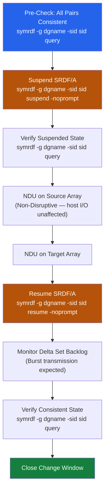

# SRDF/A — Install & Upgrade

> Part of the [SRDF/A](../../index.md) reference.

---
## Version Compatibility

SRDF/A feature availability is tied to the HYPERMAX OS version running on each PowerMax array. Both source and target arrays must run a mutually supported version — check the **Dell EMC Simple Support Matrix** before any firmware upgrade.

For mixed-version environments (e.g., during staged upgrades), confirm the specific SRDF/A features in use (cascade, adaptive copy, SRDF/Metro) are supported across both array OS versions.

---

## Firmware Upgrade Procedure

Active SRDF/A pairs must be handled carefully during array firmware upgrades (Non-Disruptive Upgrades — NDU).

**Standard procedure:**

```bash
# Step 1 — Suspend SRDF/A replication on the device group
symrdf -g <dgname> -sid <r1_sid> suspend -noprompt

# Step 2 — Verify pair state is Suspended
symrdf -g <dgname> -sid <r1_sid> query

# Step 3 — Perform NDU on source array (via Unisphere or Dell support)
# NDU on PowerMax is non-disruptive to host I/O — suspension is only for SRDF/A cycle management

# Step 4 — Perform NDU on target array

# Step 5 — Resume SRDF/A replication
symrdf -g <dgname> -sid <r1_sid> resume -noprompt

# Step 6 — Verify pair state returns to Consistent
symrdf -g <dgname> -sid <r1_sid> query
# Wait for SyncInProg → Consistent transition before closing the change window
```
```

Initial synchronisation copies the full volume from R1 to R2. Schedule this during low-write periods to avoid saturating the WAN link and delaying existing SRDF/A cycles.

---

## Removing Devices from an SRDF Group

Decommission procedure for SRDF/A-protected volumes:

```bash
# Step 1 — Quiesce host I/O on the R1 devices (application-level)
# Step 2 — Split the pair (R1 and R2 become independent)
symrdf -g <dgname> -sid <r1_sid> split -noprompt

# Step 3 — Verify both sides are Split and independent
symrdf -g <dgname> -sid <r1_sid> query

# Step 4 — Remove the pair from the device group
symdg -g <dgname> -type RDF1 remove dev <dev_id> -noprompt

# Step 5 — Remove the device from the SRDF group (RDF group)
symrdf -rdfg <group_num> -sid <r1_sid> -dev <dev_id> remove

# Step 6 — Decommission the R2 device on the target array (or repurpose)
```

---

## EOL and Platform Tracking

| Platform | Status | Why it matters |
|---|---|---|
| VMAX3 (950F/850F) | End of Service Life — no new SRDF features; firmware-only support | No new SRDF/A features; plan migration before security support ends |
| PowerMax 2000 | Current — supported with latest HYPERMAX OS | Full feature set including SRDF/A adaptive copy and Metro |
| PowerMax 8000 | Current — supported with latest HYPERMAX OS | Full feature set; higher throughput for large SRDF groups |
| PowerMax 9500 | Current — newest generation | Latest microcode features; recommended for new SRDF/A deployments |

Track array firmware versions and SRDF license expiry dates in the CMDB. SRDF licenses are array-bound (node-locked to serial number); a controller board replacement requires license re-application via Dell Support.

---

## Firmware Upgrade Sequence



## SRDF/A to SRDF/S Migration

Migrating an existing SRDF/A group to synchronous (SRDF/S) requires:

1. Confirming the WAN link RTT is ≤5ms sustained.
2. Suspending the existing SRDF/A pair.
3. Converting the RDF group type to synchronous via Unisphere (requires brief application outage or scheduled maintenance).
4. Resuming and verifying the pair enters `Synchronized` state.

Consult Dell Professional Services before converting production SRDF groups between async and sync modes.
